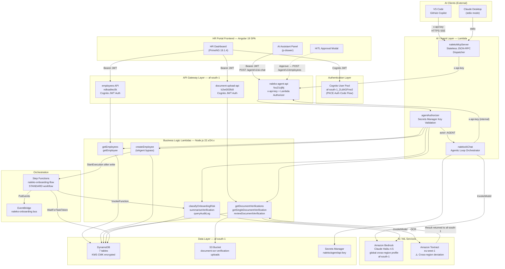
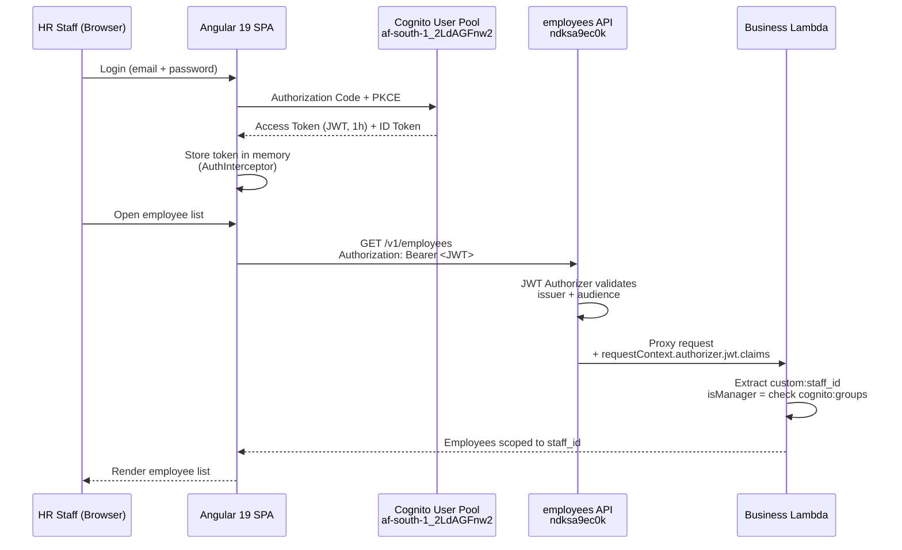
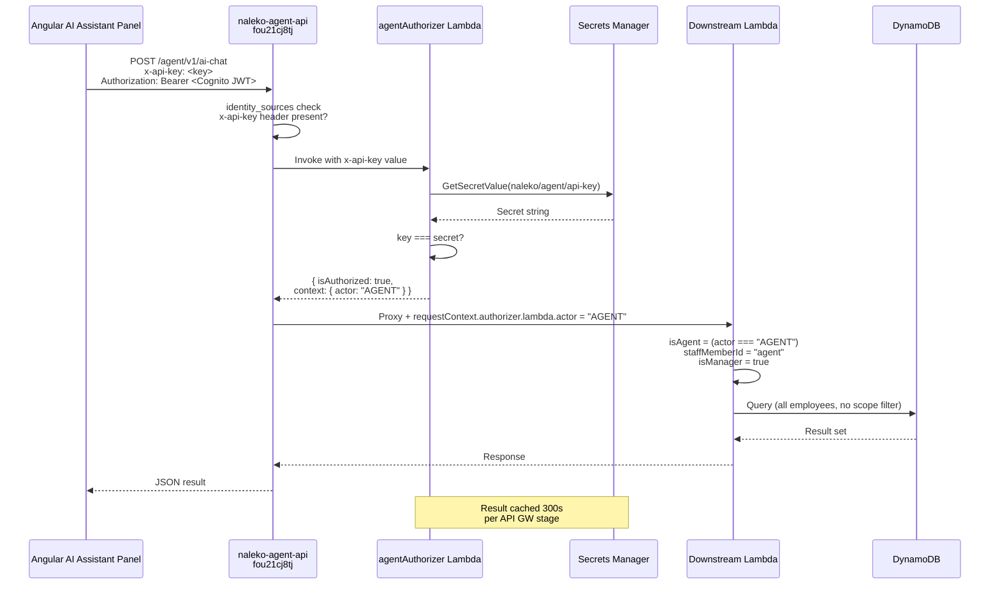
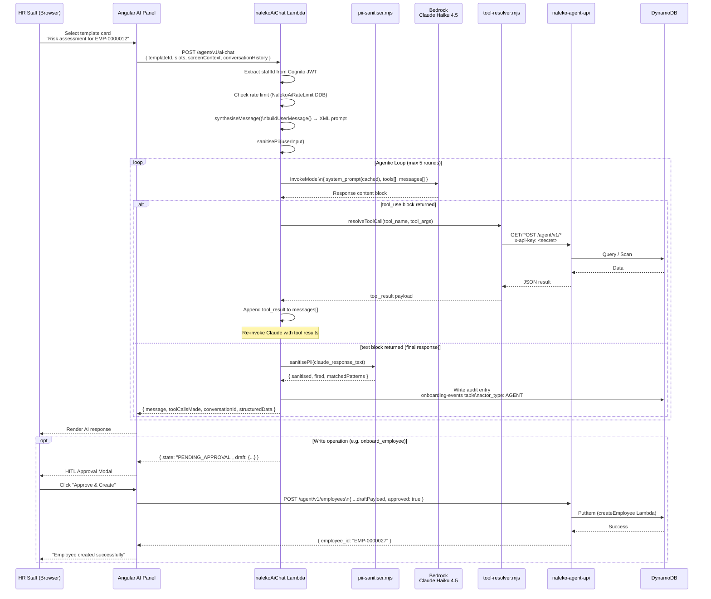
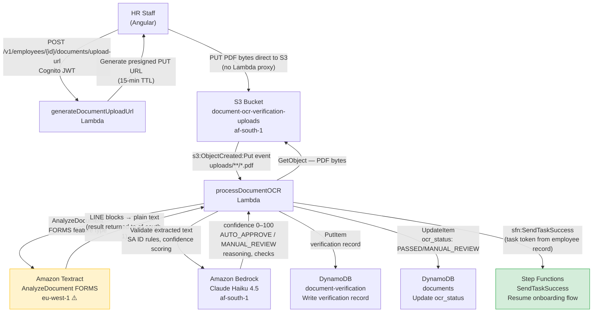
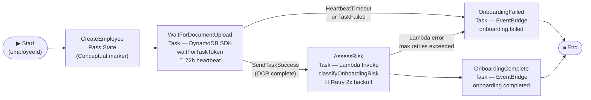

# Naleko Agentic AI Onboarding Assistant — Architecture Specification

> **Version:** 1.0.0 | **Date:** 6 May 2026  
> **Region:** `af-south-1` (Cape Town) — POPIA data residency mandatory  
> **Status:** ✅ Partially Live | 🔜 Roadmap items clearly labelled  
> **Classification:** Internal — Engineering & Architecture  
> **Authors:** Naleko Engineering Team  
> **Repository:** `obsydian-tech/hr-portal`

---

## Audience Note

This document is written to serve three simultaneous audiences:

| Reader | What to focus on |
|---|---|
| **Enterprise Architect (Banking / Regulated)** | §3 Auth Architecture, §9 POPIA Compliance, §12 Risk Register, §13 Threat Model, §14 EA Q&A |
| **Solution Architect (New Platform Onboarding)** | §11 Platform-Agnostic Blueprint, §4 Component Architecture, §5 Agentic Loop |
| **CTO / Engineering Lead** | §1 Executive Summary, §2 High-Level Architecture, §10 Observability, §12 Risk Register |

---

## Table of Contents

1. [Executive Summary](#1-executive-summary)
2. [High-Level System Architecture](#2-high-level-system-architecture)
3. [Authentication & Routing Architecture](#3-authentication--routing-architecture)
4. [Component Architecture](#4-component-architecture)
5. [Agentic Loop — Sequence Diagram](#5-agentic-loop--sequence-diagram)
6. [Document Pipeline & Step Functions Orchestration](#6-document-pipeline--step-functions-orchestration)
7. [Lambda Function Inventory](#7-lambda-function-inventory)
8. [Data Architecture](#8-data-architecture)
9. [Security & POPIA Compliance](#9-security--popia-compliance)
10. [Observability & Resilience](#10-observability--resilience)
11. [Infrastructure as Code](#11-infrastructure-as-code)
12. [Risk Register](#12-risk-register)
13. [Threat Model](#13-threat-model)
14. [Enterprise Architect Q&A — Banking Sector](#14-enterprise-architect-qa--banking-sector)
15. [Platform-Agnostic Agentic Enterprise Blueprint](#15-platform-agnostic-agentic-enterprise-blueprint)
16. [Appendix A — ADR Cross-Reference Index](#appendix-a--adr-cross-reference-index)
17. [Appendix B — Live AWS Resource Inventory](#appendix-b--live-aws-resource-inventory)

---

## 1. Executive Summary

### What Was Built

The **Naleko AI Onboarding Assistant** is a production Agentic AI system embedded inside an Angular 19 HR Portal. It gives HR staff a guided, template-driven AI interface to interrogate live employee data, run Bedrock-powered document risk assessments, query POPIA-compliant audit logs, and onboard new employees — all through a conversational panel that never requires the HR clerk to leave the context of their current screen.

It is not a chatbot. It is a **Guided Agentic Command Center**: HR staff select an action card, the system executes a multi-step tool-calling loop against real DynamoDB data via Amazon Bedrock Claude Haiku 4.5, enforces a Human-in-the-Loop (HITL) approval gate for any write operation, scrubs PII from AI responses, and writes an immutable audit trail entry — all within `af-south-1` for POPIA data residency.

### Key Achievements (Live — 6 May 2026)

| Metric | Value |
|---|---|
| Lambda functions deployed | 26 (af-south-1) |
| API Gateways | 3 (HR REST, Document Upload, Agent API) |
| Agent API routes | 7 + 1 AI Chat endpoint |
| MCP tools available to external AI clients | 7 |
| Employees in production database | 34+ |
| AI risk classifications run | 34 (batch — 5 May 2026) |
| DynamoDB tables | 7 |
| PII sanitizer patterns | 3 (SA ID, Phone, Bank Account) |
| POPIA-compliant audit trail | Active (every action tagged `actor_type: HUMAN \| AGENT`) |

### Four Architectural Pillars

**1. Separation of Concerns**
Human (HR Staff) and Machine (AI Agent) traffic travel through completely separate API Gateways with separate auth mechanisms, separate IAM surfaces, and separate audit identities. Neither path can impersonate the other.

**2. Regional Data Residency**
All compute, storage, and AI inference runs in `af-south-1` (Cape Town). The only exception is Amazon Textract (unavailable in af-south-1) which processes document images in `eu-west-1` — this deviation is documented, risk-assessed, and compensated by AWS Standard Contractual Clauses (SCCs).

**3. Human-in-the-Loop (HITL)**
No write operation (employee creation, status change) is executed autonomously by the AI. Claude returns a structured draft payload. The Angular frontend renders an approval modal. Only after explicit HR click-through does the write proceed. This is architectural, not advisory.

**4. Compliance by Design**
POPIA controls are not bolt-ons. KMS encryption, PII sanitization, audit trail, idempotency keys, rate limiting, and data minimisation are all infrastructure-level constructs baked into the Terraform definitions and Lambda execution paths.

---

## 2. High-Level System Architecture



---

## 3. Authentication & Routing Architecture

### Dual-Path Authentication Strategy

The system maintains two completely independent authentication paths. This is a deliberate architectural decision — not a convenience trade-off.

| Dimension | Human Path (HR Staff) | Agent Path (AI / Machine) |
|---|---|---|
| **Auth mechanism** | Cognito JWT (Authorization Code + PKCE) | `x-api-key` header + Lambda Authorizer |
| **Token/Key storage** | Browser session (Cognito Identity JS) | AWS Secrets Manager (`naleko/agent/api-key`) |
| **API Gateway** | `employees` (`ndksa9ec0k`) + `document-upload-api` (`b2wt303fc8`) | `naleko-agent-api` (`fou21cj8tj`) |
| **Authorizer type** | JWT Authorizer (API GW native) | REQUEST Lambda Authorizer (custom) |
| **Identity injected** | `custom:staff_id`, Cognito group membership | `actor: AGENT` context object |
| **Data scope** | Per-staff-member (HR clerk sees only their onboardees) | Manager-level (all employees visible) |
| **Audit identity** | `actor_type: HUMAN`, `actor_id: <staff_id>` | `actor_type: AGENT`, `actor_id: agent` |
| **Key rotation** | Re-issue Cognito tokens standard flow | Update Secrets Manager; no portal downtime |
| **Revocation** | Cognito user disable / group removal | Disable API key in Secrets Manager |

### Human Auth Flow



### Agent Auth Flow



### API Gateway Route Table

#### `employees` API (`ndksa9ec0k`) — HR Staff, Cognito JWT

| Method | Route | Lambda | Authorizer |
|---|---|---|---|
| `GET` | `/v1/employees` | `getEmployees` | Cognito JWT |
| `GET` | `/v1/employees/{id}` | `getEmployee` | Cognito JWT |
| `POST` | `/v1/employees` | `createEmployee` | Cognito JWT |
| `GET` | `/v1/employees/by-email` | `getEmployeeByEmail` | Cognito JWT |
| `GET` | `/v1/employees/{id}/document-verifications` | `getEmployeeDocumentVerifications` | Cognito JWT |

#### `document-upload-api` (`b2wt303fc8`) — HR Staff, Cognito JWT

| Method | Route | Lambda | Authorizer |
|---|---|---|---|
| `POST` | `/v1/employees/{id}/documents/upload-url` | `generateDocumentUploadUrl` | Cognito JWT |
| `GET` | `/v1/employees/{id}/documents/{doc_id}/presigned-url` | `getDocumentPresignedUrl` | Cognito JWT |
| `POST` | `/v1/verifications/{id}/review` | `reviewDocumentVerification` | Cognito JWT |

#### `naleko-agent-api` (`fou21cj8tj`) — AI Agent, x-api-key + Lambda Authorizer

| Method | Route | Lambda | Notes |
|---|---|---|---|
| `GET` | `/agent/v1/employees` | `getEmployees` | `isAgent` bypass — all employees |
| `GET` | `/agent/v1/employees/{id}` | `getEmployee` | Single employee lookup |
| `POST` | `/agent/v1/employees` | `createEmployee` | 🔒 HITL gate upstream |
| `POST` | `/agent/v1/employees/{id}/assess-risk` | `classifyOnboardingRisk` | Bedrock Claude Haiku |
| `GET` | `/agent/v1/verifications` | `getDocumentVerifications` | Optional status filter |
| `GET` | `/agent/v1/verifications/{id}/summary` | `summariseVerification` | Bedrock Claude Haiku |
| `GET` | `/agent/v1/audit-log` | `queryAuditLog` | POPIA audit trail |
| `POST` | `/agent/v1/ai-chat` | `nalekoAiChat` | Cognito JWT (HR staff) + x-api-key internal |

---

## 4. Component Architecture

### 4a. Frontend — Angular 19 SPA

| Component | Role | Key Behaviour |
|---|---|---|
| `HrDashboardComponent` | Host shell | Mounts AI toggle button; owns `p-drawer`; passes screen context to AI panel |
| `AiModePanel` (`p-drawer`) | AI Assistant drawer | Houses template gallery + conversation thread; PrimeNG drawer slide-in from right |
| `AiTemplateGalleryComponent` | Action card grid | 8 template cards in 2-column layout; HITL-tagged cards show `● REQUIRES APPROVAL` badge |
| `AiModeService` | Orchestration service | Injects screen context (current view, `employeeId`); calls `POST /agent/v1/ai-chat`; manages conversation state |
| `AuthInterceptor` | HTTP interceptor | Attaches Cognito JWT `Bearer` token to all outbound HTTP calls automatically |
| `CognitoService` | Identity service | Authorization Code PKCE flow; token storage; refresh management |

**Screen context injection** — `AiModeService.getScreenContext()` inspects the current route URL and active employee. When an HR clerk is on `/employee/EMP-0000012`, the AI panel auto-fills that employee ID into the relevant template slots. Context is transmitted as XML inside every chat request.

**HITL Modal** — Write-path templates (e.g. `onboard_employee`) render an approval modal before the actual API write. The AI returns a structured draft payload. The modal displays it for HR review. On approval, the Angular service re-calls the Agent API with `approved: true`.

### 4b. AI Chat Layer — `nalekoAiChat` Lambda

```
nalekoAiChat Lambda (512 MB, Node.js 22.x, 60s timeout)
│
├── index.mjs                   — Entry point: extract staffId from Cognito JWT, route request
│   ├── synthesiseMessage()     — Template ID + slots → directive string for Claude
│   ├── buildUserMessage()      — XML-structured prompt with <context><task><slots><message>
│   ├── invokeClaude()          — Bedrock InvokeModelCommand with system prompt caching
│   └── Agentic loop (max 5 rounds)
│       ├── Claude returns tool_use block
│       ├── resolveToolCall()   → tool-resolver.mjs
│       └── tool_result fed back to Claude → re-invoke
│
├── tool-resolver.mjs           — Maps Claude tool names → Agent API HTTP calls
│   ├── agentGet()             — Authenticated GET to /agent/v1/*
│   ├── agentPost()            — Authenticated POST to /agent/v1/*
│   ├── getApiKey()            — Secrets Manager cached per warm container
│   └── TOOL_DEFINITIONS[]    — Tool schema array passed to Claude in every request
│
└── pii-sanitiser.mjs          — Regex PII scrub applied to Claude's final text response
    ├── SA_ID pattern          — 13-digit YYMMDDSSSSCZZ → [SA-ID-REDACTED]
    ├── PHONE pattern          — +27XXXXXXXXX / 0XXXXXXXXX → [PHONE-REDACTED]
    └── BANK_ACCOUNT pattern   — 8–11 digit sequences → [ACCOUNT-REDACTED]
```

**System prompt caching** — The Claude system prompt is sent with `cache_control: { type: "ephemeral" }`. On warm Lambda invocations, Bedrock reuses the cached prompt token representation, reducing latency and input token cost.

**Rate limiting** — `NalekoAiRateLimit` DynamoDB table implements a per-`staffId` token bucket. Each Lambda invocation checks and increments the counter using conditional `UpdateItem`. Clients exceeding the limit receive HTTP 429.

### 4c. MCP Server Layer — `nalekoMcpServer` Lambda

The MCP server exposes the same seven Agent API tools to **external AI clients** (VS Code GitHub Copilot, Claude Desktop) without them needing to understand the HTTP API contract.

```
nalekoMcpServer Lambda (512 MB, 60s timeout)
│
├── lambda-handler.mjs          — Stateless JSON-RPC dispatcher
│   ├── GET requests            → health check { status: "ok" }
│   ├── initialize              → return capabilities inline (no session state)
│   ├── tools/list              → introspect server._registeredTools → JSON Schema
│   └── tools/call              → call tool handler directly → respond + SSE envelope
│
└── server.mjs                  — Tool definitions (7 tools)
    ├── list_employees
    ├── get_employee
    ├── list_verifications
    ├── get_verification_summary
    ├── assess_employee_risk
    ├── query_audit_log
    └── onboard_new_employee    ← Two-step: createEmployee → assess-risk
```

**The Stateless Lambda Problem** — Standard MCP sessions (initialize → tools/list → tools/call) span multiple HTTP requests. Lambda concurrent invocations run in separate execution environments that do not share memory. The stateless dispatcher solves this by handling each JSON-RPC method independently — no session affinity required.

---

## 5. Agentic Loop — Sequence Diagram



---

## 6. Document Pipeline & Step Functions Orchestration

### Document Upload Pipeline



### Step Functions State Machine: `naleko-onboarding-flow`

**Type:** STANDARD (durable, auditable — execution history in CloudWatch)  
**Trigger:** `createEmployee` Lambda calls `sfn:StartExecution` after DynamoDB `PutItem`  
**Region:** `af-south-1`



**Key design pattern — WaitForTaskToken:**
- Step Functions writes a task token to `employees.sfn_task_token` via DynamoDB SDK direct integration (no Lambda hop)
- `processDocumentOCR` reads this token after OCR completes and calls `sfn:SendTaskSuccess`
- This allows a single Step Functions execution to remain open for up to 72 hours without polling, consuming no compute

---

## 7. Lambda Function Inventory

All functions: **Runtime** `nodejs22.x` or `nodejs24.x` | **Region** `af-south-1` | **Handler** `index.handler`

### HR Operations Group

| Function | Memory | Timeout | Role | Key IAM Permissions |
|---|---|---|---|---|
| `createEmployee` | 128 MB | 3s | Create employee record; `isAgent` bypass for JWT-free creation; starts Step Functions execution | `dynamodb:PutItem`, `dynamodb:Scan`, `sfn:StartExecution` |
| `getEmployees` | 128 MB | 3s | List employees; per-staff scoping for human path; manager scope for agent path | `dynamodb:Scan`, `dynamodb:Query` |
| `getEmployee` | 128 MB | 3s | Single employee lookup by ID or UUID | `dynamodb:GetItem` |
| `getEmployeeByEmail` | 128 MB | 3s | Employee lookup by email address (uses `email-index` GSI) | `dynamodb:Query` |
| `lookupEmployeeEmail` | 128 MB | 3s | Reverse lookup — email → employee_id | `dynamodb:Query` |
| `sendNotificationEmail` | 128 MB | 10s | Transactional email via Postmark (onboarding notifications) | `secretsmanager:GetSecretValue` |
| `getBatchRiskReport` | 256 MB | 30s | Batch risk assessment across multiple employees | `dynamodb:Query`, `bedrock:InvokeModel`, `kms:Decrypt` |

### Document Pipeline Group

| Function | Memory | Timeout | Role | Key IAM Permissions |
|---|---|---|---|---|
| `generateDocumentUploadUrl` | 128 MB | 3s | Generate S3 presigned PUT URL (15-min TTL); no document data passes through Lambda | `s3:PutObject`, `dynamodb:PutItem` |
| `uploadDocumentToS3` | 128 MB | 10s | Legacy base64 upload (deprecated — replaced by presigned URL flow) | `s3:PutObject` |
| `getDocumentPresignedUrl` | 128 MB | 3s | Generate S3 presigned GET URL for document download | `s3:GetObject` |
| `processDocumentOCR` | 512 MB | 60s | Triggered by S3 event; calls Textract (eu-west-1); calls Bedrock validation; writes verification record; resumes Step Functions | `s3:GetObject`, `textract:AnalyzeDocument` (eu-west-1), `bedrock:InvokeModel` (af-south-1), `dynamodb:PutItem`, `dynamodb:UpdateItem`, `sfn:SendTaskSuccess` |
| `getDocumentVerifications` | 128 MB | 3s | List verification records with optional status filter | `dynamodb:Scan`, `dynamodb:Query` |
| `getEmployeeDocumentVerifications` | 128 MB | 3s | All verifications for a specific employee | `dynamodb:Query` |
| `getSingleDocumentVerification` | 128 MB | 3s | Single verification record detail | `dynamodb:Scan` |
| `reviewDocumentVerification` | 128 MB | 3s | HR manual review decision (APPROVED/REJECTED) | `dynamodb:UpdateItem` |
| `triggerExternalVerification` | 128 MB | 10s | Initiate third-party verification request | `dynamodb:PutItem`, external HTTP |

### AI / Agent Layer Group

| Function | Memory | Timeout | Role | Key IAM Permissions |
|---|---|---|---|---|
| `nalekoAiChat` | 512 MB | 60s | **AI Agentic Loop Orchestrator** — receives HR chat requests, calls Bedrock, resolves tool calls via Agent API, sanitises PII, writes audit log | `bedrock:InvokeModel`, `secretsmanager:GetSecretValue`, `dynamodb:PutItem` (audit), `dynamodb:GetItem/UpdateItem` (rate limit) |
| `nalekoMcpServer` | 512 MB | 60s | MCP protocol server for external AI clients; stateless JSON-RPC dispatcher | `secretsmanager:GetSecretValue` |
| `agentAuthorizer` | 128 MB | 5s | API Gateway Lambda Authorizer; validates x-api-key against Secrets Manager; returns `actor: AGENT` context | `secretsmanager:GetSecretValue` |
| `classifyOnboardingRisk` | 256 MB | 30s | Bedrock risk classification (LOW/MEDIUM/HIGH) across all employee document verifications | `bedrock:InvokeModel`, `dynamodb:Scan` |
| `summariseVerification` | 256 MB | 30s | Bedrock plain-English summary of a single verification record | `bedrock:InvokeModel`, `dynamodb:GetItem` |
| `queryAuditLog` | 128 MB | 5s | POPIA audit log query with date/employee filters | `dynamodb:Query`, `kms:Decrypt`, `kms:GenerateDataKey` |

### Infrastructure / Utility Group

| Function | Memory | Timeout | Role |
|---|---|---|---|
| `auditLogConsumer` | 128 MB | 10s | Processes DynamoDB Streams from `onboarding-events` for secondary audit sinks |
| `configRegionCheck` | 128 MB | 5s | AWS Config rule — validates Lambda functions are in af-south-1 |
| `serveAgentManifest` | 128 MB | 3s | Serves OpenAPI/agent manifest descriptor used by external integrations |
| `serveDocs` | 128 MB | 3s | Serves API documentation |

---

## 8. Data Architecture

### DynamoDB Tables (af-south-1)

| Table | PK | SK | GSIs | KMS | PITR | Billing | Purpose |
|---|---|---|---|---|---|---|---|
| `employees` | `employee_id` | — | `email-index`, `stage-index`, `created_by-index` | ✅ CMK | ✅ | PAY_PER_REQUEST | Core HR record — PII fields |
| `documents` | `employee_id` | `document_id` | — | ✅ CMK | ✅ | PAY_PER_REQUEST | Document metadata, S3 keys, OCR status |
| `document-verification` | `verificationId` | — | — | — | — | PAY_PER_REQUEST | OCR results: confidence, decision, reasoning |
| `onboarding-events` | `log_id` (UUID) | `timestamp` | — | ✅ CMK | — | PAY_PER_REQUEST | **Immutable POPIA audit trail** |
| `naleko-idempotency-keys` | `idempotencyKey` | — | — | ✅ CMK | — | PAY_PER_REQUEST | 24h TTL duplicate request prevention |
| `NalekoAiRateLimit` | `staffId` | — | — | — | — | PAY_PER_REQUEST | Per-staff AI chat token bucket |
| `external-verification-requests` | — | — | — | — | — | PAY_PER_REQUEST | Third-party verification integration |

### Known Technical Debt

| Issue | Impact | Resolution Path |
|---|---|---|
| `document-verification` uses camelCase keys; all other tables use snake_case | Join/transform overhead in every Lambda that queries both | Schema migration to snake_case in planned production tables |
| `document-verification` table has no KMS encryption | PII exposure risk for OCR results | ✅ Targeted in production schema redesign |
| `createEmployee` uses full table Scan to generate sequential IDs | O(n) performance — degrades at scale | Migrate to atomic DynamoDB counter or UUID-only IDs |
| No GSIs on `document-verification` | All verification lookups use Scan | Add `employeeId-index` + `decision-index` in production schema |

### S3 Buckets

| Bucket | Region | Purpose | Encryption | Event Trigger |
|---|---|---|---|---|
| `document-ocr-verification-uploads` | af-south-1 | Employee document storage | SSE-S3 | `s3:ObjectCreated:Put` → `processDocumentOCR` Lambda |
| `naleko-tfstate-af-south-1` | af-south-1 | Terraform remote state | SSE-S3 | — |
| `naleko-config-logs-937137806477` | af-south-1 | AWS Config + compliance logs | SSE-S3 | — |

### Data Flow: Create → Encrypt → Audit

```
HR Staff creates employee
    ↓
createEmployee Lambda
    ↓ PutItem (KMS CMK encrypts at rest)
employees table
    ↓
Audit entry written to onboarding-events
    { actor_type: "HUMAN", actor_id: "AS00001", action: "CREATE_EMPLOYEE", employee_id: "EMP-0000027" }
    ↓
Step Functions execution started (naleko-onboarding-flow)
```

---

## 9. Security & POPIA Compliance

### Control Matrix

| Control | Mechanism | POPIA Section | Status |
|---|---|---|---|
| **Data at rest encryption** | KMS CMK `alias/naleko-onboarding-pii` on all sensitive DynamoDB tables + S3 | s.19 (Security Safeguards) | ✅ Live |
| **Data in transit encryption** | TLS 1.2+ enforced on all API Gateway endpoints | s.19 | ✅ Live |
| **PII minimisation — SA ID** | `id_number_encrypted` stored as KMS ciphertext; only `idNumberLast4` returned to UI | s.10 (Minimality) | ✅ Live |
| **PII minimisation — presigned URLs** | Document images issued as 15-min S3 presigned URLs; never proxied through Lambda | s.10 | ✅ Live |
| **AI response PII scrubbing** | `pii-sanitiser.mjs` — regex patterns for SA_ID, PHONE, BANK_ACCOUNT applied to Claude's text output before Lambda returns | s.19 (compensating control) | ✅ Live |
| **Bedrock Guardrails** | `CreateGuardrail` returns `AccessDeniedException (403)` in `af-south-1`. Not available in this region. | s.19 | 🔜 Planned (post AWS regional expansion) |
| **Idempotency protection** | `naleko-idempotency-keys` table (24h TTL) prevents duplicate writes from agent retries | s.19 | ✅ Live |
| **AI rate limiting** | `NalekoAiRateLimit` DynamoDB token bucket per `staffId` | s.19 (abuse prevention) | ✅ Live |
| **Agent key in Secrets Manager** | `naleko/agent/api-key` — never stored in environment variables or code | s.19 | ✅ Live |
| **Immutable audit trail** | `onboarding-events` table; every action tagged `actor_type: HUMAN \| AGENT`; `actor_id` always present | s.23 (Proof of Lawful Processing) | ✅ Live |
| **Audit log — AI actions** | Every `nalekoAiChat` invocation writes audit entry — staffId, templateId, toolCallsMade, piiSanitiserFired | s.23 | ✅ Live |
| **90-day log retention** | CloudWatch Logs on all Lambdas with 90-day retention | s.23 | ✅ Live |
| **Cognito PKCE auth** | Authorization Code + PKCE — no implicit flow, no client secrets in browser | s.19 | ✅ Live |
| **HITL gate — write operations** | No autonomous AI write to DynamoDB without HR staff explicit approval in Angular modal | s.11 (Consent/Accountability) | ✅ Live |
| **Third-party transfer — Textract** | Document images cross to `eu-west-1` for OCR. Mitigated by AWS DPA + SCCs. | s.72 (Cross-border transfers) | ✅ Documented deviation |
| **Data subject rights procedures** | Manual erasure process; 30-day SLA; documented in POPIA-MAPPING.md | s.23, s.24 | ✅ Documented |
| **Point-in-time recovery (PITR)** | Enabled on `employees` + `documents` tables | s.19 (Integrity + Recovery) | ✅ Live |

### PII Sanitizer Detail (Compensating Control for Bedrock Guardrails)

The `pii-sanitiser.mjs` module is the primary PII defence for AI-generated responses. It is applied unconditionally on every text block Claude returns, before the Lambda response is sent to Angular.

| Pattern Name | Regex Target | Replacement | South African Context |
|---|---|---|---|
| `SA_ID` | 13-digit `YYMMDDSSSSCZZ` format | `[SA-ID-REDACTED]` | SAID encoded with DOB, gender, citizenship, checksum |
| `PHONE` | `+27XXXXXXXXX` or `0XXXXXXXXX` (10 digits) | `[PHONE-REDACTED]` | Mobile and landline |
| `BANK_ACCOUNT` | 8–11 contiguous digits (negative lookahead: excludes `EMP-` prefix) | `[ACCOUNT-REDACTED]` | SA bank account numbers (ABSA, FNB, Standard Bank, Nedbank, Capitec) |

**Limitation:** The regex approach is intentionally conservative — it may produce false positives on numeric sequences. When Bedrock Guardrails become available in `af-south-1`, this layer will be supplemented with semantic PII detection capabilities.

---

## 10. Observability & Resilience

### Logging & Tracing

| Layer | Tool | Format | Retention |
|---|---|---|---|
| Lambda structured logs | AWS Lambda Powertools `Logger` | JSON | 90 days (CloudWatch) |
| Lambda traces | AWS Lambda Powertools `Tracer` + X-Ray | Trace map | 30 days |
| Step Functions executions | CloudWatch Logs (`/aws/states/naleko-onboarding-flow`) | ALL events | 90 days |
| API Gateway access logs | CloudWatch | JSON | 30 days |

### Throttle & Rate Limits

| API Gateway | Steady-state (rps) | Burst | Rationale |
|---|---|---|---|
| `employees` (`ndksa9ec0k`) | 50 | 100 | HR staff portal — low volume |
| `document-upload-api` (`b2wt303fc8`) | 50 | 100 | Presigned URL generation — low volume |
| `naleko-agent-api` (`fou21cj8tj`) | 10 | 20 | Agent traffic — rate-limited by design; AI calls are expensive |
| AI chat (per staffId, token bucket) | Configurable | Configurable | `NalekoAiRateLimit` DynamoDB |

### Resilience Patterns

| Pattern | Where Applied | Configuration |
|---|---|---|
| Lambda retry | Step Functions `AssessRisk` state | 2 retries, 2s initial, 2x backoff |
| Idempotency keys | `createEmployee`, `uploadDocumentToS3`, `reviewDocumentVerification` | 24h TTL DynamoDB dedup |
| Step Functions catch | All terminal error states | `States.HeartbeatTimeout`, `States.ALL` → `OnboardingFailed` |
| Agentic loop circuit breaker | `nalekoAiChat` | `MAX_TOOL_ROUNDS = 5`; exits loop on exceed |
| API Gateway timeout | All routes | 30s max (API GW hard limit) |
| Bedrock timeout (MCP) | `nalekoMcpServer` tool calls | 25s per tool (`Promise.race`) |

---

## 11. Infrastructure as Code

All infrastructure is managed via Terraform with remote state stored in S3 (`naleko-tfstate-af-south-1`) and state locking in DynamoDB (`naleko-tflock`).

### Terraform File Breakdown

| File | Purpose |
|---|---|
| `provider.tf` | AWS provider, region `af-south-1`, backend config |
| `variables.tf` | `aws_region`, `aws_account_id`, environment |
| `lambdas.tf` | All Lambda function definitions + packaging |
| `apigateway.tf` | `employees` + `document-upload-api` HTTP APIs, Cognito JWT authorizers, all routes |
| `agent_api.tf` | `naleko-agent-api` HTTP API, `agentAuthorizer` Lambda authorizer, all `/agent/v1/*` routes |
| `ai_chat.tf` | `nalekoAiChat` Lambda IAM role, Bedrock policy, AI chat API route |
| `dynamodb.tf` | All 7 DynamoDB tables with GSIs, KMS encryption, PITR, TTL |
| `stepfunctions.tf` | `naleko-onboarding-flow` state machine, IAM role, CloudWatch log group |
| `cognito.tf` | Cognito User Pool (`af-south-1_2LdAGFnw2`), app client, hosted UI config |
| `kms.tf` | KMS CMK module (`alias/naleko-onboarding-pii`) |
| `s3.tf` | S3 buckets, event notification triggers |
| `iam.tf` + `iam_per_lambda.tf` | Per-Lambda execution roles, least-privilege policies |
| `eventbridge.tf` | `naleko-onboarding` custom event bus |
| `alarms.tf` | CloudWatch alarms (Lambda errors, throttles, SFN failures) |
| `dashboards.tf` | CloudWatch operational dashboard |
| `outputs.tf` | API URLs, Lambda ARNs, Cognito pool ID |
| `modules/kms_pii/` | Reusable KMS CMK module |
| `step-functions/naleko-onboarding-flow.asl.json` | Step Functions ASL definition |

### Known Console Drift (Not Yet in Terraform)

| Item | Status | Required Terraform Resource |
|---|---|---|
| `POST /agent/v1/employees` route on Agent API | 🔜 Added via Console | `aws_apigatewayv2_route` + `aws_apigatewayv2_integration` + `aws_lambda_permission` |
| `kms:Decrypt` + `bedrock:InvokeModel` inline IAM policies on `queryAuditLog`, `summariseVerification`, `classifyOnboardingRisk` | 🔜 Added via Console | `aws_iam_role_policy` additions in `iam_per_lambda.tf` |

---

## 12. Risk Register

| ID | Risk | Category | Likelihood | Impact | Current Mitigation | Residual Risk | Owner |
|---|---|---|---|---|---|---|---|
| R-01 | **Bedrock Guardrails unavailable in af-south-1** — No semantic PII detection; regex-only PII sanitizer may miss novel patterns | AI / Compliance | High | High | `pii-sanitiser.mjs` regex layer (3 SA-specific patterns); prompt engineering to discourage PII output; monitored via audit log `piiSanitiserFired` flag | Medium | Engineering |
| R-02 | **Textract cross-region data transfer** (af-south-1 → eu-west-1) — document images leave SA jurisdiction | Compliance / POPIA s.72 | Confirmed (by design) | Medium | AWS DPA + SCCs in place; processing result returned immediately to af-south-1; no persistent storage in eu-west-1; documented deviation in POPIA-MAPPING.md | Low-Medium | Compliance |
| R-03 | **Agent API key compromise** — `x-api-key` is a static secret; if leaked, attacker gains manager-level read access to all employee data | Security | Low | High | Secrets Manager storage (never in code); Lambda authorizer result cache 300s; audit log tags all agent actions; no PII written to CloudWatch | Medium | Security |
| R-04 | **Prompt injection via user input** — HR clerk types a crafted message designed to override system prompt | AI / Security | Low | Medium | System prompt uses `cache_control: ephemeral`; user input wrapped in XML `<message>` tags (limits prompt crossover); MAX_TOOL_ROUNDS=5 circuit breaker; HITL gate prevents autonomous writes | Low-Medium | Engineering |
| R-05 | **DynamoDB Scan performance degradation** — `createEmployee` scans full table for ID generation; high-volume onboarding will degrade | Performance | Medium (at scale) | Medium | Idempotency keys prevent duplicates; planned migration to atomic counter / UUID IDs in production schema | Medium (until resolved) | Engineering |
| R-06 | **Vercel frontend hosting** — Angular SPA served from US-based Vercel; HTTP traffic not in af-south-1 | Compliance / POPIA | Active | Low-Medium | SPA contains no PII; all API calls go to af-south-1; planned migration to CloudFront + S3 af-south-1 | Low | Engineering |
| R-07 | **Lambda execution role over-permissioning** — Several prototype Lambdas use `*FullAccess` policies | Security | Confirmed (prototype) | High | Per-Lambda least-privilege roles being defined in `iam_per_lambda.tf`; blocked from production deploy without resolution | High (current state) | Security |
| R-08 | **Missing KMS encryption on `document-verification` table** — OCR result records not encrypted at rest | Compliance | Confirmed (prototype) | Medium | Confidence scores and reasoning text only (no raw PII); production schema migration will add KMS | Medium (current state) | Engineering |
| R-09 | **No automated data erasure workflow** — POPIA s.24 erasure requests are handled manually with 30-day SLA | Compliance | Low | Medium | Manual procedure documented in POPIA-MAPPING.md; escalation to Information Officer; Cognito disable immediate | Medium | Compliance |
| R-10 | **nalekoAiChat agentic loop hallucinates tool arguments** — Claude may generate incorrect employee IDs if context is ambiguous | AI / Data Integrity | Low | Medium | Staff-ID scoping enforced at Lambda level (not by AI); HITL gate on write operations; tool resolver validates API responses | Low-Medium | Engineering |

---

## 13. Threat Model

### Assets Under Protection

| Asset | Classification | Threat Level |
|---|---|---|
| SA ID numbers (encrypted in DynamoDB) | Special Personal Information (POPIA) | Critical |
| Employee personal information (name, email, phone) | Personal Information (POPIA) | High |
| Document images (S3) | Special Personal Information | Critical |
| Audit log (immutable) | Compliance record | High |
| Agent API key (Secrets Manager) | System credential | High |
| Cognito tokens (browser session) | Authentication credential | High |

### Threat Surface Analysis

#### T1 — External API Attack Surface

| Threat | Vector | Control |
|---|---|---|
| Unauthenticated access to employee data | Call `employees` API without JWT | JWT Authorizer rejects; 401 returned |
| Agent API key brute force | Repeated calls to `/agent/v1/*` | 10 rps throttle; no exponential hints in error response |
| Agent API key replay after rotation | Old key reused | Secrets Manager rotation + Lambda authorizer 300s cache expiry |
| CORS bypass | Cross-origin request from non-allowlisted domain | API GW CORS config; `allow_origins` restricted to `localhost:4200` + Vercel domain |

#### T2 — AI-Specific Threats

| Threat | Vector | Control |
|---|---|---|
| Prompt injection | HR clerk crafts message to override system prompt | XML encapsulation of `<message>` tag; system prompt uses `ephemeral` cache; HITL gate on writes |
| Data exfiltration via AI response | Claude instructed to repeat raw DynamoDB content | `pii-sanitiser.mjs` scrubs SA_ID, PHONE, BANK_ACCOUNT before response leaves Lambda |
| Autonomous write without approval | AI bypasses HITL gate | `onboard_new_employee` tool in `tool-resolver.mjs` returns draft without calling API; write only on `approved: true` from Angular |
| Token exhaustion (cost attack) | Malicious HR staff floods AI chat | `NalekoAiRateLimit` DynamoDB token bucket per `staffId`; HTTP 429 on exceed |
| Model abuse via MCP | External AI client calls `onboard_new_employee` with arbitrary data | MCP `onboard_new_employee` calls `POST /agent/v1/employees` directly — no HITL gate in MCP path; **⚠️ risk noted for MCP write operations** |

#### T3 — Data Layer Threats

| Threat | Vector | Control |
|---|---|---|
| DynamoDB table dump | Compromised Lambda role | KMS CMK — data unreadable without `kms:Decrypt` permission separate from table access |
| S3 document exfiltration | Public bucket access | Bucket is private; presigned URLs time-limited (15 min); no public ACLs |
| Audit log tampering | DynamoDB `UpdateItem` on audit entries | `onboarding-events` items written with `ConditionExpression` preventing overwrite; Lambda execution role has only `PutItem` (not `UpdateItem`) |
| Cross-region data residency violation | Lambda deployed outside af-south-1 | AWS Config `configRegionCheck` Lambda enforces af-south-1 constraint |

#### T4 — Supply Chain & Infrastructure

| Threat | Vector | Control |
|---|---|---|
| Terraform state manipulation | Access to `naleko-tfstate-af-south-1` S3 bucket | State bucket has restrictive bucket policy; `naleko-tflock` DynamoDB prevents concurrent applies |
| Lambda dependency compromise | Malicious npm package in Lambda zip | `npm ci` (lockfile) in all Lambda build steps; no `npm install --latest` |
| Claude model update breaks tool schema | Anthropic updates Claude API contract | Pinned to `global.anthropic.claude-haiku-4-5-20251001-v1:0`; version string in Terraform variable |

---

## 14. Enterprise Architect Q&A — Banking Sector

*Questions a bank's Enterprise Architect or Chief Information Security Officer is likely to ask during an architecture review, with factual answers from this system.*

---

**Q1: Where does the personal information reside, and can you guarantee South African data residency?**

All personal information is stored and processed in AWS `af-south-1` (Cape Town). DynamoDB tables, S3 documents, Cognito User Pool, Lambda execution, Bedrock inference — all in af-south-1.

**There is one documented exception:** Amazon Textract is not available in `af-south-1`. Document images (ID documents, proof of bank account) are sent to `eu-west-1` (Ireland) for OCR processing. The raw text result is returned immediately to `af-south-1`. No data persists in eu-west-1. This deviation is covered by AWS's Data Processing Addendum (DPA) and Standard Contractual Clauses (SCCs), and is documented in the POPIA Compliance Register. It will be resolved when AWS expands Textract to af-south-1.

---

**Q2: How do you prevent the AI from exposing PII in its responses?**

Three-layer defence:

1. **Prompt engineering** — System prompt instructs Claude to never expose raw PII, refer to employees by ID or first name only, and to operate only on HR onboarding tasks.
2. **PII Sanitizer** (`pii-sanitiser.mjs`) — Unconditional regex scrub on every text block Claude returns before it reaches Angular. SA ID numbers (13-digit YYMMDDSSSSCZZ format), phone numbers (+27/0 prefix), and bank account numbers (8–11 digits) are replaced with `[SA-ID-REDACTED]`, `[PHONE-REDACTED]`, `[ACCOUNT-REDACTED]`.
3. **Data minimisation at source** — SA ID numbers are stored as KMS-encrypted ciphertext; only `idNumberLast4` is ever returned to any client. This limits what Claude can even observe in tool call responses.

AWS Bedrock Guardrails (which would add semantic PII detection) return `AccessDeniedException` in `af-south-1` and are not currently available. The PII sanitizer is the compensating control, documented as such in the risk register (R-01).

---

**Q3: How is the AI's identity separated from HR staff identity in your audit trail?**

Every action in the system writes to the `onboarding-events` DynamoDB table. Every entry carries:

- `actor_type`: `"HUMAN"` or `"AGENT"` 
- `actor_id`: the HR staff member's Cognito `custom:staff_id` (e.g. `AS00001`) for human actions, or `"agent"` for AI-initiated actions
- `action`: the specific operation (e.g. `CREATE_EMPLOYEE`, `ASSESS_RISK`, `AI_CHAT`)
- `timestamp`: ISO 8601
- `employee_id`: subject of the action

This means a POPIA audit query can unambiguously answer: *"Was this employee's record created by a human or by the AI?"* and *"Which HR staff member approved the AI's recommendation?"*

---

**Q4: Can the AI autonomously modify or create employee data?**

No — not through the Angular HR Portal path. The Human-in-the-Loop (HITL) gate is enforced in two places:

1. **`tool-resolver.mjs`** — The `onboard_new_employee` tool handler returns a draft payload object and **never calls the Agent API write endpoint**. The draft is returned to the Angular frontend.
2. **Angular HITL Modal** — The Angular AI panel renders the draft in an approval modal. The actual `POST /agent/v1/employees` call only executes when the HR clerk explicitly clicks "Approve & Create".

**However:** The MCP Server path (`nalekoMcpServer`) does call `POST /agent/v1/employees` directly when the `onboard_new_employee` MCP tool is invoked by an external AI client (e.g. Claude Desktop). This is a documented risk (see T2 above). For banking deployments, MCP write tools should be disabled or wrapped in an additional approval layer.

---

**Q5: What happens if the Bedrock API call fails mid-conversation?**

The `nalekoAiChat` Lambda handles Bedrock failures as follows:

- Bedrock throttling (`ThrottlingException`) → Lambda returns HTTP 503 to Angular; Angular displays "AI is temporarily busy, please try again."
- Bedrock model error → Lambda returns HTTP 500 with `"I encountered an error reaching the AI service. Your data was not modified."` Angular renders the error in the conversation thread.
- Agentic loop tool failure → If a tool call to the Agent API fails (e.g. downstream Lambda error), the error is returned to Claude as a `tool_result` with `is_error: true`. Claude synthesises a plain-English explanation of what went wrong. No data is written.
- Loop runaway → `MAX_TOOL_ROUNDS = 5` circuit breaker; after 5 rounds of tool calls without a final text response, Lambda returns an error. No infinite loops.

All failures write an audit entry to `onboarding-events` with the error state recorded.

---

**Q6: How do you manage the agent API key lifecycle and rotation?**

The agent API key is stored in AWS Secrets Manager (`naleko/agent/api-key`). It is never written to environment variables, code, or logs. The process for rotation:

1. Generate a new key: `aws secretsmanager put-secret-value --secret-id naleko/agent/api-key --secret-string '<new-key>'`
2. The `agentAuthorizer` Lambda caches the key for 300 seconds (API Gateway authorizer cache). Within 300 seconds, all new requests will use the new key.
3. Update the `nalekoAiChat` Lambda's module-level cache by deploying a new version (or using Lambda's `/release` endpoint to invalidate the warm environment).
4. Revoke the old key.

There is no downtime during rotation. The Angular AI panel uses a Cognito JWT for the outer auth layer; the x-api-key is only used for internal Lambda-to-Lambda calls.

---

**Q7: What is your data retention strategy and how does it comply with POPIA s.14 (retention of records)?**

| Data Type | Retention Period | Mechanism | Basis |
|---|---|---|---|
| Employee personal information | Duration of employment + 5 years | Manual archival process (automated deletion workflow: roadmap) | POPIA s.14 + Labour Relations Act |
| SA ID documents (S3) | 7 years post-termination | S3 Object Lifecycle Policy (🔜 Planned) | PAIA / POPIA legal obligation |
| OCR verification records | 7 years post-termination | Manual | Legal obligation |
| Audit log (`onboarding-events`) | 7 years (compliance minimum) | DynamoDB (no TTL on audit table) | s.23 proof of lawful processing |
| CloudWatch logs | 90 days | CloudWatch Log Group retention policy | Operational (legitimate interest) |
| Idempotency keys | 24 hours | DynamoDB TTL (automatic) | Not personal information |
| AI rate limit counters | Rolling window | DynamoDB TTL (automatic) | Not personal information |

---

**Q8: How is this architecture sized for enterprise scale? What are the bottlenecks?**

**Current scale capacity (PAY_PER_REQUEST DynamoDB + Lambda):**
- DynamoDB PAY_PER_REQUEST scales to tens of thousands of reads/writes per second automatically — no pre-provisioning required.
- Lambda scales horizontally on demand — up to 1,000 concurrent executions by default (soft limit; can be raised to 10,000+).
- API Gateway: 10,000 requests/second (default) per stage; current throttle config is intentionally lower (50 rps HR, 10 rps Agent).

**Known bottlenecks for high-volume onboarding:**
1. `createEmployee` full-table Scan for ID generation — O(n). Breaks at ~10,000 employees. **Fix:** atomic DynamoDB counter or UUID-only IDs.
2. No GSIs on `document-verification` — all lookups are table Scans. **Fix:** production schema migration.
3. Bedrock `InvokeModel` latency — Claude Haiku 4.5 in `af-south-1` via cross-region inference profile adds ~200–400ms per invocation. AI chat conversations with multiple tool rounds (up to 5) can take 5–15 seconds end-to-end.

**Bedrock quote limits:** Default limit for Claude Haiku via cross-region profile is 50 requests/minute (on-demand). For banking-volume deployments, request Bedrock provisioned throughput (PTU).

---

**Q9: How would you add this to a banking platform that already uses Salesforce for HR?**

See §15 Platform-Agnostic Blueprint for the detailed mapping. The short answer:

The AI Assistant can be embedded as a Salesforce LWC (Lightning Web Component) using Salesforce's `@salesforce/apex` to call a backend service. That backend service is a Spring AI `ChatClient` (Java) that implements the same agentic loop pattern. The HITL gate maps to a Salesforce Approval Process. The audit trail maps to Platform Events + Big Objects. The dual auth path maps to Salesforce Connected Apps + Named Credentials. The pattern survives a complete technology stack swap — only the SDK names change.

---

**Q10: What would a POPIA Section 22 breach notification look like in this system?**

If a data breach is identified (e.g., an agent API key is compromised and used to export employee records):

1. **Detect:** CloudWatch alarm on anomalous Agent API call volume or `queryAuditLog` showing `actor_id: agent` with unusual query patterns.
2. **Contain:** Rotate agent API key immediately (< 5 minutes, no downtime). Disable compromised Lambda functions if needed.
3. **Assess:** Query `onboarding-events` audit log for all `actor_type: AGENT` actions in the compromised window to scope the breach.
4. **Notify:** POPIA s.22 — notify the Information Regulator within a reasonable time (Information Regulator guidance: promptly, typically within 72 hours). Notify affected data subjects if there is risk of harm.
5. **Document:** Breach record in internal information security register; update POPIA-MAPPING.md §5 breach register.

---

## 15. Platform-Agnostic Agentic Enterprise Blueprint

### The 6 Invariants

Before the mapping table, these 6 principles are **technology-invariant**. They hold true regardless of cloud provider, programming language, or frontend framework:

1. **Dual-Auth Identity Separation** — Human traffic and machine traffic must have separate identity providers, separate API surfaces, and separate audit identities. They must not share a credential path.
2. **Server-Side LLM Orchestration** — The AI model is never called directly from the client (browser, mobile app, widget). A server-side orchestrator (Lambda, Spring Service, Apex class) owns the model invocation, tool calling loop, and response sanitization. API keys never touch the client.
3. **Human-in-the-Loop for Consequential State Changes** — Any write operation initiated by an AI recommendation must pass through a human approval gate before executing. This is architectural, not advisory.
4. **PII Guardrail Layer** — AI responses must pass through a jurisdiction-specific PII scrubber before reaching the UI. The scrubber's patterns must be tuned to the regulatory context (POPIA → SA_ID; GDPR → NI numbers; US → SSN).
5. **Immutable AI Audit Trail** — Every AI-initiated action must be logged immutably with: actor identity, action type, subject identity, timestamp, tool calls made, and guardrail firing status. Human and AI actions must be distinguishable by a single query.
6. **Tool Isolation** — AI tools (functions the model can call) must never have broader data access than the human user who initiated the conversation, unless explicitly elevated via a separate, auditable mechanism (e.g., agent-level scope for cross-employee analytics).

---

### Platform Mapping Table

| Concept | Naleko (AWS / Node.js / Angular) | Java / Spring Cloud / Kubernetes | Salesforce / LWC / Apex |
|---|---|---|---|
| **Frontend** | Angular 19 SPA (`p-drawer` AI panel) | React / Vue / Thymeleaf (`<Dialog>` component) | Lightning Web Component (`lightning-modal`) |
| **AI Orchestrator** | `nalekoAiChat` Lambda (Node.js) | Spring AI `ChatClient` service (`@Service`) | Apex `AgentOrchestratorService` class |
| **LLM API** | Bedrock `InvokeModelCommand` (Claude Haiku 4.5) | Spring AI `AnthropicChatModel` / OpenAI | Salesforce Einstein AI or Apex `HttpRequest` to Bedrock |
| **Human Auth** | Cognito User Pool (PKCE) | Spring Security + Keycloak / Okta / Azure Entra | Salesforce Identity (SAML / OAuth 2.0) |
| **Agent Auth** | API GW Lambda Authorizer + `x-api-key` + Secrets Manager | Spring Cloud Gateway API key filter + Vault/AWS SM | Salesforce Connected App + Named Credentials |
| **Human API Gateway** | API Gateway v2 HTTP (Cognito JWT) | Spring Cloud Gateway (JWT filter) | Salesforce Apex REST / Experience Cloud |
| **Agent API Gateway** | Separate API Gateway v2 HTTP (x-api-key) | Separate Spring Cloud Gateway route group (API key) | Separate Connected App with restricted OAuth scopes |
| **`isAgent` bypass** | `event.requestContext.authorizer.lambda.actor === "AGENT"` | `SecurityContext.setAuthentication(agentPrincipal)` | Custom Apex permission check + `System.runAs()` |
| **Tool Definitions** | Zod schemas → Bedrock `tools[]` array | Spring AI `@Tool` annotation on service methods | Apex methods annotated `@InvocableMethod` |
| **Agentic Loop** | `for (rounds < MAX_TOOL_ROUNDS)` in Lambda | Spring AI `ChatClient.call()` with tool callbacks | Apex loop with HTTP callouts |
| **PII Sanitizer** | `pii-sanitiser.mjs` (regex, Node.js) | Java `Pattern` filter class (utility service) | Apex `Pattern.compile()` filter in `AgentService` |
| **HITL Gate** | Angular modal + `approved: true` POST | Frontend dialog + REST confirmation endpoint | Salesforce Approval Process / Screen Flow |
| **Async Orchestration** | AWS Step Functions (STANDARD workflow) | Temporal.io workflow / Spring State Machine | Salesforce Flow Orchestration / Process Builder |
| **Event Bus** | Amazon EventBridge (custom bus) | Apache Kafka (MSK) / Spring Cloud Stream | Salesforce Platform Events |
| **Data Store** | DynamoDB (PAY_PER_REQUEST, KMS) | PostgreSQL / MongoDB / Cosmos DB (JPA/Hibernate) | Salesforce Objects (standard + custom) |
| **File / Document Storage** | S3 + presigned URLs (15-min TTL) | MinIO / Azure Blob / S3 + presigned URLs | Salesforce Files / ContentDocument |
| **AI Audit Trail** | DynamoDB `onboarding-events` (append-only) | Append-only RDBMS table / audit log service | Salesforce Big Objects (immutable) |
| **Secret Management** | AWS Secrets Manager | HashiCorp Vault / Azure Key Vault / AWS SM | Salesforce Named Credentials + Protected Custom Settings |
| **IaC** | Terraform (`af-south-1`) | Helm charts + Kustomize / Terraform | Salesforce CLI (`sf deploy`) + Terraform for infra |
| **Observability** | CloudWatch Logs + X-Ray + Lambda Powertools | ELK / Datadog / Prometheus + Grafana | Salesforce Event Log Files + Splunk |
| **Compliance Audit Query** | `queryAuditLog` Lambda → DynamoDB | Audit service REST endpoint → RDBMS | Salesforce Event Log API / Big Objects SOQL |

### Deceased Estate Agent — MSK / Event-Driven Mapping

For the deceased estate processing platform (Java/Spring Cloud + Kubernetes + MSK/Kafka):

| Naleko Pattern | Deceased Estate Equivalent |
|---|---|
| Step Functions WaitForTaskToken | Kafka consumer group paused on `estate.documents.uploaded` topic; Spring KafkaListener resumes processing |
| EventBridge `onboarding.completed` | MSK topic `estate.process.completed` → consumed by downstream Spring services |
| Employee onboarding lifecycle | Estate administration lifecycle (death notice → document collection → beneficiary verification → distribution) |
| HITL gate (Angular modal) | Executor/attorney approval screen in React widget or Salesforce LWC |
| PII Sanitizer (SA_ID patterns) | Extended patterns: SA_ID + banking sector fields (FICA reference numbers, account numbers) |
| `classifyOnboardingRisk` (Bedrock) | `classifyEstateRisk` — Bedrock or OpenAI assessing estate complexity, disputed claims signals |
| Cognito User Pool | Bank's Okta / Azure Entra / internal LDAP |
| DynamoDB audit trail | Kafka compacted topic `estate.audit` → Cassandra or PostgreSQL append-only audit table |

---

## Appendix A — ADR Cross-Reference Index

| ADR | Title | Key Decision | Relevance to AI Architecture |
|---|---|---|---|
| ADR-001 | REST vs GraphQL vs gRPC | REST (HTTP API v2) chosen for Agent API | Simplicity for Lambda proxy; GraphQL subscriptions not needed for synchronous tool calls |
| ADR-002 | DynamoDB vs Aurora | DynamoDB for all tables | PAY_PER_REQUEST + KMS per-attribute encryption; Aurora adds VPC complexity incompatible with serverless Lambda cold-start times |
| ADR-003 | Terraform vs CDK | Terraform chosen | Stronger state management; team familiarity; module reuse across environments |
| ADR-004 | Step Functions vs direct Lambda chaining | Step Functions for onboarding lifecycle | `WaitForTaskToken` is the critical reason: suspending execution for 72h without polling, with durable state |
| ADR-005 | API-first headless design | Angular + MCP share same Agent API | Single backend contract; MCP tools are wrappers over the same Agent API routes the Angular app uses |

---

## Appendix B — Live AWS Resource Inventory

*As of 6 May 2026 — queried via AWS CLI `af-south-1`*

### API Gateways

| Name | ID | Protocol | Auth | Base URL |
|---|---|---|---|---|
| `employees` | `ndksa9ec0k` | HTTP v2 | Cognito JWT | `https://ndksa9ec0k.execute-api.af-south-1.amazonaws.com` |
| `document-upload-api` | `b2wt303fc8` | HTTP v2 | Cognito JWT | `https://b2wt303fc8.execute-api.af-south-1.amazonaws.com` |
| `naleko-agent-api` | `fou21cj8tj` | HTTP v2 | x-api-key + Lambda | `https://fou21cj8tj.execute-api.af-south-1.amazonaws.com` |

### Cognito

| Resource | ID | Notes |
|---|---|---|
| User Pool | `af-south-1_2LdAGFnw2` | `naleko-dev-user-pool` |
| App Client | `1pk5rd58glsohfplnlr63tg0qb` | JWT audience claim |

### Lambda Functions (26 deployed)

`agentAuthorizer` · `auditLogConsumer` · `classifyOnboardingRisk` · `configRegionCheck` · `createEmployee` · `generateDocumentUploadUrl` · `getBatchRiskReport` · `getDocumentPresignedUrl` · `getDocumentVerifications` · `getEmployee` · `getEmployeeByEmail` · `getEmployeeDocumentVerifications` · `getEmployees` · `getSingleDocumentVerification` · `lookupEmployeeEmail` · `nalekoAiChat` · `nalekoMcpServer` · `processDocumentOCR` · `queryAuditLog` · `reviewDocumentVerification` · `sendNotificationEmail` · `serveAgentManifest` · `serveDocs` · `summariseVerification` · `triggerExternalVerification` · `uploadDocumentToS3`

### DynamoDB Tables

`employees` · `documents` · `document-verification` · `onboarding-events` · `naleko-idempotency-keys` · `NalekoAiRateLimit` · `external-verification-requests` · `naleko-tflock` (state lock)

### S3 Buckets

`document-ocr-verification-uploads` (af-south-1) · `naleko-tfstate-af-south-1` · `naleko-config-logs-937137806477`

### Bedrock Model

`global.anthropic.claude-haiku-4-5-20251001-v1:0` (cross-region inference profile, af-south-1)

### Step Functions

`naleko-onboarding-flow` (STANDARD, af-south-1)

### EventBridge

`naleko-onboarding` (custom bus, af-south-1)

### KMS

`alias/naleko-onboarding-pii` (af-south-1) — CMK for all PII table encryption

---

*Document maintained by the Naleko Engineering Team.*  
*For questions or review requests, raise an issue in `obsydian-tech/hr-portal`.*  
*Next review: on material system change or 6 May 2027 (annual cadence).*
