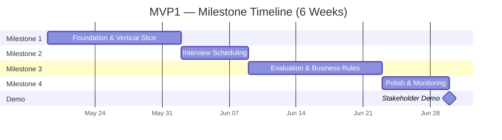
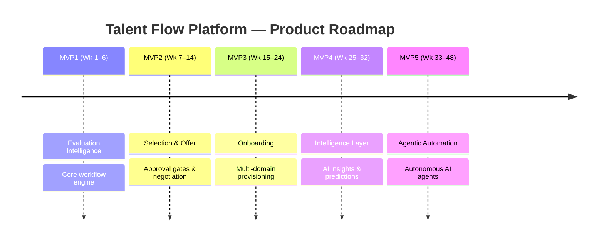

# MVP1 — Talent Flow Platform: Evaluation Intelligence

> **Timeline:** 6 Weeks | **Budget:** $0/month (AWS Free Tier) | **Status:** Ready for Execution

---

## What is MVP1?

MVP1 delivers a **working, end-to-end Evaluation Intelligence workflow** (Stages 1–3) — the foundational engine of the Talent Flow platform. It proves that the platform can orchestrate a real hiring decision through automation: from candidate creation, through interview scheduling and panel evaluation, to a system-generated recommendation — with **no manual handoffs** and **no disconnected tools**.

This is the foundation that every future capability builds on.

---

## What's In Scope

- ✅ Candidate creation and pipeline tracking (real-time status updates)
- ✅ Interview scheduling with automated email notifications to panel members
- ✅ Panel evaluation submission with configurable panel sizes (1–5 members per interview)
- ✅ Automated score aggregation using business-approved scoring weights
- ✅ STRONG_NO veto rule (BR-006) — any panel member's veto auto-rejects, no override
- ✅ Automatic candidate stage advancement based on evaluation outcomes
- ✅ SLA monitoring with breach alerts (e.g., first engagement within 48 hours)
- ✅ Secured access with user authentication and tenant-aware data isolation
- ✅ Production-quality UI with error handling, validation, and responsive design

## What's Deliberately Deferred

- ⏩ Offer generation and approval workflows → **MVP2**
- ⏩ Onboarding orchestration and compliance → **MVP3**
- ⏩ AI-powered insights (sentiment, predictions) → **MVP4**
- ⏩ Autonomous AI agents (sourcing, screening) → **MVP5**

---

## Milestone Breakdown

| Milestone | Timeline | What It Delivers |
|---|---|---|
| **M1 — Foundation & Vertical Slice** | Week 1–2 | A user can **log in**, **create a candidate**, and **see the candidate in a live pipeline** with real-time status updates. The platform's core architecture is operational — secured, tenant-aware, and event-driven from day one. |
| **M2 — Interview Scheduling** | Week 3 | A hiring manager can **schedule interviews** for candidates. Panel members **receive automated email notifications** with interview details. Interviews appear on the candidate's timeline. |
| **M3 — Evaluation & Business Rules** | Week 4–5 | Panel members **submit scored evaluations**. The system **aggregates scores** using approved business rules, **applies the STRONG_NO veto** (BR-006), and **auto-advances the candidate** to the next stage. This is the heart of the platform — proving it orchestrates hiring decisions correctly. |
| **M4 — Polish & Monitoring** | Week 6 | The platform is **production-ready**: SLA monitoring with breach alerts, polished UI, hardened authentication (session management, password reset), and operational dashboards. Ready for stakeholder demo. |

---

## What the Demo Looks Like

In a **20-minute walkthrough**, the Business Analyst and Product Owner will see:

1. **Login** to a secured platform with tenant-aware access
2. **Create a candidate** (Sarah Chen, Senior Software Engineer) — the platform automatically initiates the evaluation workflow with no manual intervention
3. **Schedule an interview** — panel members receive real-time email notifications with meeting details
4. **Submit evaluations** — two panel members score the candidate; the second submits a **STRONG_NO**, triggering an **automatic rejection** per business rule BR-006 (no debate, no override)
5. **See the outcome** — aggregated scores appear instantly, the veto is logged with full transparency, and the candidate's workflow advances automatically
6. **SLA monitoring in action** — a candidate who hasn't received first engagement within 48 hours is flagged with a breach alert, escalated to the hiring manager

**The takeaway:** This is no longer a theoretical solution — it's a working platform that proves the architecture, enforces business rules, and can be extended to all 12 hiring stages.

---

## What MVP1 Unlocks

- 🔓 **Proves the platform works** — moves from architecture documents to a live, working product
- 🔓 **Validates business rules** — scoring weights, veto logic, and SLA enforcement are correct and auditable
- 🔓 **Establishes the extensible foundation** — every future feature (offers, onboarding, AI) builds on this same pattern without rework
- 🔓 **Enables stakeholder confidence** — the PO and BA can see, touch, and validate the product vision
- 🔓 **Clears the path to MVP2** — immediately ready to extend into selection and offer workflows

---

## Full Product Roadmap (High-Level)

| MVP | Theme | What It Adds | Timeline |
|---|---|---|---|
| **MVP1** | Evaluation Intelligence | Core workflow engine — candidate → interview → evaluation → decision | Week 1–6 |
| **MVP2** | Selection & Offer Intelligence | Shortlisting, offer generation, approval gates, candidate negotiation | Week 7–14 |
| **MVP3** | Onboarding Orchestration | Background checks, multi-domain provisioning (IT/Finance), Day-1 readiness | Week 15–24 |
| **MVP4** | Intelligence Layer | AI insights — sentiment analysis, predictive scoring, bias detection | Week 25–32 |
| **MVP5** | Agentic Automation | Autonomous AI agents — sourcing, screening, scheduling, negotiation | Week 33–48 |

---

## Next Steps

1. **Review & Align** — Please review this MVP1 scope and milestone plan. Does it match your product vision?
2. **Confirm Demo Expectations** — Is the demo scenario (candidate → interview → evaluation with veto) the right story to prove the platform?
3. **Greenlight Execution** — Once aligned, I begin **Task 1 (Week 1, Day 1)** immediately

I'm ready to start building. Looking forward to your feedback.

---

## Appendix: Visual Diagrams

### Milestone Timeline (Confluence — Mermaid)

Paste the following into a **Mermaid macro** in Confluence to render the Gantt chart:



### Product Roadmap (Confluence — Mermaid)



### Email-Friendly Milestone Flow (Text Version)

For email where charts won't render, use this:

```
MVP1 — EVALUATION INTELLIGENCE (6 Weeks)

  ┌─────────────────────────────────────────────────────────┐
  │  M1 (Wk 1–2)  →  M2 (Wk 3)  →  M3 (Wk 4–5)  →  M4 (Wk 6)  │
  │  Foundation       Interview      Evaluation       Polish &     │
  │  & Login          Scheduling     & Business       Monitoring   │
  │                                  Rules                         │
  └─────────────────────────────────────────────────────────┘
                                                        ↓
                                                  📋 DEMO DAY
```

**Roadmap at a glance:**

```
MVP1 ━━━━━━━▶ MVP2 ━━━━━━━━▶ MVP3 ━━━━━━━━━━▶ MVP4 ━━━━━━━━▶ MVP5
Evaluation    Selection &    Onboarding        Intelligence   Agentic
Intelligence  Offer          Orchestration     Layer (AI)     Automation
(6 wks)       (8 wks)        (10 wks)          (8 wks)        (16 wks)
```

---

*Document: MVP1-EMAIL-SUMMARY.md | Version: 1.0 | Date: 2026-05-13*
