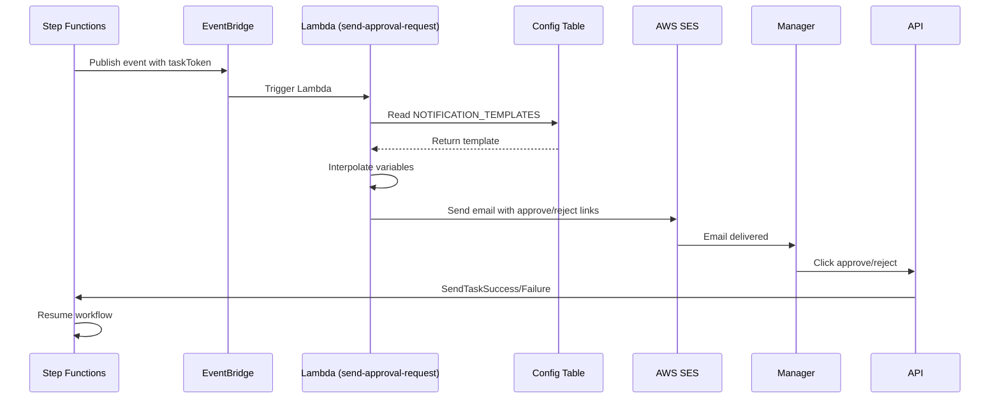

# Step Functions Orchestration - Long-Running Workflows

> **Purpose**: Design patterns for durable, long-running workflows using AWS Step Functions
> **Audience**: Developers, Solution Architects
> **Status**: v1.0 - Implementation Ready

---

## Executive Summary

While Lambda + EventBridge handles short-lived, event-driven processes, **Step Functions** manages long-running workflows that require:
- **Wait states** (hours, days, weeks)
- **Human approvals**
- **Complex branching logic**
- **Saga pattern orchestration**
- **Durable state**

**POC Scope**: Step Functions used only for workflows that genuinely need long-running orchestration (Offer Approval, Background Checks).

**Cost Impact**: Minimal (<$1/month at POC scale due to low execution volume)

---

## When to Use Step Functions vs EventBridge

### Use EventBridge + Lambda When:
✅ Event-driven reactions (fire-and-forget)
✅ Fan-out to multiple consumers
✅ Content-based routing
✅ Immediate processing (<15 minutes)
✅ Independent domain executions

**Examples**:
- Candidate created → Workflow orchestrator triggered
- Vote submitted → Score calculation triggered
- SLA breached → Escalation triggered

---

### Use Step Functions When:
✅ **Long waits** (hours/days/weeks)
✅ **Human approvals** (blocking state until decision)
✅ **Complex conditional branching** (>3 levels deep)
✅ **Saga orchestration** (coordinated multi-step transactions with compensation)
✅ **Retry/error handling** with exponential backoff

**Examples**:
- Offer approval (wait for manager decision, could take days)
- Background check (wait for 3rd party vendor, could take weeks)
- Onboarding sequence (multi-day checklist with human checkpoints)

---

## Pattern 1: Hybrid Orchestration (Recommended for POC)

### Architecture
```
EventBridge (Fast Path)
    ↓
Lambda (Business Logic)
    ↓
Step Functions (Long-Running Only)
    ↓
EventBridge (Resumption Events)
```

### Example: Offer Approval Workflow

**Trigger**: EventBridge event `EvaluationCompleted`
**Handler**: Lambda `offer-generator`
**Action**: Create offer, start Step Functions workflow

```javascript
// Lambda: offer-generator
export const handler = async (event) => {
  const { candidateId, finalDecision } = event.detail;

  if (finalDecision !== 'HIRE') {
    // No offer needed, publish rejection event
    await publishEvent('OfferNotGenerated', { candidateId, reason: 'NO_HIRE' });
    return;
  }

  // Generate offer
  const offer = await createOffer(candidateId);

  // Start Step Functions workflow for approval
  await stepFunctions.startExecution({
    stateMachineArn: process.env.OFFER_APPROVAL_STATE_MACHINE_ARN,
    input: JSON.stringify({
      offerId: offer.offerId,
      candidateId: offer.candidateId,
      position: offer.position,
      salary: offer.salary,
      approvalRequired: true
    })
  });

  return { offerId: offer.offerId };
};
```

---

## Pattern 2: Offer Approval State Machine

### State Machine Definition
```json
{
  "Comment": "Offer approval workflow with human decision point",
  "StartAt": "CreateOfferRecord",
  "States": {
    "CreateOfferRecord": {
      "Type": "Task",
      "Resource": "arn:aws:lambda:us-east-1:123456789012:function:talent-flow-create-offer",
      "ResultPath": "$.offerDetails",
      "Next": "CheckApprovalRequired"
    },

    "CheckApprovalRequired": {
      "Type": "Choice",
      "Choices": [
        {
          "Variable": "$.approvalRequired",
          "BooleanEquals": true,
          "Next": "SendApprovalRequest"
        }
      ],
      "Default": "AutoApprove"
    },

    "SendApprovalRequest": {
      "Type": "Task",
      "Resource": "arn:aws:lambda:us-east-1:123456789012:function:talent-flow-send-approval-request",
      "ResultPath": "$.approvalRequestSent",
      "Next": "WaitForApproval"
    },

    "WaitForApproval": {
      "Type": "Task",
      "Resource": "arn:aws:states:::aws-sdk:eventbridge:putEvents.waitForTaskToken",
      "Parameters": {
        "Entries": [
          {
            "Source": "talent-flow.offer",
            "DetailType": "OfferApprovalPending",
            "Detail": {
              "offerId.$": "$.offerId",
              "candidateId.$": "$.candidateId",
              "taskToken.$": "$$.Task.Token"
            },
            "EventBusName": "talent-flow-bus"
          }
        ]
      },
      "ResultPath": "$.approvalDecision",
      "Next": "CheckApprovalDecision",
      "Catch": [
        {
          "ErrorEquals": ["States.Timeout"],
          "Next": "ApprovalTimeout",
          "ResultPath": "$.error"
        }
      ],
      "HeartbeatSeconds": 86400,
      "TimeoutSeconds": 604800
    },

    "CheckApprovalDecision": {
      "Type": "Choice",
      "Choices": [
        {
          "Variable": "$.approvalDecision.decision",
          "StringEquals": "APPROVED",
          "Next": "SendOfferToCandidate"
        },
        {
          "Variable": "$.approvalDecision.decision",
          "StringEquals": "REJECTED",
          "Next": "OfferRejectedByManager"
        }
      ],
      "Default": "OfferRejectedByManager"
    },

    "SendOfferToCandidate": {
      "Type": "Task",
      "Resource": "arn:aws:lambda:us-east-1:123456789012:function:talent-flow-send-offer",
      "ResultPath": "$.offerSent",
      "Next": "WaitForCandidateResponse"
    },

    "WaitForCandidateResponse": {
      "Type": "Task",
      "Resource": "arn:aws:states:::aws-sdk:eventbridge:putEvents.waitForTaskToken",
      "Parameters": {
        "Entries": [
          {
            "Source": "talent-flow.offer",
            "DetailType": "OfferSentToCandidate",
            "Detail": {
              "offerId.$": "$.offerId",
              "candidateId.$": "$.candidateId",
              "taskToken.$": "$$.Task.Token",
              "expiresAt": "2024-05-20T00:00:00Z"
            },
            "EventBusName": "talent-flow-bus"
          }
        ]
      },
      "ResultPath": "$.candidateDecision",
      "Next": "ProcessCandidateDecision",
      "Catch": [
        {
          "ErrorEquals": ["States.Timeout"],
          "Next": "CandidateOfferExpired",
          "ResultPath": "$.error"
        }
      ],
      "TimeoutSeconds": 604800
    },

    "ProcessCandidateDecision": {
      "Type": "Choice",
      "Choices": [
        {
          "Variable": "$.candidateDecision.decision",
          "StringEquals": "ACCEPTED",
          "Next": "OfferAccepted"
        },
        {
          "Variable": "$.candidateDecision.decision",
          "StringEquals": "DECLINED",
          "Next": "OfferDeclined"
        }
      ],
      "Default": "OfferDeclined"
    },

    "OfferAccepted": {
      "Type": "Task",
      "Resource": "arn:aws:lambda:us-east-1:123456789012:function:talent-flow-offer-accepted",
      "ResultPath": "$.acceptedResult",
      "Next": "PublishOfferAcceptedEvent"
    },

    "PublishOfferAcceptedEvent": {
      "Type": "Task",
      "Resource": "arn:aws:states:::events:putEvents",
      "Parameters": {
        "Entries": [
          {
            "Source": "talent-flow.offer",
            "DetailType": "OfferAccepted",
            "Detail": {
              "offerId.$": "$.offerId",
              "candidateId.$": "$.candidateId",
              "acceptedAt.$": "$$.State.EnteredTime"
            },
            "EventBusName": "talent-flow-bus"
          }
        ]
      },
      "End": true
    },

    "OfferDeclined": {
      "Type": "Task",
      "Resource": "arn:aws:lambda:us-east-1:123456789012:function:talent-flow-offer-declined",
      "End": true
    },

    "OfferRejectedByManager": {
      "Type": "Task",
      "Resource": "arn:aws:lambda:us-east-1:123456789012:function:talent-flow-offer-manager-rejected",
      "End": true
    },

    "ApprovalTimeout": {
      "Type": "Task",
      "Resource": "arn:aws:lambda:us-east-1:123456789012:function:talent-flow-approval-timeout",
      "End": true
    },

    "CandidateOfferExpired": {
      "Type": "Task",
      "Resource": "arn:aws:lambda:us-east-1:123456789012:function:talent-flow-offer-expired",
      "End": true
    },

    "AutoApprove": {
      "Type": "Pass",
      "Result": {
        "decision": "APPROVED",
        "approvedBy": "SYSTEM",
        "reason": "Below auto-approval threshold"
      },
      "ResultPath": "$.approvalDecision",
      "Next": "SendOfferToCandidate"
    }
  }
}
```

---

## Pattern 3: Callback Pattern (Human Approval)

### How It Works
1. Step Functions enters "wait state" with `.waitForTaskToken`
2. Step Functions publishes event with `taskToken` to EventBridge
3. EventBridge rule triggers Lambda → sends email/notification
4. Manager clicks "Approve" or "Reject" link
5. API Gateway → Lambda → `SendTaskSuccess` or `SendTaskFailure`
6. Step Functions resumes with decision

### Lambda: Send Approval Request
```javascript
// send-approval-request.js
export const handler = async (event) => {
  const { offerId, candidateId, taskToken } = event;

  // Store task token in DynamoDB (for later retrieval)
  await dynamoDb.send(new PutItemCommand({
    TableName: 'talent-flow-state',
    Item: {
      PK: `OFFER#${offerId}`,
      SK: 'APPROVAL_TOKEN',
      taskToken,
      candidateId,
      status: 'PENDING',
      createdAt: new Date().toISOString(),
      ttl: Math.floor(Date.now() / 1000) + (7 * 24 * 60 * 60) // 7 day TTL
    }
  }));

  // Send email to manager
  await sendEmail({
    to: 'manager@company.com',
    subject: `Approval Required: Offer for ${candidateName}`,
    body: `
      Please review and approve/reject the offer:

      Candidate: ${candidateName}
      Position: ${position}
      Salary: $${salary}

      [Approve](https://talent-flow.com/api/approval/${offerId}/approve)
      [Reject](https://talent-flow.com/api/approval/${offerId}/reject)
    `
  });

  return { approvalRequestSent: true };
};
```

### Lambda: Process Approval Decision
```javascript
// process-approval-decision.js
import { SFNClient, SendTaskSuccessCommand, SendTaskFailureCommand } from "@aws-sdk/client-sfn";

const sfn = new SFNClient({});

export const handler = async (event) => {
  const { offerId, decision } = event; // decision: 'APPROVED' | 'REJECTED'

  // Retrieve task token from DynamoDB
  const result = await dynamoDb.send(new GetItemCommand({
    TableName: 'talent-flow-state',
    Key: {
      PK: `OFFER#${offerId}`,
      SK: 'APPROVAL_TOKEN'
    }
  }));

  if (!result.Item) {
    throw new Error('Task token not found');
  }

  const taskToken = result.Item.taskToken;

  if (decision === 'APPROVED') {
    // Resume Step Functions with success
    await sfn.send(new SendTaskSuccessCommand({
      taskToken,
      output: JSON.stringify({
        decision: 'APPROVED',
        approvedBy: 'MANAGER-123',
        approvedAt: new Date().toISOString()
      })
    }));
  } else {
    // Resume Step Functions with rejection
    await sfn.send(new SendTaskFailureCommand({
      taskToken,
      error: 'OfferRejected',
      cause: 'Manager rejected the offer'
    }));
  }

  // Update DynamoDB status
  await dynamoDb.send(new UpdateItemCommand({
    TableName: 'talent-flow-state',
    Key: { PK: `OFFER#${offerId}`, SK: 'APPROVAL_TOKEN' },
    UpdateExpression: 'SET #status = :status, #decision = :decision',
    ExpressionAttributeNames: { '#status': 'status', '#decision': 'decision' },
    ExpressionAttributeValues': { ':status': 'COMPLETED', ':decision': decision }
  }));

  return { success: true };
};
```

---

## Pattern 4: Background Check Workflow (Multi-Week Wait)

### State Machine Definition
```json
{
  "Comment": "Background check workflow with external vendor integration",
  "StartAt": "InitiateBackgroundCheck",
  "States": {
    "InitiateBackgroundCheck": {
      "Type": "Task",
      "Resource": "arn:aws:lambda:::function:talent-flow-initiate-background-check",
      "ResultPath": "$.backgroundCheckRequest",
      "Next": "WaitForBackgroundCheckCompletion"
    },

    "WaitForBackgroundCheckCompletion": {
      "Type": "Task",
      "Resource": "arn:aws:states:::aws-sdk:eventbridge:putEvents.waitForTaskToken",
      "Parameters": {
        "Entries": [
          {
            "Source": "talent-flow.onboarding",
            "DetailType": "BackgroundCheckInitiated",
            "Detail": {
              "candidateId.$": "$.candidateId",
              "checkId.$": "$.backgroundCheckRequest.checkId",
              "taskToken.$": "$$.Task.Token"
            },
            "EventBusName": "talent-flow-bus"
          }
        ]
      },
      "ResultPath": "$.backgroundCheckResult",
      "Next": "EvaluateBackgroundCheck",
      "Catch": [
        {
          "ErrorEquals": ["States.Timeout"],
          "Next": "BackgroundCheckTimeout"
        }
      ],
      "TimeoutSeconds": 2592000
    },

    "EvaluateBackgroundCheck": {
      "Type": "Choice",
      "Choices": [
        {
          "Variable": "$.backgroundCheckResult.status",
          "StringEquals": "CLEAR",
          "Next": "BackgroundCheckPassed"
        },
        {
          "Variable": "$.backgroundCheckResult.status",
          "StringEquals": "FLAGGED",
          "Next": "BackgroundCheckFlagged"
        }
      ],
      "Default": "BackgroundCheckFailed"
    },

    "BackgroundCheckPassed": {
      "Type": "Task",
      "Resource": "arn:aws:states:::events:putEvents",
      "Parameters": {
        "Entries": [
          {
            "Source": "talent-flow.onboarding",
            "DetailType": "BackgroundCheckPassed",
            "Detail": {
              "candidateId.$": "$.candidateId"
            },
            "EventBusName": "talent-flow-bus"
          }
        ]
      },
      "End": true
    },

    "BackgroundCheckFlagged": {
      "Type": "Task",
      "Resource": "arn:aws:lambda:::function:talent-flow-background-check-review",
      "Next": "WaitForManualReview"
    },

    "WaitForManualReview": {
      "Type": "Task",
      "Resource": "arn:aws:states:::aws-sdk:eventbridge:putEvents.waitForTaskToken",
      "Parameters": {
        "Entries": [
          {
            "Source": "talent-flow.onboarding",
            "DetailType": "BackgroundCheckReviewRequired",
            "Detail": {
              "candidateId.$": "$.candidateId",
              "taskToken.$": "$$.Task.Token"
            },
            "EventBusName": "talent-flow-bus"
          }
        ]
      },
      "ResultPath": "$.reviewDecision",
      "Next": "ProcessReviewDecision",
      "TimeoutSeconds": 604800
    },

    "ProcessReviewDecision": {
      "Type": "Choice",
      "Choices": [
        {
          "Variable": "$.reviewDecision.decision",
          "StringEquals": "APPROVED",
          "Next": "BackgroundCheckPassed"
        }
      ],
      "Default": "BackgroundCheckFailed"
    },

    "BackgroundCheckFailed": {
      "Type": "Task",
      "Resource": "arn:aws:lambda:::function:talent-flow-background-check-failed",
      "End": true
    },

    "BackgroundCheckTimeout": {
      "Type": "Task",
      "Resource": "arn:aws:lambda:::function:talent-flow-background-check-timeout",
      "End": true
    }
  }
}
```

---

## Pattern 5: Saga Pattern with Compensation

### Use Case: Offer Accepted → Onboarding Initiation

If onboarding fails after offer accepted, need to compensate (reverse offer acceptance).

### State Machine with Compensation
```json
{
  "Comment": "Saga pattern with compensation for onboarding failures",
  "StartAt": "AcceptOffer",
  "States": {
    "AcceptOffer": {
      "Type": "Task",
      "Resource": "arn:aws:lambda:::function:talent-flow-accept-offer",
      "ResultPath": "$.offerAccepted",
      "Next": "CreateOnboardingRecord",
      "Catch": [
        {
          "ErrorEquals": ["States.ALL"],
          "Next": "CompensateOfferAcceptance",
          "ResultPath": "$.error"
        }
      ]
    },

    "CreateOnboardingRecord": {
      "Type": "Task",
      "Resource": "arn:aws:lambda:::function:talent-flow-create-onboarding",
      "ResultPath": "$.onboardingRecord",
      "Next": "InitiateBackgroundCheck",
      "Catch": [
        {
          "ErrorEquals": ["States.ALL"],
          "Next": "CompensateOnboardingRecord",
          "ResultPath": "$.error"
        }
      ]
    },

    "InitiateBackgroundCheck": {
      "Type": "Task",
      "Resource": "arn:aws:lambda:::function:talent-flow-initiate-background-check",
      "ResultPath": "$.backgroundCheck",
      "Next": "SendWelcomeEmail",
      "Catch": [
        {
          "ErrorEquals": ["States.ALL"],
          "Next": "CompensateBackgroundCheck",
          "ResultPath": "$.error"
        }
      ]
    },

    "SendWelcomeEmail": {
      "Type": "Task",
      "Resource": "arn:aws:lambda:::function:talent-flow-send-welcome-email",
      "End": true
    },

    "CompensateBackgroundCheck": {
      "Type": "Task",
      "Resource": "arn:aws:lambda:::function:talent-flow-cancel-background-check",
      "ResultPath": "$.compensation.backgroundCheck",
      "Next": "CompensateOnboardingRecord"
    },

    "CompensateOnboardingRecord": {
      "Type": "Task",
      "Resource": "arn:aws:lambda:::function:talent-flow-delete-onboarding",
      "ResultPath": "$.compensation.onboarding",
      "Next": "CompensateOfferAcceptance"
    },

    "CompensateOfferAcceptance": {
      "Type": "Task",
      "Resource": "arn:aws:lambda:::function:talent-flow-reverse-offer",
      "ResultPath": "$.compensation.offer",
      "Next": "SagaFailed"
    },

    "SagaFailed": {
      "Type": "Fail",
      "Cause": "Saga compensation completed",
      "Error": "OnboardingInitiationFailed"
    }
  }
}
```

---

## Cost Analysis

### Step Functions Pricing (POC)
- **Standard Workflows**: $0.025 per 1,000 state transitions
- **Express Workflows**: $1.00 per 1M requests + duration

### POC Volume Estimate
- Offer approvals: 10 candidates/month
- State transitions per execution: ~15 states
- Total: 10 × 15 = 150 state transitions/month

**Cost**: 150 / 1000 × $0.025 = **$0.004/month** (negligible)

### At 100x Scale (Production)
- 1,000 candidates/month
- 15,000 state transitions/month
- **Cost**: $0.38/month (still negligible)

---

## Best Practices

### 1. Keep State Machines Focused
❌ Don't: One mega state machine for entire candidate lifecycle
✅ Do: Separate state machines per domain
- `offer-approval-workflow`
- `background-check-workflow`
- `onboarding-checklist-workflow`

### 2. Use EventBridge for Triggering
❌ Don't: Direct Lambda → Step Functions invocation
✅ Do: Lambda → EventBridge → Step Functions
- Decouples event producers from workflow orchestration
- Allows multiple consumers of same event

### 3. Store Task Tokens in DynamoDB
✅ Enables callback pattern resumption
✅ Allows querying "who's waiting for what"
✅ TTL for automatic cleanup

### 4. Set Realistic Timeouts
- Offer approval: 7 days
- Background check: 30 days
- Onboarding checklist: 90 days

### 5. Use Exponential Backoff for Retries
```json
{
  "Retry": [
    {
      "ErrorEquals": ["States.TaskFailed"],
      "IntervalSeconds": 2,
      "MaxAttempts": 3,
      "BackoffRate": 2.0
    }
  ]
}
```

---

## Monitoring & Alerting

### CloudWatch Metrics
- `ExecutionsFailed` (alert if >5% failure rate)
- `ExecutionsTimedOut` (alert if any timeout)
- `ExecutionTime` (P95, P99 latency)

### CloudWatch Alarms
```yaml
OfferApprovalTimeoutAlarm:
  Threshold: 1 execution timeout
  Action: SNS → PagerDuty
  Severity: HIGH
```

---

## Testing Strategy

### Local Testing
```bash
# Use Step Functions Local (Docker)
docker run -p 8083:8083 amazon/aws-stepfunctions-local

# Execute state machine
aws stepfunctions start-execution \
  --endpoint http://localhost:8083 \
  --state-machine-arn arn:aws:states:local:123456789012:stateMachine:offer-approval \
  --input file://test-input.json
```

### Integration Testing
```javascript
// Test callback pattern
it('should resume workflow when approval received', async () => {
  // 1. Start execution
  const execution = await stepFunctions.startExecution({
    stateMachineArn: OFFER_APPROVAL_ARN,
    input: JSON.stringify(mockOffer)
  });

  // 2. Wait for workflow to reach "WaitForApproval" state
  await waitForState(execution.executionArn, 'WaitForApproval', 5000);

  // 3. Retrieve task token from DynamoDB
  const token = await getTaskToken(mockOffer.offerId);

  // 4. Send approval
  await stepFunctions.sendTaskSuccess({
    taskToken: token,
    output: JSON.stringify({ decision: 'APPROVED' })
  });

  // 5. Wait for execution to complete
  const result = await waitForCompletion(execution.executionArn, 10000);

  expect(result.status).toBe('SUCCEEDED');
});
```

---

## Migration from POC to Production

### POC Approach
- Minimal Step Functions (only offer approval + background check)
- Standard Workflows (cheaper, simpler)

### Production Approach
- Comprehensive workflows for all long-running processes
- Express Workflows for high-throughput short-duration tasks
- X-Ray tracing enabled
- CloudWatch Logs integration

---

## Next Steps

1. ✅ Review Step Functions patterns
2. ⏸️ Decide which workflows need Step Functions vs pure EventBridge
3. ⏸️ Create Terraform modules for state machines
4. ⏸️ Implement callback pattern for human approvals
5. ⏸️ Deploy and test offer approval workflow

---

**End of Step Functions Orchestration Guide**

---
---

## 🆕 v2.0 Addendum: Metadata-Lite Architecture Updates

> **Added**: 2026-05-15
> **Document Version**: 2.0
> **Context**: MVP1 evolved to Metadata-Lite architecture (externalized Variable Six)
> **See**: MVP1-FOUNDATION-PLAN-v2.md, PROJECT_CONTEXT.md (Session Checkpoint 2026-05-15)

---

### What Changed in v2.0

**v1.0**: Step Functions state machines used hardcoded approval thresholds and notification templates.

**v2.0**: Step Functions will read approval rules and notification templates from `talent-flow-config` table (config-driven).

**Note**: Step Functions are **MVP2 scope** (Stages 4-12: Offer Approval, Background Checks, Onboarding). v2.0 updates documented here for completeness, but not implemented in MVP1.

---

### Config-Driven Approval Rules (MVP2)

#### What Will Change in MVP2

**v1.0 (Hardcoded)**:
```javascript
// Offer Approval State Machine - hardcoded approval logic
"CheckApprovalRequired": {
  "Type": "Choice",
  "Choices": [
    {
      "Variable": "$.salary",
      "NumericGreaterThan": 150000,
      "Next": "SendApprovalRequest"
    }
  ],
  "Default": "AutoApprove"
}
```

**v2.0 (Config-Driven)**:
```javascript
// Approval threshold read from config table
"GetApprovalConfig": {
  "Type": "Task",
  "Resource": "arn:aws:lambda:...:function:config-manager",
  "Parameters": {
    "action": "getActiveConfig",
    "tenantId.$": "$.tenantId",
    "configType": "APPROVAL_RULES"
  },
  "ResultPath": "$.approvalConfig",
  "Next": "CheckApprovalRequired"
},

"CheckApprovalRequired": {
  "Type": "Choice",
  "Choices": [
    {
      "Variable": "$.salary",
      "NumericGreaterThanPath": "$.approvalConfig.data.salaryThresholds[0].min",
      "Next": "SendApprovalRequest"
    }
  ],
  "Default": "AutoApprove"
}
```

**Impact**:
- ✅ **Banking Tenant**: Requires C-level approval for all offers (threshold: $0)
- ✅ **Tech Startup**: Auto-approves all offers <$200K (threshold: $200,000)
- ✅ **Agriculture**: No approval required (threshold: ∞)

---

### Config-Driven Notification Templates (MVP2)

#### What Will Change in MVP2

**v1.0 (Hardcoded)**:
```javascript
// Lambda: send-approval-request.js (hardcoded email template)
const emailBody = `
Dear ${managerName},

Please review the offer for ${candidateName}:
Position: ${position}
Salary: ${salary}

Click here to approve: ${approveLink}
Click here to reject: ${rejectLink}
`;
```

**v2.0 (Config-Driven)**:
```javascript
// Lambda: send-approval-request.js (reads template from config)
const { getActiveConfig } = require('./shared/config-reader');

const templateConfig = await getActiveConfig(tenantId, 'NOTIFICATION_TEMPLATES');
const template = templateConfig.data.OFFER_APPROVAL_REQUEST;

// Interpolate variables
let emailBody = template.body;
emailBody = emailBody.replace('{{managerName}}', managerName);
emailBody = emailBody.replace('{{candidateName}}', candidateName);
emailBody = emailBody.replace('{{position}}', position);
emailBody = emailBody.replace('{{salary}}', salary);
emailBody = emailBody.replace('{{approveLink}}', approveLink);
emailBody = emailBody.replace('{{rejectLink}}', rejectLink);
```

**Impact**:
- ✅ **Banking**: Formal language, compliance disclaimers
- ✅ **Tech Startup**: Casual tone, emoji-friendly
- ✅ **Agriculture**: Bilingual templates (English + Afrikaans)

---

### Callback Pattern with Config (MVP2)

**Step Functions → EventBridge → Lambda → Email with Config Template**



---

### Design Decision: When to Read Config

**Option 1: Read Config at State Machine Start** (❌ Not Recommended)
- State machine execution starts
- First state: GetApprovalConfig Lambda
- Store config in execution context
- Use throughout workflow

**Downside**: If config changes mid-execution (e.g., 3-day approval wait), state machine uses stale config.

**Option 2: Read Config Just-In-Time** (✅ Recommended for MVP2)
- Each Lambda that needs config reads it when invoked
- Always uses current active config
- 5-min cache in Lambda reduces DynamoDB reads

**Example**: `send-approval-request` Lambda reads notification template config when triggered (not at workflow start).

**Rationale**: Approval workflows can take days/weeks. Config may change during execution (e.g., HR updates email template). Just-in-time reads ensure latest config used.

**Contrast with Scoring Weights**: Candidate evaluations lock to config version (fairness requirement). Approval workflows use active config (operational policy).

---

### MVP2 Lambda Updates Needed

When implementing Step Functions in MVP2, update these Lambdas:

1. **send-approval-request.js**
   - Add `config-reader.js` import
   - Read `NOTIFICATION_TEMPLATES` config
   - Interpolate template variables
   - Send email via SES

2. **process-approval-decision.js**
   - No config needed (just calls SendTaskSuccess/Failure)

3. **initiate-background-check.js**
   - Read `STAGE_ENABLEMENT` config
   - Check if background checks enabled for this tenant
   - If disabled, skip background check state machine

4. **send-offer-email.js**
   - Read `NOTIFICATION_TEMPLATES` config
   - Get `OFFER_EXTENDED` template
   - Interpolate variables (candidateName, position, salary, benefits, startDate)
   - Send email via SES

---

### Config Schema for Approval Rules (Reference)

See `DYNAMODB_SCHEMA_DESIGN.md v2.0 Addendum` for complete schema.

**Example**:
```json
{
  "configType": "APPROVAL_RULES",
  "data": {
    "salaryThresholds": [
      { "max": 150000, "approvers": [] },                         // Auto-approve
      { "min": 150001, "max": 200000, "approvers": ["MANAGER"] },
      { "min": 200001, "approvers": ["MANAGER", "C_LEVEL"] }
    ],
    "levelThresholds": {
      "Junior": { "approvers": [] },
      "Mid": { "approvers": ["MANAGER"] },
      "Senior": { "approvers": ["MANAGER", "C_LEVEL"] },
      "Staff": { "approvers": ["C_LEVEL", "BOARD"] },
      "Principal": { "approvers": ["C_LEVEL", "BOARD"] }
    }
  }
}
```

---

### Summary of v2.0 Changes (MVP2 Scope)

**What's New** (when MVP2 is implemented):
- ✅ Approval thresholds read from `APPROVAL_RULES` config
- ✅ Notification templates read from `NOTIFICATION_TEMPLATES` config
- ✅ Stage enablement checks (skip background checks if disabled for tenant)
- ✅ Just-in-time config reads (always use active config, not stale)

**What This Enables** (MVP2):
- ✅ **Banking Tenant**: All offers require C-level approval (compliance requirement)
- ✅ **Tech Startup**: Auto-approve all offers <$200K (move fast)
- ✅ **Agriculture**: No approval required (flat hierarchy)
- ✅ **Brand Consistency**: Email templates match tenant's brand voice

**Implementation Timeline**:
- MVP1 (Week 1-7): Config infrastructure built (table, config-reader, admin UI)
- **MVP2 (Week 8-11)**: Step Functions implemented with config-driven approvals

**Cost Impact**: No additional cost (config reads already accounted for in v2.0)

**Performance Impact**: +10-15ms per Lambda invocation (config read), negligible for long-running workflows (minutes to days)

---

**v2.0 Addendum Complete**
**Last Updated**: 2026-05-15
**Related Documents**:
- MVP1-FOUNDATION-PLAN-v2.md (execution plan)
- LAMBDA_CATALOG.md v2.0 Addendum (Lambda updates)
- DYNAMODB_SCHEMA_DESIGN.md v2.0 Addendum (config table schema)
- PROJECT_CONTEXT.md (Session Checkpoint 2026-05-15)
