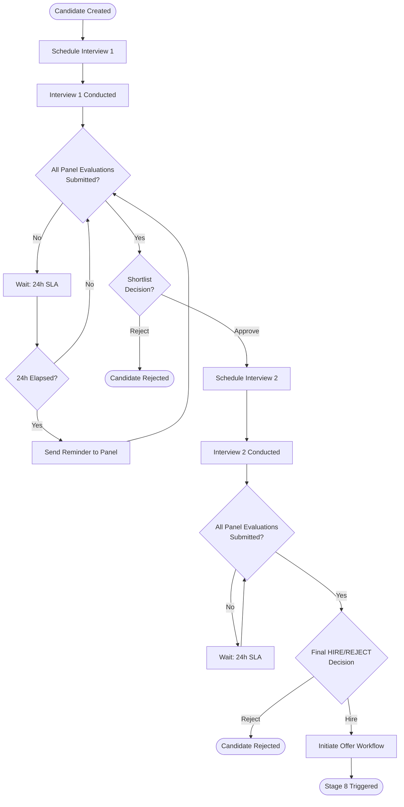
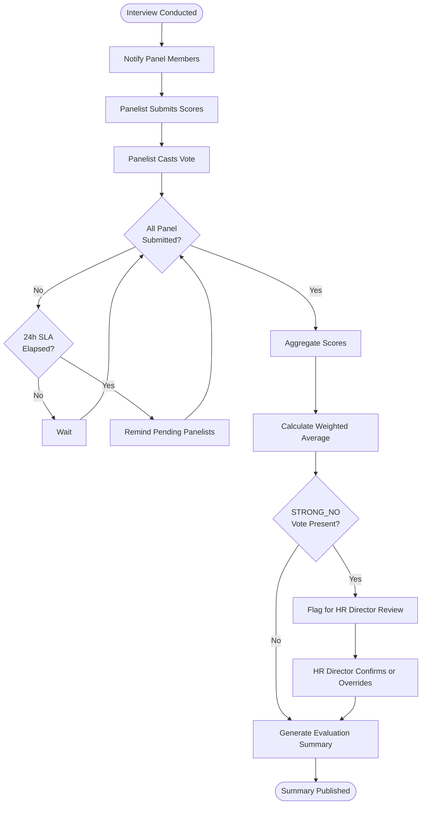
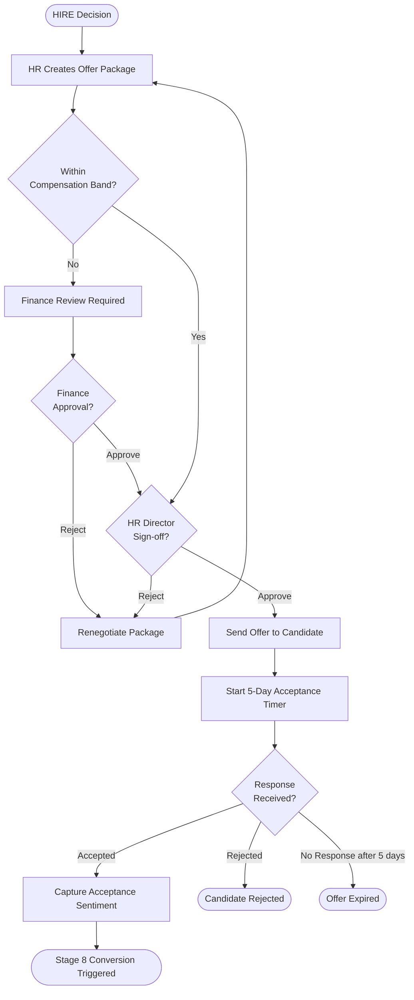
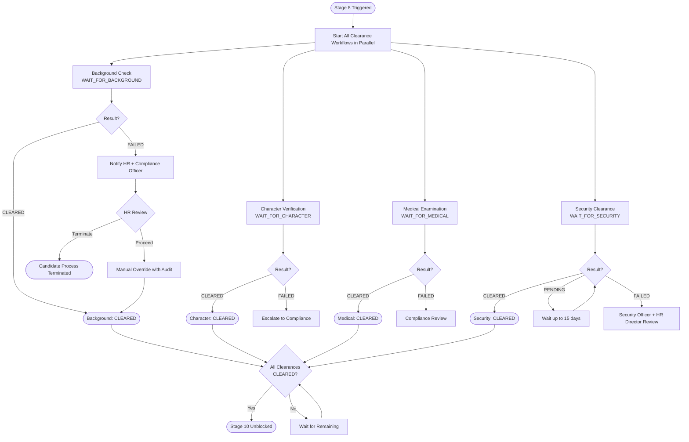
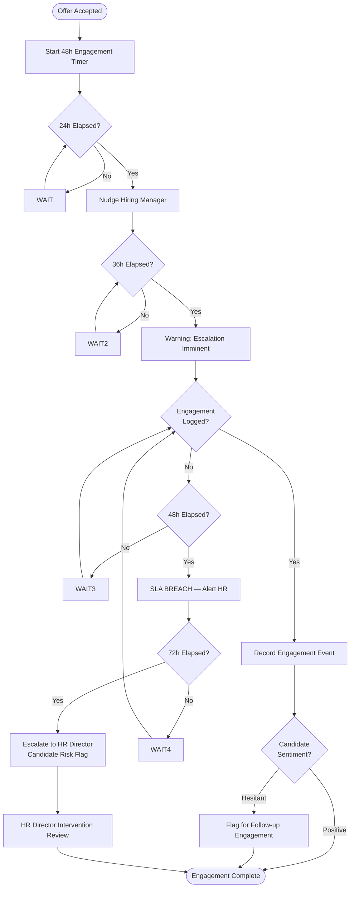
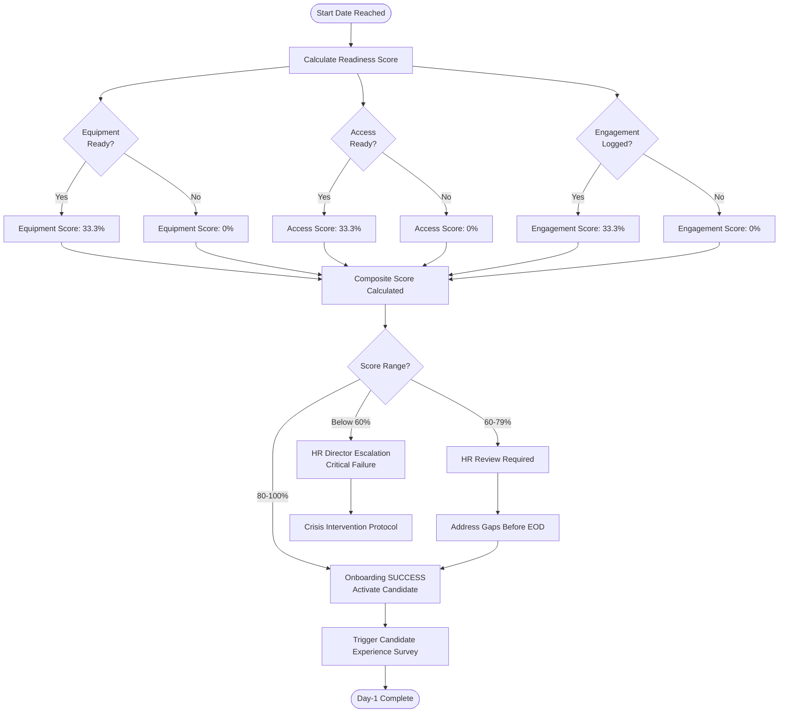
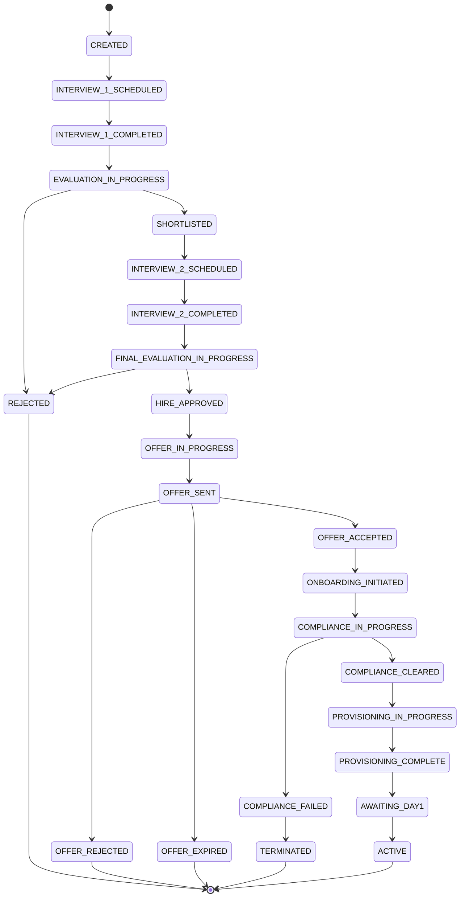
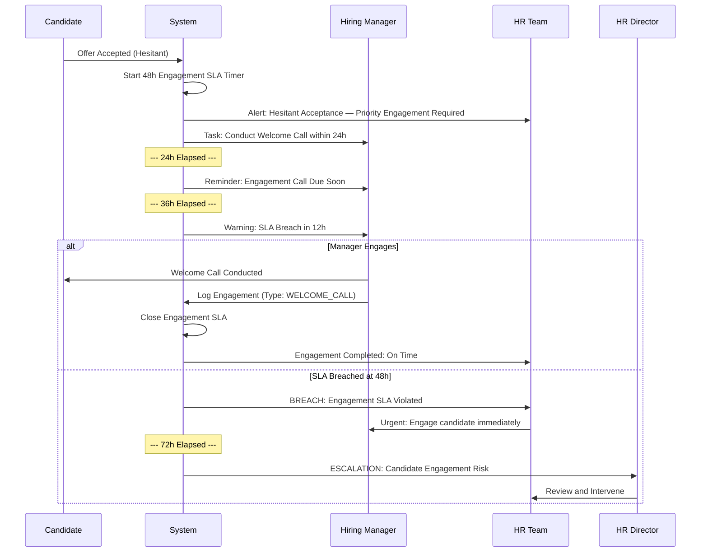

# Talent Flow Platform
# Business Requirements & Process Engineering Document
## Version 1.0 — 11 May 2026
### Classification: Internal Product Definition | Pre-Architecture Phase

---

> **Document Purpose**
> This document defines the complete business process engineering, operational workflow design, stakeholder analysis, domain modeling, BPMN flows, SLA frameworks, and business rules catalogue for the Talent Flow Platform.
> It is intentionally infrastructure-agnostic. Architecture Version 1 is a downstream deliverable.

---

## Table of Contents

1. Executive Summary
2. Product Positioning
3. Stakeholder Analysis
4. Business Capability Map
5. End-to-End Business Process Engineering
6. BPMN Process Diagrams
7. Workflow State Definitions
8. Domain & Entity Modeling
9. UML Diagrams
10. User Journey Engineering
11. Business Rules Catalogue
12. SLA & Operational Intelligence Framework
13. Exception & Failure Engineering
14. Reporting & Operational Analytics
15. Future AI/Agentic Readiness

---

# 1. Executive Summary

## 1.1 Vision

The Talent Flow Platform is an enterprise-grade Talent Operations Orchestration Platform designed to eliminate the operational black hole that exists between offer acceptance and successful Day-1 onboarding.

The platform transforms hiring from a series of disconnected administrative tasks into a measurable, orchestrated, and accountable operational workflow.

The foundational strategic principle is:

> **"The process itself becomes the product."**

## 1.2 Product Goals

- Eliminate candidate ghosting through proactive engagement SLAs
- Create a single operational system of record for the full talent lifecycle
- Provide measurable onboarding readiness scores before Day 1
- Enforce compliance as a workflow prerequisite, not an afterthought
- Enable configurable onboarding flows across industries (standard, government, banking, agricultural)
- Provide operational intelligence that identifies bottlenecks in real time
- Create a foundation for AI-assisted workflow automation in future phases

## 1.3 Operational Goals

- Reduce average time-to-first-engagement to under 48 hours from offer acceptance
- Achieve 100% Day-1 readiness on equipment, access, and engagement dimensions
- Reduce offer acceptance-to-onboarding dropout rate by 40%+
- Reduce compliance workflow cycle time by eliminating manual tracking
- Enable HR leaders to identify provisioning and engagement bottlenecks in real time
- Create an immutable audit trail for every workflow transition for regulatory compliance

## 1.4 Business Problem Statement

### The Industry Problem

Most organisations operate HR as a series of handoffs:
- Recruitment team closes → Hands off to HR operations
- HR operations completes paperwork → Hands off to IT
- IT provisions → Candidate arrives on Day 1, unprepared
- Manager receives new joiner → Has had no engagement since offer letter

This results in:
- Candidates who accepted offers ghosting before Day 1 (industry rate: 15–22%)
- Day-1 failures where equipment, access, or introductions are not ready
- Compliance gaps discovered after the candidate has started
- No visibility into which department caused onboarding failure
- Inability to measure or improve the onboarding experience systematically

### The Talent Flow Answer

Talent Flow treats onboarding as a **workflow orchestration problem**, not a documentation problem.

By defining every lifecycle stage as a workflow state, every stakeholder as an actor with operational accountability, and every KPI as a measurable SLA, the platform transforms onboarding into a managed operational system with end-to-end visibility.

---

# 2. Product Positioning

## 2.1 What the Platform IS

| Dimension | Description |
|---|---|
| **Category** | Talent Operations Orchestration Platform |
| **Core Function** | Workflow orchestration for the full talent lifecycle |
| **Primary Value** | Operational accountability + engagement intelligence + readiness measurement |
| **Target Market** | Enterprise HR, Government departments, Banking/Finance, Regulated industries |
| **Commercial Model** | SaaS, multi-tenant, configurable workflow templates per industry |

## 2.2 What the Platform is NOT

| NOT | Reason |
|---|---|
| A simple ATS | It does not manage job postings or candidate sourcing |
| A recruitment portal | It begins at first interview, not at job advertisement |
| A document verification system | Documents are inputs, not the product |
| A static onboarding checklist | Workflows are dynamic, state-driven, and orchestrated |
| A CRUD HR system | The workflow engine, not data storage, is the core |

## 2.3 Strategic Differentiation

### Differentiator 1 — Engagement as an SLA

Most systems record that a welcome call happened. Talent Flow enforces it as a timed operational commitment with escalation paths if it fails.

### Differentiator 2 — Configurable Workflow Templates

The platform does not hardcode a 12-step process. It stores onboarding flows as configurable JSON templates, enabling the same engine to run government clearance workflows, banking compliance workflows, and rapid-hire agricultural workflows.

### Differentiator 3 — Dual-Ledger Operational Intelligence

The platform maintains two operational layers:
- **System of Record** — current state for fast operational reads
- **System of Truth** — immutable event ledger for audit and compliance

### Differentiator 4 — The Conversion Point

Step 8 (Offer Accepted) is the platform's orchestration trigger — the moment every downstream workflow (provisioning, compliance, engagement) is activated simultaneously, not sequentially.

### Differentiator 5 — Government-Ready Compliance Engine

The platform natively supports statutory clearance workflows with wait-state orchestration, making it suitable for government onboarding where compliance is a prerequisite, not an administrative add-on.

---

# 3. Stakeholder Analysis

## 3.1 HR Operations Manager

| Dimension | Detail |
|---|---|
| **Primary Role** | Manages full onboarding pipeline for multiple candidates simultaneously |
| **Responsibilities** | Create candidate records, initiate evaluations, manage offer workflows, monitor compliance, track readiness |
| **Goals** | Reduce manual follow-up, gain visibility into where each candidate is, close the feedback loop at Day 1 |
| **Frustrations** | Siloed systems, manual status chasing, reactive discovery of compliance failures, cannot see IT provisioning status |
| **KPIs** | Offer acceptance rate, time-to-onboard, compliance completion rate, Day-1 readiness rate |
| **System Interactions** | Dashboard, candidate pipeline view, workflow monitoring, SLA alerts, compliance tracking |

## 3.2 Hiring Manager

| Dimension | Detail |
|---|---|
| **Primary Role** | Makes final hiring decisions, responsible for candidate engagement post-offer |
| **Responsibilities** | Participate in evaluation, cast final vote, conduct welcome call within 48h |
| **Goals** | Hire the right person, ensure smooth team integration, avoid Day-1 onboarding failure |
| **Frustrations** | No visibility into onboarding progress, unclear when to engage candidate, no accountability tracking |
| **KPIs** | Evaluation quality score, engagement timeliness (48h SLA), interview vote completion rate |
| **System Interactions** | Evaluation workspace, voting panel, engagement scheduling, SLA alert notifications |

## 3.3 Interview Panel Member

| Dimension | Detail |
|---|---|
| **Primary Role** | Technical or behavioural evaluator in the interview process |
| **Responsibilities** | Score candidate across dimensions, submit panel vote, provide detailed feedback |
| **Goals** | Complete evaluation accurately, collaborate with panel, contribute to objective hiring decision |
| **Frustrations** | Unstructured feedback capture, no visibility into other panelists' views, disconnected scoring |
| **KPIs** | Evaluation submission rate, feedback quality score, time to submit evaluation |
| **System Interactions** | Evaluation scoring panel, voting controls, feedback textarea, panel summary view |

## 3.4 Candidate

| Dimension | Detail |
|---|---|
| **Primary Role** | Subject of the talent lifecycle workflow |
| **Responsibilities** | Respond to interview invitations, provide required documentation, complete psychometric assessments, engage with onboarding tasks |
| **Goals** | Clarity on process status, timely communication, smooth Day-1 experience |
| **Frustrations** | Black hole communications, uncertainty about next steps, delayed provisioning discovered Day 1 |
| **KPIs** | Acceptance sentiment trend, psychometric completion rate, document submission rate, Day-1 experience survey score |
| **System Interactions** | Candidate portal (limited scope), email/WhatsApp notifications, survey forms |

## 3.5 IT Administrator

| Dimension | Detail |
|---|---|
| **Primary Role** | Responsible for all technical provisioning before Day 1 |
| **Responsibilities** | Provision laptop, email, access card, system permissions |
| **Goals** | Complete provisioning on time, receive clear task assignments with deadlines |
| **Frustrations** | Last-minute provisioning requests, lack of lead time, no visibility into start dates |
| **KPIs** | Provisioning completion rate, provisioning lead time, Day-1 IT readiness score |
| **System Interactions** | IT provisioning board, checklist interface, provisioning status updates |

## 3.6 Facilities Manager

| Dimension | Detail |
|---|---|
| **Primary Role** | Manages physical workspace readiness |
| **Responsibilities** | Allocate workspace, prepare access card, coordinate parking, set up workstation |
| **Goals** | Know start dates early, coordinate with IT for access card alignment |
| **Frustrations** | Short lead times, no integration with IT provisioning, physical space availability conflicts |
| **KPIs** | Workspace readiness rate, facilities completion time |
| **System Interactions** | Facilities checklist, provisioning board |

## 3.7 Compliance Officer

| Dimension | Detail |
|---|---|
| **Primary Role** | Ensures all statutory and regulatory requirements are met before candidate starts |
| **Responsibilities** | Track background checks, medical clearances, certificate validations |
| **Goals** | Zero compliance gaps, auditable records, clear workflow gating |
| **Frustrations** | Manual status updates, no workflow visibility, compliance discovered as failed after candidate starts |
| **KPIs** | Compliance completion rate, clearance cycle time, compliance breach rate |
| **System Interactions** | Compliance dashboard, clearance tracking, manual override controls, audit trail |

## 3.8 Security Officer (Government Flow)

| Dimension | Detail |
|---|---|
| **Primary Role** | Approves security clearance for sensitive roles |
| **Responsibilities** | Conduct security verification, update clearance status, manage wait-state progression |
| **Goals** | Accurate clearance records, secure access gating, full audit trail |
| **Frustrations** | Paper-based processes with no digital tracking, inability to show audit proof |
| **KPIs** | Clearance turnaround time, clearance accuracy rate |
| **System Interactions** | Security clearance module, manual override with audit log, compliance dashboard |

## 3.9 Finance Lead

| Dimension | Detail |
|---|---|
| **Primary Role** | Approves offer packages and compensation components |
| **Responsibilities** | Validate CTC, approve benefits, sign off on offer package |
| **Goals** | Ensure compensation is within budget, reduce approval cycle time |
| **Frustrations** | Slow approval chains, lack of visibility into pending approvals |
| **KPIs** | Offer approval turnaround time, budget compliance rate |
| **System Interactions** | Offer approval workflow, compensation summary (read-only for non-finance roles) |

## 3.10 Executive / HR Director

| Dimension | Detail |
|---|---|
| **Primary Role** | Strategic oversight of talent operations performance |
| **Responsibilities** | Monitor KPIs, identify systemic bottlenecks, drive process improvements |
| **Goals** | Organisation-wide visibility, trend analysis, ROI on talent investment |
| **Frustrations** | Lack of cross-functional onboarding data, reactive reporting |
| **KPIs** | Offer acceptance rate, Day-1 readiness rate, time-to-productivity, engagement conversion rate |
| **System Interactions** | Executive dashboard, analytics views, bottleneck reports |

## 3.11 Government Onboarding Coordinator

| Dimension | Detail |
|---|---|
| **Primary Role** | Manages government-specific onboarding compliance |
| **Responsibilities** | Track HRMS, PFMS, eOffice, DIGILOCKER provisioning, statutory clearances |
| **Goals** | Full compliance before system access granted, audit-ready at all times |
| **Frustrations** | Disconnected government systems, paper-based clearance processes |
| **KPIs** | Government system provisioning rate, compliance clearance time |
| **System Interactions** | Government compliance module, provisioning board, clearance tracker |

---

# 4. Business Capability Map

## Level 1 Capabilities

```
Talent Flow Platform
├── 1. Recruitment Management
│   ├── 1.1 Candidate Profile Management
│   ├── 1.2 Interview Scheduling & Tracking
│   ├── 1.3 Evaluation Management
│   └── 1.4 Shortlisting & Decision Capture
│
├── 2. Onboarding Orchestration
│   ├── 2.1 Onboarding Workflow Engine
│   ├── 2.2 Workflow Template Management
│   ├── 2.3 Stage Transition Control
│   └── 2.4 Onboarding Progress Tracking
│
├── 3. Compliance Management
│   ├── 3.1 Statutory Clearance Tracking
│   ├── 3.2 Government Compliance Workflows
│   ├── 3.3 Manual Override Management
│   └── 3.4 Compliance Audit Trail
│
├── 4. Provisioning Management
│   ├── 4.1 IT Provisioning Coordination
│   ├── 4.2 Facilities Management
│   ├── 4.3 Government System Provisioning
│   └── 4.4 Readiness Checklist Management
│
├── 5. Engagement Intelligence
│   ├── 5.1 Engagement SLA Tracking
│   ├── 5.2 Sentiment Capture & Monitoring
│   ├── 5.3 Escalation Management
│   └── 5.4 Engagement Analytics
│
├── 6. Workflow Orchestration
│   ├── 6.1 State Engine Management
│   ├── 6.2 Event Processing
│   ├── 6.3 Wait-State Management
│   └── 6.4 Parallel Workflow Coordination
│
├── 7. Readiness Tracking
│   ├── 7.1 Day-1 Readiness Scoring
│   ├── 7.2 Composite Score Calculation
│   └── 7.3 Readiness Gap Identification
│
├── 8. SLA Management
│   ├── 8.1 SLA Timer Engine
│   ├── 8.2 SLA Breach Detection
│   ├── 8.3 Escalation Triggering
│   └── 8.4 SLA Reporting
│
├── 9. Reporting & Analytics
│   ├── 9.1 Operational Dashboards
│   ├── 9.2 Executive Reporting
│   ├── 9.3 Bottleneck Analytics
│   └── 9.4 Trend Analysis
│
└── 10. Communication Management
    ├── 10.1 Notification Engine
    ├── 10.2 Escalation Alerts
    ├── 10.3 Candidate Communications
    └── 10.4 Operational Alerts
```

---

# 5. End-to-End Business Process Engineering

---

## Stage 1 — First Interview Completed

| Attribute | Detail |
|---|---|
| **Purpose** | Capture initial interview outcome and initiate evaluation record |
| **Actors** | HR, Hiring Manager, Interview Panel Member |
| **Inputs** | Candidate profile, interview scheduled record, panel assignments |
| **Outputs** | Interview event record, evaluation workspace opened, stage transition notification |
| **Triggers** | HR marks interview as completed in the system |
| **Dependencies** | Interview must be in SCHEDULED state; panel members must be assigned |
| **SLA Rules** | Evaluation submission by each panel member within 24h of interview completion |
| **Exception Handling** | If panel member does not submit evaluation within 24h → send reminder; after 48h → escalate to HR |
| **Escalation Logic** | Unevaluated interview after 48h flags candidate as EVALUATION_DELAYED |
| **Business Rules** | Minimum 1 panel member required; all assigned members must submit before stage can close |
| **Approvals** | None at this stage — stage closes when all evaluations submitted |
| **Notifications** | Panel members notified to submit evaluation; Hiring Manager notified of interview completion |
| **Operational Risks** | Panel member unavailability; incomplete scoring |
| **Success Metrics** | Evaluation submission rate within SLA; average scoring completeness |

---

## Stage 2 — Candidate Evaluation & Shortlisting

| Attribute | Detail |
|---|---|
| **Purpose** | Aggregate evaluation scores, produce weighted recommendation, and determine shortlist outcome |
| **Actors** | HR, Hiring Manager, Interview Panel |
| **Inputs** | All panel evaluation submissions, psychometric results if applicable |
| **Outputs** | Evaluation summary, weighted average score, AI recommendation (future), shortlist decision |
| **Triggers** | All assigned panel members submit evaluations |
| **Dependencies** | All evaluations must be in SUBMITTED state |
| **SLA Rules** | Hiring Manager must make shortlist decision within 24h of evaluation summary being published |
| **Exception Handling** | No decision within 24h → escalate to HR Director |
| **Escalation Logic** | Decision delay > 48h flags candidate as DECISION_DELAYED |
| **Business Rules** | Weighted average across Technical (30%), Communication (25%), Cultural Fit (25%), Problem Solving (20%); minimum average of 6.0/10 to proceed |
| **Approvals** | Hiring Manager provides APPROVE_PROGRESS or REJECT decision |
| **Notifications** | HR notified of shortlist decision; candidate notified of outcome (next step or rejection) |
| **Operational Risks** | Inconsistent scoring calibration; bias in voting |
| **Success Metrics** | Decision timeliness; scoring calibration variance across panels |

---

## Stage 3 — Second Interview Scheduled

| Attribute | Detail |
|---|---|
| **Purpose** | Schedule the next interview round and prepare evaluation workspace |
| **Actors** | HR, Hiring Manager, Candidate |
| **Inputs** | Shortlist approval, candidate availability, hiring manager availability |
| **Outputs** | Interview scheduled record, calendar invites, panel assignments for round 2 |
| **Triggers** | Shortlist approval granted |
| **Dependencies** | Stage 2 must be in APPROVED state |
| **SLA Rules** | Second interview must be scheduled within 5 business days of shortlist approval |
| **Exception Handling** | Scheduling delay > 5 days → alert HR; candidate notified of delay |
| **Business Rules** | Stage selector advances to Interview 2; Interview 1 locked from editing |
| **Notifications** | Candidate receives interview invitation; panel members assigned and notified |
| **Operational Risks** | Candidate disengagement during scheduling delay; calendar conflicts |
| **Success Metrics** | Schedule confirmation rate; time from shortlist to scheduled date |

---

## Stage 4 — Second Interview Conducted

| Attribute | Detail |
|---|---|
| **Purpose** | Execute second interview and capture structured evaluation |
| **Actors** | HR, Hiring Manager, Interview Panel (may differ from round 1), Candidate |
| **Inputs** | Round 1 evaluation summary, candidate profile, round 2 panel assignments |
| **Outputs** | Round 2 evaluation records, updated scoring, updated sentiment indicators |
| **Triggers** | Interview marked as conducted by HR |
| **Dependencies** | Interview must be in SCHEDULED state |
| **SLA Rules** | Same 24h evaluation submission SLA applies |
| **Business Rules** | Round 2 may include psychometric assessments (HR-configurable); new panel members may be added |
| **Notifications** | Same evaluation submission notifications as Stage 1 |
| **Success Metrics** | Evaluation completion rate; sentiment trend from round 1 to round 2 |

---

## Stage 5 — Final Decision

| Attribute | Detail |
|---|---|
| **Purpose** | Make the final HIRE or REJECT decision, formally closing the evaluation phase |
| **Actors** | Hiring Manager, HR Director (if required by RBAC policy) |
| **Inputs** | All evaluation summaries across all interview rounds, aggregate vote distribution |
| **Outputs** | Final decision record (HIRE or REJECT), audit event, candidate notification |
| **Triggers** | All round evaluations complete and shortlisted |
| **Dependencies** | All interview rounds marked COMPLETE with evaluations SUBMITTED |
| **SLA Rules** | Final decision must be made within 24h of last evaluation summary |
| **Exception Handling** | If Hiring Manager does not decide within 24h → HR Director notified |
| **Business Rules** | HIRE decision: minimum 60% of panel votes must be YES or STRONG_YES; STRONG_NO votes from any panel member automatically trigger HR Director review |
| **Approvals** | Hiring Manager final HIRE decision; HR Director counter-signature for senior roles |
| **Notifications** | HR notified of decision; candidate notified (offer process begins or rejection with feedback) |
| **Operational Risks** | Delayed decision; panel disagreement requiring escalation |
| **Success Metrics** | Decision timeliness; hire/reject ratio; STRONG_NO escalation frequency |

---

## Stage 6 — Offer Creation & Approval

| Attribute | Detail |
|---|---|
| **Purpose** | Create, validate, and approve the formal offer package before sending |
| **Actors** | HR, Finance, Hiring Manager, HR Director |
| **Inputs** | HIRE decision, compensation band, benefits package, start date |
| **Outputs** | Approved offer document, offer workflow record |
| **Triggers** | HIRE decision in APPROVED state |
| **Dependencies** | Stage 5 must be HIRE_APPROVED |
| **SLA Rules** | Offer must be created and approved within 2 business days of HIRE decision |
| **Exception Handling** | Finance approval pending > 1 day → reminder; > 2 days → HR Director escalation |
| **Business Rules** | CTC must be within approved compensation band; Finance must approve if CTC exceeds band threshold; HR Director must sign off on all senior-level offers |
| **Approvals** | Finance Lead approval of CTC; HR Director final sign-off |
| **Notifications** | Finance Lead notified for approval; HR Director notified for final sign-off |
| **Operational Risks** | Compensation band breach; delayed Finance approval; candidate loses interest during delay |
| **Success Metrics** | Offer approval cycle time; approval SLA compliance rate |

---

## Stage 7 — Offer Sent

| Attribute | Detail |
|---|---|
| **Purpose** | Deliver the formal offer to the candidate and initiate acceptance tracking |
| **Actors** | HR |
| **Inputs** | Approved offer document |
| **Outputs** | Offer delivery record, acceptance SLA timer started |
| **Triggers** | Offer approval completed |
| **SLA Rules** | Candidate must respond within 5 business days (configurable per workflow template) |
| **Exception Handling** | No response in 3 days → HR sends reminder; no response in 5 days → Hiring Manager engagement |
| **Business Rules** | Offer is locked from editing once sent; any changes require a new offer workflow |
| **Notifications** | Candidate receives offer via email/WhatsApp; HR notified of delivery confirmation |
| **Operational Risks** | Offer not received (delivery failure); competing offers; candidate cold |
| **Success Metrics** | Offer acceptance rate; response time from delivery to acceptance |

---

## Stage 8 — Offer Accepted (The Conversion Point)

| Attribute | Detail |
|---|---|
| **Purpose** | Capture acceptance, record sentiment, and trigger all downstream onboarding workflows simultaneously |
| **Actors** | HR, Candidate |
| **Inputs** | Candidate acceptance confirmation, acceptance sentiment |
| **Outputs** | Candidate record moved to ONBOARDING state; provisioning tasks created; compliance workflow initiated; engagement SLA timer started |
| **Triggers** | HR records OFFER_ACCEPTED with sentiment flag |
| **Dependencies** | Offer must be in SENT state |
| **SLA Rules** | Engagement SLA starts immediately on acceptance — first engagement must occur within 48h |
| **Exception Handling** | HESITANT or RELUCTANT sentiment → immediate HR alert and manager notification |
| **Escalation Logic** | RELUCTANT sentiment triggers priority escalation to Hiring Manager AND HR Director |
| **Business Rules** | Acceptance sentiment is mandatory field; workflow branching: EXCITED = standard flow; HESITANT = reassurance task generated; RELUCTANT = urgent escalation |
| **Approvals** | No approval needed — this is a trigger event |
| **Notifications** | IT provisioning team notified; Facilities notified; HR Director notified; Hiring Manager tasked with 48h engagement; Compliance workflow started |
| **Operational Risks** | Sentiment not captured; downstream workflows fail to trigger |
| **Success Metrics** | Acceptance rate; sentiment distribution; downstream workflow trigger success rate |

---

## Stage 9 — Pre-Onboarding & Compliance

| Attribute | Detail |
|---|---|
| **Purpose** | Complete all statutory and regulatory requirements before candidate gains system access or reports on Day 1 |
| **Actors** | Compliance Officer, Security Officer, HR, Candidate, Government agencies (external) |
| **Inputs** | Acceptance record, workflow template (Government or Standard), candidate identity documents |
| **Outputs** | All clearances in CLEARED state; compliance record complete; Stage 10 unblocked |
| **Triggers** | Stage 8 conversion event |
| **Dependencies** | Stage 10 (IT provisioning) is blocked until all mandatory clearances are CLEARED |
| **SLA Rules** | Standard flow: Background check within 5 days; Government flow: Security clearance within 15 days (configurable) |
| **Exception Handling** | Clearance FAILED → HR and Hiring Manager notified; compliance review initiated |
| **Wait-State Logic** | System enters WAIT_FOR_CLEARANCES; IT provisioning cannot advance |
| **Manual Override** | HR Admin may manually override a clearance with full audit trail (reason + authoriser) |
| **Business Rules** | Government flow — ALL four clearances (background, character, medical, security) must be CLEARED; Standard flow — background check mandatory, others configurable |
| **Approvals** | Security Officer approves security clearance; Compliance Officer closes compliance record |
| **Notifications** | Candidate reminded of document submission deadlines; Compliance Officer notified of pending items; HR alerted to any FAILED status |
| **Operational Risks** | External agency delays; paper-based clearances; candidate document submission delays |
| **Success Metrics** | Clearance completion rate within SLA; manual override rate; compliance breach rate |

---

## Stage 10 — IT & Facilities Provisioning

| Attribute | Detail |
|---|---|
| **Purpose** | Ensure all technical and physical resources are provisioned and verified before Day 1 |
| **Actors** | IT Administrator, Facilities Manager |
| **Inputs** | Cleared compliance record, start date, role type, workflow template |
| **Outputs** | All provisioning items in READY state; Day-1 IT readiness score calculated |
| **Triggers** | All mandatory clearances in CLEARED state (from Stage 9) |
| **Dependencies** | Clearance completion from Stage 9 |
| **SLA Rules** | All provisioning must be complete 2 business days before start date |
| **Exception Handling** | Any item NOT_READY 2 days before start → alert IT Lead and HR; escalate if not resolved by Day 0 |
| **Business Rules** | Standard flow checklist: Laptop, Email, Access Card, Workspace; Government checklist adds: eOffice, HRMS, PFMS, Gov Email, Security access |
| **Approvals** | IT Lead verifies checklist completion; Facilities Lead verifies physical readiness |
| **Notifications** | IT team receives provisioning task assignments with deadline; HR notified of completion |
| **Operational Risks** | Equipment unavailability; government system provisioning delays; access permission failures |
| **Success Metrics** | Provisioning completion rate; time-to-provisioned; Day-1 IT readiness score |

---

## Stage 11 — First Engagement Touchpoint

| Attribute | Detail |
|---|---|
| **Purpose** | Ensure the candidate has a meaningful human connection with the organisation within 48h of acceptance |
| **Actors** | Hiring Manager, HR (backup), Buddy (optional, configurable) |
| **Inputs** | Acceptance record, engagement task assigned at Stage 8 |
| **Outputs** | Engagement event record; time-to-first-engagement metric calculated; HESITANT candidates re-evaluated post-engagement |
| **Triggers** | 48h SLA timer from Offer Acceptance |
| **SLA Rules** | Primary SLA: First engagement within 48h of acceptance; Escalation 1: 36h — manager nudge; Escalation 2: 48h — HR notified of breach; Escalation 3: 72h — HR Director escalation |
| **Exception Handling** | Manager unavailable → HR must execute backup engagement; if no engagement logged by 72h → pipeline risk flag |
| **Business Rules** | Engagement must be logged with: type (call/meeting/message), initiator, timestamp, response quality; HESITANT candidates require a specific "Reassurance Engagement" task type |
| **Approvals** | None — logged by actor |
| **Notifications** | Manager reminded at 24h, 36h, 48h marks; HR alerted at 48h breach |
| **Operational Risks** | Manager deprioritises engagement; candidate unreachable; sentiment worsens |
| **Success Metrics** | Engagement completion rate within SLA; pre/post sentiment comparison; engagement response quality distribution |

---

## Stage 12 — Day 1 Activation

| Attribute | Detail |
|---|---|
| **Purpose** | Verify all readiness dimensions are complete and formally activate the onboarding as successful |
| **Actors** | HR, IT, Hiring Manager, Candidate |
| **Inputs** | IT readiness score, Facilities readiness score, Engagement record, Compliance record |
| **Outputs** | Composite Day-1 Readiness Score (0–100%); candidate moved to ACTIVE state; post-onboarding survey triggered |
| **Triggers** | Start date reached |
| **Business Rules** | Readiness Score = (Equipment 33.3% + Access 33.3% + Human Engagement 33.3%); score < 80% triggers HR review; score < 60% triggers escalation to HR Director |
| **Post-Completion** | Candidate experience survey sent after 5 days; responses feed analytics |
| **Notifications** | HR notified of readiness score; Hiring Manager notified of Day-1 start; HR Director notified if score < 80% |
| **Operational Risks** | Last-minute provisioning failures; manager absent on Day 1 |
| **Success Metrics** | Average Day-1 readiness score; readiness score distribution across cohorts |

---

# 6. BPMN Process Diagrams

All diagrams use Mermaid BPMN-style notation (text-based BPMN).

---

## 6.1 Recruitment Lifecycle BPMN



---

## 6.2 Interview Evaluation BPMN



---

## 6.3 Offer Approval BPMN



---

## 6.4 Government Compliance Workflow BPMN



---

## 6.5 Engagement Escalation BPMN



---

## 6.6 Day-1 Readiness BPMN



---

# 7. Workflow State Definitions

## 7.1 Candidate Pipeline States

| State | Description | Allowed Transitions | Blocking? |
|---|---|---|---|
| `CREATED` | Candidate record created, interview not yet scheduled | → `INTERVIEW_1_SCHEDULED` | No |
| `INTERVIEW_1_SCHEDULED` | First interview confirmed | → `INTERVIEW_1_COMPLETED` | No |
| `INTERVIEW_1_COMPLETED` | Interview conducted, awaiting evaluations | → `EVALUATION_IN_PROGRESS` | No |
| `EVALUATION_IN_PROGRESS` | Panel evaluations being collected | → `SHORTLISTED`, `REJECTED` | No |
| `SHORTLISTED` | Evaluation complete, approved for next round | → `INTERVIEW_2_SCHEDULED` | No |
| `INTERVIEW_2_SCHEDULED` | Second interview confirmed | → `INTERVIEW_2_COMPLETED` | No |
| `INTERVIEW_2_COMPLETED` | Second interview conducted | → `FINAL_EVALUATION_IN_PROGRESS` | No |
| `FINAL_EVALUATION_IN_PROGRESS` | Final evaluation aggregation | → `HIRE_APPROVED`, `REJECTED` | No |
| `HIRE_APPROVED` | Final HIRE decision made | → `OFFER_IN_PROGRESS` | No |
| `OFFER_IN_PROGRESS` | Offer being created and approved | → `OFFER_SENT` | No |
| `OFFER_SENT` | Offer delivered to candidate | → `OFFER_ACCEPTED`, `OFFER_REJECTED`, `OFFER_EXPIRED` | No |
| `OFFER_ACCEPTED` | Candidate accepted — **CONVERSION POINT** | → `ONBOARDING_INITIATED` | No |
| `OFFER_REJECTED` | Candidate declined offer | Terminal | Terminal |
| `OFFER_EXPIRED` | No response within acceptance window | Terminal | Terminal |
| `REJECTED` | Candidate removed from process | Terminal | Terminal |
| `ONBOARDING_INITIATED` | All downstream workflows triggered | → `COMPLIANCE_IN_PROGRESS` | No |
| `COMPLIANCE_IN_PROGRESS` | Clearances being processed | → `COMPLIANCE_CLEARED`, `COMPLIANCE_FAILED` | Blocks Stage 10 |
| `COMPLIANCE_CLEARED` | All clearances CLEARED | → `PROVISIONING_IN_PROGRESS` | No |
| `COMPLIANCE_FAILED` | One or more clearances FAILED | → HR Review → Manual Override or `TERMINATED` | Terminal path |
| `PROVISIONING_IN_PROGRESS` | IT and Facilities tasks being completed | → `PROVISIONING_COMPLETE` | No |
| `PROVISIONING_COMPLETE` | All provisioning items READY | → `AWAITING_DAY1` | No |
| `AWAITING_DAY1` | All readiness conditions met | → `ACTIVE` | No |
| `ENGAGEMENT_AT_RISK` | 48h engagement SLA breached | → `ACTIVE` (if resolved), `HR_REVIEW` | No |
| `ACTIVE` | Candidate is now an active employee | → Post-onboarding analytics | Terminal |
| `TERMINATED` | Process terminated due to compliance or decision failure | Terminal | Terminal |

## 7.2 Clearance States

| State | Description |
|---|---|
| `NOT_STARTED` | Clearance not yet initiated |
| `IN_PROGRESS` | Clearance submitted, awaiting result |
| `CLEARED` | Clearance successfully completed |
| `FAILED` | Clearance failed — requires review |
| `OVERRIDDEN` | Manually overridden by HR Admin with audit trail |
| `NOT_REQUIRED` | Not applicable for this workflow template |

## 7.3 Provisioning Item States

| State | Description |
|---|---|
| `NOT_STARTED` | Task not yet assigned |
| `ASSIGNED` | Task assigned to IT/Facilities |
| `IN_PROGRESS` | Work in progress |
| `READY` | Item provisioned and verified |
| `FAILED` | Provisioning failed — requires attention |
| `NOT_REQUIRED` | Not applicable for this role/template |

## 7.4 Evaluation States

| State | Description |
|---|---|
| `DRAFT` | Evaluation in progress, not yet submitted |
| `SUBMITTED` | Evaluation submitted by panel member |
| `LATE` | Submitted after SLA deadline |
| `MISSING` | Panel member did not submit (triggered after 48h) |

---

# 8. Domain & Entity Modeling

## 8.1 Core Entity Relationship Diagram

```
┌─────────────────────────────────────────────────────────────────┐
│                         CANDIDATE                               │
│  id, name, email, phone, applied_date, experience_years,        │
│  source, level, workflow_template_id, current_stage,            │
│  acceptance_sentiment, day1_readiness_score, status             │
└──────────────────────────┬──────────────────────────────────────┘
                           │ 1
                           │ owns
                    ───────┴──────
                   │              │
                   │ 1..n         │ 1..n
              ┌────▼────┐   ┌────▼──────────┐
              │INTERVIEW│   │   WORKFLOW     │
              │         │   │STAGE_INSTANCE  │
              └────┬────┘   └───────┬────────┘
                   │ 1..n          │
              ┌────▼────────┐      │ triggers
              │ EVALUATION  │   ┌──▼──────────┐
              │             │   │ AUDIT_EVENT │
              └────┬────────┘   └─────────────┘
                   │ 1..n
              ┌────▼────┐
              │  VOTE   │
              └─────────┘

┌─────────────┐    ┌─────────────┐    ┌──────────────────┐
│    OFFER    │    │  CLEARANCE  │    │ PROVISIONING_TASK│
│             │    │             │    │                  │
└──────┬──────┘    └─────────────┘    └──────────────────┘
       │ 1
       │ has sentiment
  ┌────▼──────────┐
  │   SENTIMENT   │
  └───────────────┘

┌──────────────┐    ┌──────────────────┐
│  ENGAGEMENT  │    │   NOTIFICATION   │
│  TOUCHPOINT  │    │                  │
└──────────────┘    └──────────────────┘

┌──────────────────────┐    ┌────────────────┐
│  WORKFLOW_TEMPLATE   │    │   SLA_TIMER    │
│  (JSON definition)   │    │                │
└──────────────────────┘    └────────────────┘
```

## 8.2 Entity Definitions

### Candidate
The central entity. Owns the full lifecycle record. Carries current state, sentiment history, and links to all sub-entities.

Key attributes: `id`, `current_stage`, `workflow_template_id`, `acceptance_sentiment`, `day1_readiness_score`, `status`, `sentiment_history[]`

### Workflow Template
A JSON definition of a configurable onboarding flow. Defines stages, stage requirements, parallel stages, and permissions per stage. Templates are versioned.

Key attributes: `id`, `name`, `version`, `stages[]`, `industry`

### Interview
Represents a scheduled and conducted interview session. Belongs to a candidate and a specific round.

Key attributes: `id`, `candidate_id`, `round`, `scheduled_date`, `conducted_date`, `panel_members[]`, `status`

### Evaluation
A panel member's scored evaluation of a candidate for a specific interview round. Contains dimension scores and overall vote.

Key attributes: `id`, `interview_id`, `evaluator_id`, `technical_score`, `communication_score`, `cultural_fit_score`, `problem_solving_score`, `overall_vote`, `feedback_text`, `submitted_at`, `status`

### Vote
The formal STRONG_NO / NO / YES / STRONG_YES structured decision attached to an evaluation.

### Offer
The formal compensation package offered to a candidate. Has an approval chain and acceptance record.

Key attributes: `id`, `candidate_id`, `ctc_value`, `benefits`, `start_date`, `approval_status`, `acceptance_status`, `acceptance_sentiment`, `sent_at`, `accepted_at`

### Clearance
A single compliance clearance item for a candidate. Status is independent and contributes to the overall compliance gate.

Key attributes: `id`, `candidate_id`, `type` (BACKGROUND/CHARACTER/MEDICAL/SECURITY), `status`, `cleared_at`, `overridden_by`, `override_reason`

### Provisioning Task
A single IT or Facilities provisioning item for a candidate.

Key attributes: `id`, `candidate_id`, `type` (LAPTOP/EMAIL/ACCESS_CARD/EOFFICCE etc), `status`, `assigned_to`, `completed_at`, `deadline`

### Engagement Touchpoint
An engagement event logged against a candidate within the engagement SLA window.

Key attributes: `id`, `candidate_id`, `type` (WELCOME_CALL/BUDDY_INTRO/HR_SESSION), `initiator_id`, `logged_at`, `response_quality`, `notes`

### SLA Timer
A time-bounded operational commitment attached to a workflow stage.

Key attributes: `id`, `candidate_id`, `stage`, `sla_type`, `started_at`, `deadline`, `breached`, `breach_notified_at`

### Audit Event
An immutable append-only record of every state transition and action in the system.

Key attributes: `id`, `candidate_id`, `event_type`, `actor_id`, `timestamp`, `previous_state`, `new_state`, `metadata`

### Sentiment
A timestamped sentiment observation captured at key lifecycle moments.

Key attributes: `id`, `candidate_id`, `stage`, `sentiment_value`, `captured_at`, `notes`

---

# 9. UML Diagrams

## 9.1 Use Case Diagram

```
┌─────────────────────────────────────────────────────────┐
│                  TALENT FLOW PLATFORM                   │
│                                                         │
│  ┌───────────────────────────────────────────────────┐  │
│  │          RECRUITMENT & EVALUATION                 │  │
│  │  [Create Candidate Record]       ←── HR           │  │
│  │  [Schedule Interview]            ←── HR           │  │
│  │  [Submit Evaluation]             ←── Panel Member │  │
│  │  [Cast Structured Vote]          ←── Panel Member │  │
│  │  [Make Final Hire Decision]      ←── Hiring Mgr   │  │
│  └───────────────────────────────────────────────────┘  │
│                                                         │
│  ┌───────────────────────────────────────────────────┐  │
│  │              OFFER MANAGEMENT                     │  │
│  │  [Create Offer Package]          ←── HR           │  │
│  │  [Approve Compensation]          ←── Finance      │  │
│  │  [Send Offer]                    ←── HR           │  │
│  │  [Record Acceptance + Sentiment] ←── HR           │  │
│  └───────────────────────────────────────────────────┘  │
│                                                         │
│  ┌───────────────────────────────────────────────────┐  │
│  │              COMPLIANCE MANAGEMENT                │  │
│  │  [Track Clearance Status]        ←── Compliance   │  │
│  │  [Update Security Clearance]     ←── Security     │  │
│  │  [Manual Override Clearance]     ←── HR Admin     │  │
│  └───────────────────────────────────────────────────┘  │
│                                                         │
│  ┌───────────────────────────────────────────────────┐  │
│  │              PROVISIONING                         │  │
│  │  [Complete IT Checklist]         ←── IT Admin     │  │
│  │  [Complete Facilities Checklist] ←── Facilities   │  │
│  └───────────────────────────────────────────────────┘  │
│                                                         │
│  ┌───────────────────────────────────────────────────┐  │
│  │              ENGAGEMENT & DAY 1                   │  │
│  │  [Log Engagement Touchpoint]     ←── Hiring Mgr   │  │
│  │  [View Readiness Score]          ←── HR           │  │
│  │  [Submit Experience Survey]      ←── Candidate    │  │
│  └───────────────────────────────────────────────────┘  │
│                                                         │
└─────────────────────────────────────────────────────────┘
```

## 9.2 Stage Transition State Diagram



## 9.3 Engagement Escalation Sequence Diagram



---

# 10. User Journey Engineering

## 10.1 HR Operations Manager Journey

```
Step | Touchpoint            | Emotion        | Friction                   | Need
-----|----------------------|----------------|---------------------------|------------------
1    | Create candidate     | Neutral         | Manual data entry          | Quick form, smart defaults
2    | Assign interview panel | Slightly stressed | Finding available evaluators | Role-based panel suggestions
3    | Monitor evaluations  | Anxious         | Chasing panel members      | SLA visibility dashboard
4    | Review shortlist     | Focused         | Conflicting panel views    | Structured evaluation summary
5    | Initiate offer       | Satisfied       | Multi-step approval chain  | Single workflow view
6    | Monitor compliance   | Anxious         | External clearance delays  | Real-time clearance status board
7    | Track provisioning   | Uncertain       | No IT visibility           | Cross-department provisioning view
8    | Check Day-1 readiness | Stressed       | Last-minute discoveries    | Readiness score dashboard
```

## 10.2 Hiring Manager Journey

```
Step | Touchpoint            | Emotion        | Friction                   | Need
-----|----------------------|----------------|---------------------------|------------------
1    | Receive eval task    | Engaged         | Multiple eval forms to fill | Unified evaluation workspace
2    | Score candidate      | Focused         | Calibration uncertainty    | Historical scoring benchmarks
3    | Cast vote            | Decisive        | Peer pressure from panel   | Anonymous voting option
4    | Review panel summary | Analytical      | Conflicting scores         | Visual score breakdown
5    | Make hire decision   | Decisive        | Approval complexity        | One-click decision with justification
6    | Receive engagement task | Slightly burdened | Calendar conflicts       | Engagement scheduling tool
7    | Log welcome call     | Satisfied       | Remembering to log it      | Mobile-friendly quick log
```

## 10.3 IT Administrator Journey

```
Step | Touchpoint            | Emotion        | Friction                   | Need
-----|----------------------|----------------|---------------------------|------------------
1    | Receive provisioning task | Neutral  | Late notification          | Early warning with start dates
2    | Review checklist     | Organised       | Unclear requirements       | Role-based default checklist
3    | Complete items       | Systematic      | Equipment unavailability   | Inventory pre-check alerts
4    | Mark items ready     | Satisfied       | No feedback channel        | Completion confirmation with HR view
5    | Respond to escalation | Stressed       | Unclear urgency            | Clear SLA deadline visibility
```

## 10.4 Candidate Journey (Indirect)

```
Step | Touchpoint            | Emotion        | Friction                   | Need
-----|----------------------|----------------|---------------------------|------------------
1    | Receive interview invite | Excited    | Scheduling uncertainty     | Clear calendar invite
2    | Post-interview silence | Anxious       | No status updates          | Automated status notifications
3    | Receive offer        | Excited         | Unclear terms              | Clear offer summary
4    | Accept with hesitation | Uncertain    | No human contact post-accept | Immediate manager outreach
5    | Await Day 1          | Nervous         | No preparation materials   | Pre-arrival readiness confirmation
6    | Day 1 arrival        | Hopeful         | Unprepared workstation     | Confirmation of readiness before arrival
```

---

# 11. Business Rules Catalogue

## 11.1 Evaluation Rules

| Rule ID | Rule | Enforcement |
|---|---|---|
| EVAL-001 | Minimum 1 panel member required to open evaluation | System enforced |
| EVAL-002 | All assigned panel members must submit before evaluation closes | Blocking gate |
| EVAL-003 | Weighted score formula: Technical 30%, Communication 25%, Cultural Fit 25%, Problem Solving 20% | System calculated |
| EVAL-004 | Minimum weighted average of 6.0/10 to proceed to next round | System gate |
| EVAL-005 | Any STRONG_NO vote triggers mandatory HR Director review before shortlist approval | Workflow branch |
| EVAL-006 | Panel evaluation must be submitted within 24h of interview (SLA) | SLA enforced |
| EVAL-007 | Evaluations are DRAFT until explicitly submitted; DRAFT evaluations do not count toward all-submitted gate | User action |

## 11.2 Offer Rules

| Rule ID | Rule | Enforcement |
|---|---|---|
| OFFER-001 | Offer CTC must be within approved compensation band | System validation |
| OFFER-002 | CTC above band requires Finance Lead approval | Approval gate |
| OFFER-003 | All senior-level offers require HR Director sign-off | Approval gate |
| OFFER-004 | Offer is locked from editing once SENT | System lock |
| OFFER-005 | Offer expires after 5 business days without response (configurable) | SLA timer |
| OFFER-006 | Acceptance sentiment is a mandatory field — no default | Required field |

## 11.3 Compliance Rules

| Rule ID | Rule | Enforcement |
|---|---|---|
| COMP-001 | Stage 10 (IT Provisioning) is blocked until all mandatory clearances are CLEARED | Workflow gate |
| COMP-002 | Government flow: All four clearances are mandatory | Template enforced |
| COMP-003 | Standard flow: Background check mandatory; others configurable | Template enforced |
| COMP-004 | Manual override requires authoriser identity, reason, and timestamp — stored in audit trail | Mandatory audit |
| COMP-005 | FAILED clearance requires HR + Compliance Officer review before termination or override | Approval required |
| COMP-006 | Security clearance wait-state maximum: 15 business days (configurable per template) | SLA timer |

## 11.4 Engagement Rules

| Rule ID | Rule | Enforcement |
|---|---|---|
| ENG-001 | First engagement must occur within 48h of offer acceptance | SLA enforced |
| ENG-002 | HESITANT acceptance triggers Reassurance Engagement task type (not generic welcome call) | Workflow branch |
| ENG-003 | RELUCTANT acceptance triggers immediate escalation to Hiring Manager AND HR Director | Dual notification |
| ENG-004 | Engagement must be logged with type, initiator, timestamp, and response quality | Required fields |
| ENG-005 | If no engagement logged by 72h → automatic ENGAGEMENT_AT_RISK flag | System automated |

## 11.5 Readiness Scoring Rules

| Rule ID | Rule | Enforcement |
|---|---|---|
| READY-001 | Day-1 Readiness Score = (Equipment 33.3% + Access 33.3% + Human Engagement 33.3%) | System calculated |
| READY-002 | Score 80–100% = PASS (Activate candidate) | System action |
| READY-003 | Score 60–79% = HR Review Required (gaps must be resolved before EOD) | Alert + review |
| READY-004 | Score below 60% = Critical Failure (HR Director escalation, Day-1 crisis protocol) | Escalation |
| READY-005 | Candidate experience survey triggered 5 business days after Day-1 activation | Automated |

## 11.6 Sentiment Escalation Rules

| Rule ID | Sentiment | Workflow Action |
|---|---|---|
| SENT-001 | EXCITED | Standard onboarding flow — no intervention |
| SENT-002 | NEUTRAL | Standard onboarding flow — monitor |
| SENT-003 | HESITANT | Generate Reassurance Engagement task; HR notified |
| SENT-004 | RELUCTANT | Immediate escalation to HM + HR Director; high-priority engagement within 12h |

---

# 12. SLA & Operational Intelligence Framework

## 12.1 SLA Definitions

| SLA ID | Stage | SLA | Escalation Path |
|---|---|---|---|
| SLA-001 | Panel Evaluation Submission | 24h from interview | 24h: Reminder → 48h: HR Escalation |
| SLA-002 | Shortlist Decision | 24h from evaluation summary | 24h: HR Director notified |
| SLA-003 | Interview 2 Scheduling | 5 business days from shortlist | Alert to HR; candidate notified of delay |
| SLA-004 | Final Hire Decision | 24h from final evaluation | HR Director notified |
| SLA-005 | Offer Creation & Approval | 2 business days from HIRE decision | Finance: 1 day reminder → 2 days: HR Director |
| SLA-006 | Offer Acceptance Window | 5 business days | 3 days: HR reminder → 5 days: HM engagement |
| SLA-007 | First Engagement | 48h from acceptance | 24h: nudge → 36h: warning → 48h: HR alert → 72h: Director escalation |
| SLA-008 | Compliance Clearances (Standard) | Background: 5 business days | +2 days: Compliance alert |
| SLA-009 | Security Clearance (Government) | 15 business days | +3 days: Compliance escalation |
| SLA-010 | IT Provisioning Complete | 2 business days before start date | -3 days: IT alert → -1 day: HR Director |

## 12.2 Operational KPIs

| KPI | Target | Measurement |
|---|---|---|
| Offer acceptance rate | > 85% | Accepted / Sent offers |
| Time-to-first-engagement | < 48h | Mean time from acceptance to first engagement log |
| Day-1 readiness rate | 100% | % of candidates with readiness score ≥ 80% on Day 1 |
| Panel evaluation completion rate | > 95% within SLA | Evaluations submitted within 24h / total assigned |
| Compliance clearance rate | 100% | % clearances cleared before Stage 10 |
| Onboarding dropout rate | < 5% | Candidates accepted who do not start / total accepted |
| Provisioning completion rate | 100% | Provisioning items READY 2 days before start / total |
| SLA breach rate | < 5% | SLA breaches / total SLA instances |

---

# 13. Exception & Failure Engineering

## 13.1 Workflow Failure Scenarios

| Scenario | Trigger | System Response | Human Response |
|---|---|---|---|
| Panel member does not submit evaluation | 24h SLA missed | Auto-reminder sent | HR coordinates panel member |
| STRONG_NO vote present | Vote submitted | HR Director review required | Review and decide whether to proceed |
| Finance approval delayed | 1 business day | Finance reminder | HR follows up with Finance |
| Clearance FAILED | Status update | HR + Compliance Officer alerted | Review and decision: override or terminate |
| IT provisioning not complete 2 days before start | SLA breach | IT Lead alerted | IT prioritises; HR monitors |
| Manager misses 48h engagement window | SLA breach | HR alerted, manager notified | HR conducts backup engagement |
| Candidate not reachable for engagement | 48h no response | Engagement AT_RISK flag | HR investigates candidate status |
| Candidate experience survey not completed | 10 days after Day 1 | Reminder sent | HR follows up directly |

## 13.2 Manual Override Scenarios

| Override Type | Who Can Trigger | Required Fields | Audit Impact |
|---|---|---|---|
| Security clearance override | HR Admin | Reason, authoriser, supporting document reference | Full audit record; Compliance Officer notified |
| Evaluation SLA waiver | HR Director | Reason, extended deadline | Audit record; panel notified |
| Offer lock override | HR Director | Reason, Finance re-approval required | Audit record |
| Engagement SLA waiver | HR Director | Reason, alternative engagement plan | Audit record |

---

# 14. Reporting & Operational Analytics

## 14.1 HR Operations Dashboard

Real-time pipeline view showing:
- Candidates by current stage (Kanban or list view)
- SLA status indicators (green/amber/red)
- Upcoming start dates and readiness scores
- Active compliance blockers
- Engagement tasks due today

## 14.2 Executive Dashboard

High-level talent operations health metrics:
- Offer acceptance rate (rolling 90 days)
- Average Day-1 readiness score (rolling 90 days)
- SLA breach rate by stage
- Bottleneck identification (which stage causes most delays)
- Sentiment distribution at offer acceptance

## 14.3 Bottleneck Analytics

Stage-by-stage delay analysis showing:
- Average dwell time per stage
- Top causes of SLA breaches
- Department-level accountability (IT provisioning, Compliance, HR)
- On-time vs late transition rates

## 14.4 Engagement Analytics

- Time-to-first-engagement distribution
- Sentiment at acceptance vs sentiment at Day 1 (comparison)
- Engagement responsiveness by Hiring Manager
- Correlation between engagement timing and Day-1 satisfaction

---

# 15. Future AI/Agentic Readiness

> **Note:** This section defines opportunities only. No AI is being designed at this stage.

## 15.1 Predictive Ghosting Detection
Using acceptance sentiment, engagement response quality, and historical patterns to predict candidates at risk of ghosting before Day 1.

## 15.2 Interview Summarisation
Automatically generating objective interview summary reports from structured evaluation data and free-text feedback.

## 15.3 Sentiment Extraction from Communications
NLP analysis of engagement touchpoint notes and candidate survey responses to extract sentiment signals.

## 15.4 Intelligent Nudging
AI agent monitoring SLA timers and proactively nudging stakeholders before breaches occur, rather than waiting for breach events.

## 15.5 Onboarding Risk Scoring
A composite risk model combining acceptance sentiment, clearance delays, provisioning status, and engagement timeliness to generate an onboarding risk score.

## 15.6 Workflow Optimisation Suggestions
Analysing historical workflow data to suggest optimisations to workflow templates (e.g., parallelising clearances that are frequently sequential).

## 15.7 Escalation Intelligence
Learning from past escalation patterns to determine when to escalate to manager vs HR vs director based on candidate/role context.

---

*End of Document: TALENTFLOW-BRD-v1.md*
*Next: TALENTFLOW-UXUI-v1.md*
