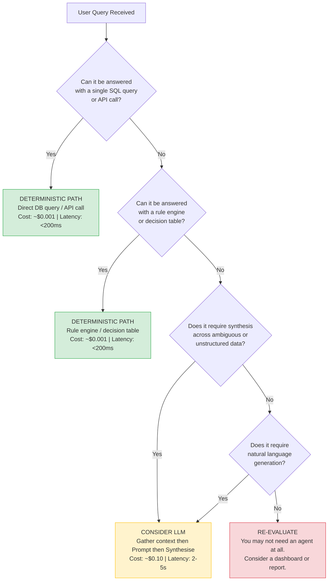
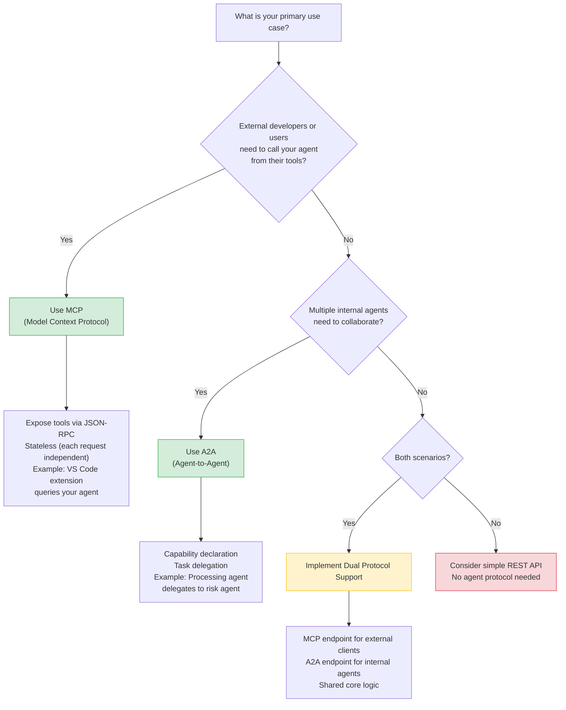
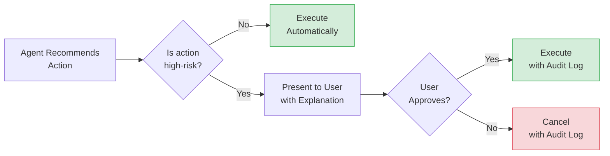
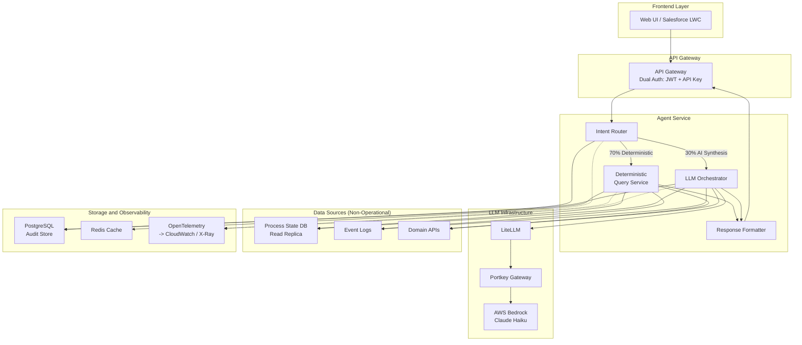
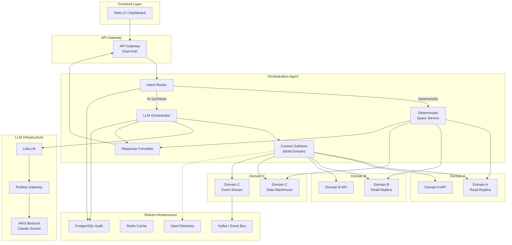
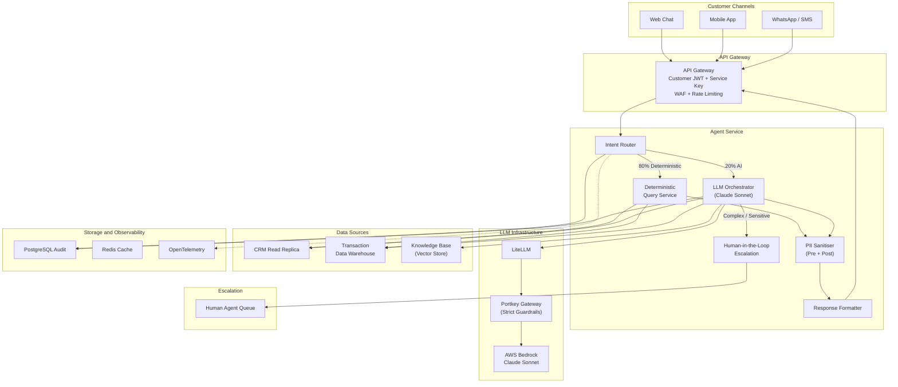
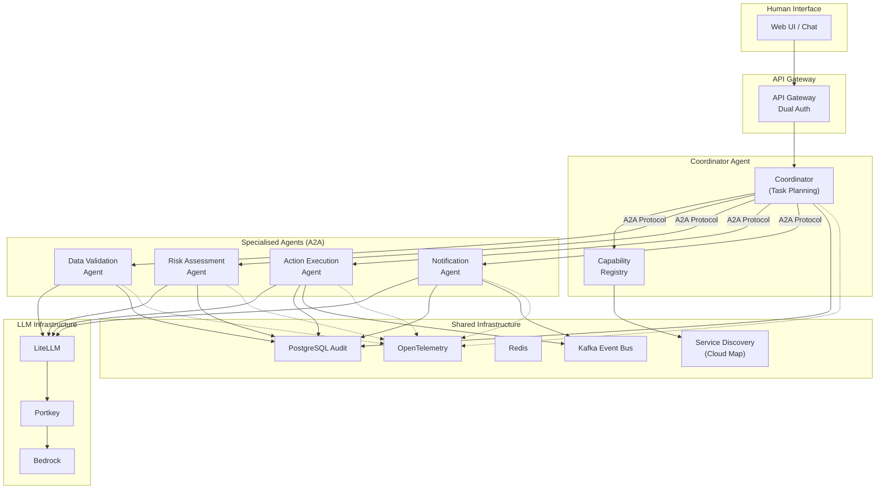
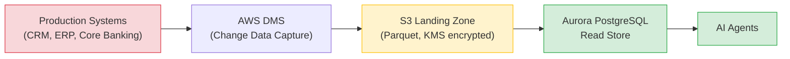
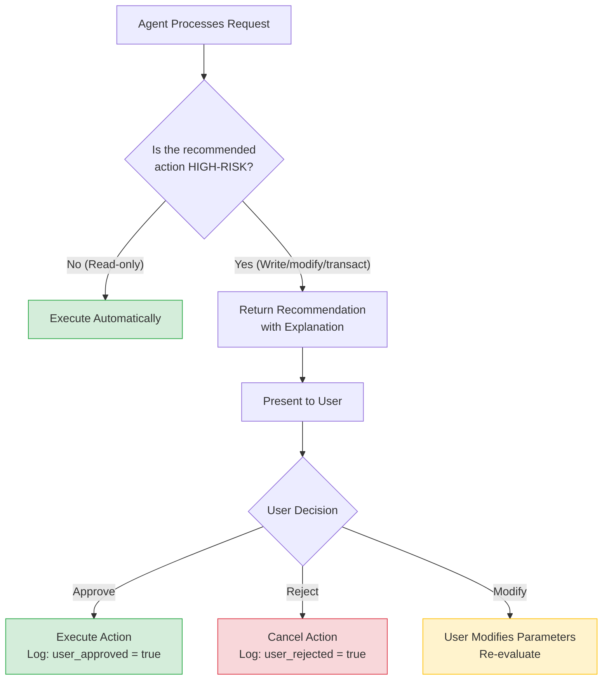
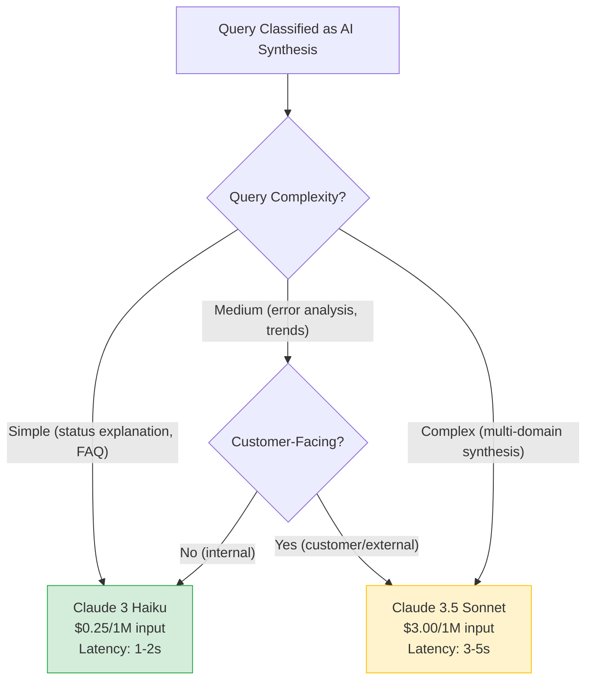

# Enterprise Agentic AI Architecture Skill

> **Version**: 2.0
> **Last Updated**: 2026-05-10
> **Audience**: Solution Architects designing enterprise-grade AI agents in banking and regulated industries
> **Purpose**: Codified Enterprise Architect guidance — practical framework for production-ready agentic AI solutions
> **Outputs**: High-level blueprints, component diagrams, technology stack recommendations, compliance checklists

---

## Changelog: v2.0 Enhancements

| # | Enhancement | Section | Source |
|---|------------|---------|--------|
| 1 | Constrained Delegation Model + IRSA | 3.2 | ChatGPT + Gemini |
| 2 | HTTP Security Headers Contract | 3.2 | ChatGPT + Gemini |
| 3 | OpenTelemetry GenAI Semantic Conventions | 3.6 | Gemini |
| 4 | Plan Act Reflect Execution Loop | 3.7 | Gemini |
| 5 | Data Sensitivity in A2A Capability Cards | Appendix A | ChatGPT + Gemini |
| 6 | CDC Pipeline Mermaid Diagram | 3.3 | ChatGPT + Gemini |
| 7 | Detailed Cost Equation | Appendix C | Gemini |
| 8 | Enterprise Anti-Patterns | 1.4 (New) | ChatGPT + Gemini |

---

## Table of Contents

- [Part 1: Foundations (The "Why")](#part-1-foundations-the-why)
  - [1.1 Core Principle: Deterministic First, Intelligence When Necessary](#11-core-principle-deterministic-first-intelligence-when-necessary)
  - [1.2 The Nine Pillars of Enterprise AI Agents](#12-the-nine-pillars-of-enterprise-ai-agents)
  - [1.3 Prerequisites](#13-prerequisites)
  - [1.4 Enterprise Anti-Patterns](#14-enterprise-anti-patterns)
- [Part 2: Reference Architectures (The "What")](#part-2-reference-architectures-the-what)
  - [2.1 Architecture Pattern Catalog](#21-architecture-pattern-catalog)
  - [2.2 Component Blueprint](#22-component-blueprint)
  - [2.3 Protocol Selection Guide](#23-protocol-selection-guide)
- [Part 3: Implementation Patterns (The "How")](#part-3-implementation-patterns-the-how)
  - [3.1 Deterministic vs Intelligence Patterns](#31-deterministic-vs-intelligence-patterns)
  - [3.2 Dual Authentication Implementation](#32-dual-authentication-implementation)
  - [3.3 Non-Operational Database Patterns](#33-non-operational-database-patterns)
  - [3.4 Prompt Storage & Audit](#34-prompt-storage--audit)
  - [3.5 LLM Stack Integration](#35-llm-stack-integration)
  - [3.6 Observability & Tracing](#36-observability--tracing)
  - [3.7 Google ADK Compliance](#37-google-adk-compliance)
  - [3.8 Caching Strategies](#38-caching-strategies)
- [Part 4: Technology Selection (The "With")](#part-4-technology-selection-the-with)
  - [4.1 Technology Selection Matrix](#41-technology-selection-matrix)
  - [4.2 Cloud Provider Comparison](#42-cloud-provider-comparison)
  - [4.3 LLM Provider Selection](#43-llm-provider-selection)
- [Part 5: Outputs & Artifacts](#part-5-outputs--artifacts)
  - [5.1 Architecture Document Template](#51-architecture-document-template)
  - [5.2 Compliance / Readiness Checklist](#52-compliance--readiness-checklist)
  - [5.3 Technology Selection Worksheet](#53-technology-selection-worksheet)
- [Part 6: Anonymised Case Studies](#part-6-anonymised-case-studies)
  - [6.1 Multi-Stage Orchestration Visibility Agent](#61-multi-stage-orchestration-visibility-agent)
  - [6.2 Customer-Facing Support Agent](#62-customer-facing-support-agent)
  - [6.3 IT Asset Management Agent](#63-it-asset-management-agent)
- [Appendix A: Protocol Specifications](#appendix-a-protocol-specifications)
- [Appendix B: Security Checklist](#appendix-b-security-checklist)
- [Appendix C: Cost Optimisation Playbook](#appendix-c-cost-optimisation-playbook)
- [Appendix D: Glossary](#appendix-d-glossary)
- [Invocation Template](#invocation-template)
- [Output Deliverables](#output-deliverables)

---

## Design Principles

Before any architecture decision, internalise these non-negotiable principles:

| # | Principle | One-Liner |
|---|-----------|-----------|
| 1 | **Requirements before solutions** | Never propose technology without validating the need. |
| 2 | **Deterministic first, intelligence when necessary** | Only use LLMs when simpler approaches fail. |
| 3 | **Evidence before assumptions** | Ground all patterns in real-world use cases. |
| 4 | **Compliance by design** | Security, audit, and cost control are architectural — not bolt-ons. |
| 5 | **Constrained delegation** | Agents operate under scoped permissions. Never as unrestricted super-users. |

---

# Part 1: Foundations (The "Why")

## 1.1 Core Principle: Deterministic First, Intelligence When Necessary

### Intent Classification Framework

Every user query falls somewhere on a spectrum of complexity. Before reaching for an LLM, classify the intent:

| Level | Intent Type | Description | Example Query | LLM Justified? |
|-------|-------------|-------------|---------------|-----------------|
| 1 | **Lookup** | Direct key-value retrieval from a known schema | "What is the status of process 12345?" | No — SQL `SELECT` or API call |
| 2 | **Aggregation** | Counting, summing, averaging over structured data | "How many processes failed this week?" | No — SQL `GROUP BY` / aggregate query |
| 3 | **Correlation** | Joining data across two or more structured sources | "Which processes failed AND had a recent config change?" | Maybe — if join logic is static, use SQL joins; if heuristic, consider LLM |
| 4 | **Synthesis** | Combining structured + unstructured data to produce an insight | "Why did process 12345 fail and is it related to the Monday batch job?" | Yes — requires multi-source reasoning, context, and natural-language explanation |
| 5 | **Creative** | Generating novel content, plans, recommendations from ambiguous inputs | "Draft a remediation plan for recurring Monday failures" | Yes — requires reasoning, planning, language generation |

**Rule of thumb**: If the intent is Level 1 or 2, an LLM is an expensive, slow, and non-deterministic replacement for a SQL query. Start deterministic; escalate only when complexity demands it.

### Decision Flowchart: "Do I Need an LLM for This?"



**Key Insight**: In a typical enterprise agent deployment, **60-80% of queries are deterministic** (Levels 1-2). Routing these through an LLM wastes money, adds latency, and introduces non-determinism. The Intent Router component (see Part 2) is the single most important cost-saving decision in your architecture.

---

## 1.2 The Nine Pillars of Enterprise AI Agents

Enterprise AI agents in regulated industries must satisfy nine architectural pillars. Pillars 1-6 are **mandatory** for every agent. Pillars 7-9 are **conditional** based on use case.

---

### Pillar 1: Dual Authentication

> **Classification**: Mandatory

#### What It Is

Every request to an enterprise AI agent carries **two independent authentication contexts**:

1. **User Context (Layer 1)** — A JWT token representing the human user, issued by the enterprise Identity Provider (IdP). This answers: _"Who is asking?"_
2. **Service Context (Layer 2)** — An API key or service token representing the calling application or agent service. This answers: _"Which system is acting on behalf of the user?"_

These two contexts must **never be conflated**. A user JWT alone does not authorise a backend service to access downstream APIs. A service API key alone does not identify which user triggered the action.

#### Why It Matters

- **Auditability**: Regulatory bodies (POPIA, GDPR) require knowing _who_ did _what_ and _through which system_.
- **Least Privilege**: User-scoped access prevents agent services from accessing data beyond the user's entitlement.
- **Blast Radius**: If a service API key is compromised, audit logs still show which user actions were affected.
- **Regulatory Compliance**: Financial regulators mandate non-repudiation — the ability to trace every action to a specific individual and system.

#### How to Implement

```
User (Browser / Mobile / Salesforce LWC)
    |
    v
    User JWT (from IdP - Cognito / Okta / Azure AD)
    |
    v
API Gateway
    |
    +-- Validate User JWT -> Extract user_id, role, entitlements
    |
    v
Agent Service
    |
    +-- Attach Service API Key (from Secrets Manager)
    |
    v
Downstream Services (Non-operational DBs, Domain APIs)
    |
    +-- Validate BOTH: user_id (data scoping) + service_id (authorisation)
    |
    v
Audit Log Entry:
{
    "user_id": "AS00001",
    "service_id": "agent-service",
    "action": "query_process_state",
    "resource": "process/12345",
    "timestamp": "2026-05-10T14:30:00Z",
    "trace_id": "trace_abc123"
}
```

**Context Propagation**: Every internal request object carries a structured context:

```json
{
  "user_context": {
    "user_id": "AS00001",
    "role": "operations_staff",
    "entitlements": ["view_processes", "view_errors"],
    "jwt_exp": "2026-05-10T15:00:00Z"
  },
  "service_context": {
    "service_id": "agent-service",
    "api_key_id": "key_xyz789",
    "environment": "production"
  },
  "trace_context": {
    "trace_id": "trace_abc123",
    "span_id": "span_def456"
  }
}
```

#### AWS Implementation

| Component | AWS Service | Purpose |
|-----------|-------------|---------|
| User Authentication | **Cognito User Pool** | Issue JWTs, PKCE flow, MFA |
| Service Authentication | **Secrets Manager** | Store and rotate API keys |
| Gateway Validation | **API Gateway** + **Lambda Authoriser** | Validate both JWT and API key |
| Key Rotation | **Secrets Manager** auto-rotation | 90-day key rotation |

#### Azure / GCP Equivalent

| Component | Azure | GCP |
|-----------|-------|-----|
| User Auth | Azure AD / Entra ID | Identity Platform |
| Service Auth | Key Vault | Secret Manager |
| Gateway | API Management | API Gateway |

#### Trade-offs

- **When to bend**: Internal-only tools in non-production environments may use simplified auth during development. **Never** in production.
- **Cost**: Lambda Authoriser adds ~5ms latency per request. This is acceptable for the audit value it provides.
- **Complexity**: Dual auth adds integration overhead. Offset this with a shared auth middleware library that all agent services import.

---

### Pillar 2: Non-Operational Database Queries

> **Classification**: Mandatory

#### What It Is

AI agents must **never query transactional (operational) databases directly**. Instead, they query **non-operational data sources**: read replicas, data warehouses, materialised views, or CDC-fed secondary stores.

#### Why It Matters

- **Performance Isolation**: Operational databases serve real-time transactions (payments, account operations). An AI agent running a complex analytical query can degrade transaction throughput.
- **Predictability**: Transactional DBs are optimised for OLTP (short reads/writes). AI agent queries are often OLAP-style (joins, aggregations, full-table scans).
- **Blast Radius**: A runaway agent query on a production DB could cause an outage affecting millions of customers.
- **Compliance**: Segregation of duties — analytics workloads must not interfere with operational SLAs.

#### The Red-Flag Question

Before designing your data access layer, ask: **"Does this agent need data that is less than 1 second old, or is 5-minute staleness acceptable?"**

In the vast majority of enterprise AI use cases, **5-minute-old data is perfectly acceptable**. Status lookups, error explanations, trend analysis — none of these require real-time transactional data.

#### How to Implement

| Option | Data Freshness | Complexity | Cost | Best For |
|--------|----------------|------------|------|----------|
| **Read Replica** | < 1 min lag | Low | $$ | Near-real-time queries, simple setup |
| **Data Warehouse** | 5-60 min lag | Medium | $$$ | Complex analytics, cross-domain joins |
| **Materialised Views** | Refresh interval | Low | $ | Pre-computed common queries |
| **CDC Pipeline** | Near-real-time | High | $$ | Event-driven updates, streaming |

#### AWS Implementation

| Option | AWS Service | Details |
|--------|-------------|---------|
| Read Replica | **RDS Read Replica** / **Aurora Reader Endpoint** | Automatic replication, < 1 min lag |
| Data Warehouse | **Redshift** / **Athena over S3** | Serverless analytics, Parquet/ORC |
| Materialised Views | **PostgreSQL Materialised Views** | `REFRESH MATERIALIZED VIEW` on schedule |
| CDC Pipeline | **DynamoDB Streams -> Lambda -> S3 -> Athena** | Event-driven, serverless |

#### Azure / GCP Equivalent

| Option | Azure | GCP |
|--------|-------|-----|
| Read Replica | Azure SQL read replica | Cloud SQL read replica |
| Data Warehouse | Synapse Analytics | BigQuery |
| CDC | Azure Event Hubs + Stream Analytics | Dataflow + Pub/Sub |

#### Trade-offs

- **When to bend**: If the agent is purely read-only and queries are index-optimised with strict timeouts, a read replica of the operational DB is acceptable. **Never** allow full-table scans or open-ended queries against production.
- **Cost**: Read replicas double your RDS cost. Offset with right-sizing and reserved instances.
- **Staleness**: Document the maximum acceptable data lag for each use case. Make this an explicit architectural decision, not an afterthought.

---

### Pillar 3: Prompt/Response Audit Storage

> **Classification**: Mandatory

#### What It Is

Every prompt sent to an AI agent — and every response it generates — must be stored in a **structured, queryable audit store**. This is not optional logging; it is a first-class data model.

#### Why It Matters

- **Regulatory Compliance**: POPIA and GDPR require organisations to demonstrate what data was processed, when, by whom, and why. AI agents are no exception.
- **Cost Tracking**: LLM costs are usage-based. Without per-query cost tracking, spend is invisible until the monthly bill arrives.
- **Debugging**: When an agent gives a wrong answer, you need the exact prompt, context, and model version to reproduce and fix the issue.
- **Continuous Improvement**: Analysing prompt/response patterns reveals opportunities to shift queries from LLM to deterministic (cost reduction) or improve prompt templates (quality improvement).

#### How to Implement — PostgreSQL Schema

```sql
CREATE TABLE agent_prompts (
    prompt_id           UUID PRIMARY KEY DEFAULT gen_random_uuid(),
    user_id             VARCHAR(50)      NOT NULL,
    service_id          VARCHAR(100)     NOT NULL,
    prompt_text         TEXT             NOT NULL,
    response_text       TEXT,
    intent_type         VARCHAR(50),     -- 'deterministic' | 'ai_synthesis'
    llm_model_used      VARCHAR(100),    -- NULL if deterministic
    llm_tokens_input    INT,
    llm_tokens_output   INT,
    llm_cost_usd        DECIMAL(10, 6),
    response_time_ms    INT              NOT NULL,
    data_sources_queried TEXT[],          -- PostgreSQL array
    error_details       JSONB,           -- NULL if successful
    created_at          TIMESTAMP        NOT NULL DEFAULT NOW(),
    trace_id            VARCHAR(100)     NOT NULL
);

-- Indexes for common query patterns
CREATE INDEX idx_agent_prompts_user_id ON agent_prompts (user_id);
CREATE INDEX idx_agent_prompts_created_at ON agent_prompts (created_at);
CREATE INDEX idx_agent_prompts_trace_id ON agent_prompts (trace_id);
CREATE INDEX idx_agent_prompts_intent_type ON agent_prompts (intent_type);
CREATE INDEX idx_agent_prompts_model ON agent_prompts (llm_model_used);
```

#### Why PostgreSQL (Not CloudWatch, Not DynamoDB)

| Requirement | PostgreSQL | CloudWatch Logs | DynamoDB |
|-------------|-----------|-----------------|----------|
| Rich querying (joins, aggregations, window functions) | Yes | No | No |
| Full-text search | Yes (tsvector) | Limited | No |
| JSONB support for flexible metadata | Yes | No | Yes |
| Cost at scale | Low | **High** (ingestion + query) | Medium |
| Retention control | Yes (custom) | Limited tiers | Yes |
| Compliance-grade audit | Yes | Limited | Limited |
| Integration with BI tools | Yes | No | No |

#### AWS Implementation

- **RDS PostgreSQL** (af-south-1), encrypted at rest with **KMS CMK**
- **pg_partman** for time-based partitioning (monthly partitions for 7-year retention)
- **IAM database authentication** for service identity

#### Azure / GCP Equivalent

| Component | Azure | GCP |
|-----------|-------|-----|
| Database | Azure Database for PostgreSQL - Flexible Server | Cloud SQL for PostgreSQL |
| Encryption | Azure Disk Encryption + CMK | CMEK |

#### Trade-offs

- **Storage cost**: At 1,000 queries/day with average 2 KB per row, that is ~60 MB/month, ~4.3 GB over 7 years. Negligible.
- **Performance**: Partitioned tables handle billions of rows efficiently. Add read replicas for analytics workloads if needed.
- **Privacy**: Prompt text may contain PII. Apply column-level encryption or tokenisation for sensitive fields.

---

### Pillar 4: Observability

> **Classification**: Mandatory

#### What It Is

Every component in the agent architecture must be instrumented with **OpenTelemetry**-compatible telemetry: distributed traces, structured logs, and metrics. Observability is not "monitoring" — it is the ability to ask arbitrary questions about system behaviour after the fact.

#### Why It Matters

- **Cost Visibility**: Without per-query cost metrics, LLM spend is a black box.
- **Latency Debugging**: A slow response could be the LLM, the database, the cache miss, or the network. Distributed tracing pinpoints the bottleneck.
- **Anomaly Detection**: Metrics enable alerts on cost spikes, latency regressions, and error rate increases.
- **Compliance**: Regulators may ask "How does your AI system perform?" — you need data to answer.

#### How to Implement

**Spans to capture** (conceptual — not full code):

```
agent_query_start
+-- intent_classification (label: deterministic | ai_synthesis)
+-- [if deterministic] db_query (duration, rows_returned, source)
+-- [if ai_synthesis] context_gathering
|   +-- db_query_1 (duration, rows_returned, source)
|   +-- db_query_2 (duration, rows_returned, source)
|   +-- api_call_1 (duration, status_code)
+-- [if ai_synthesis] llm_invoke
|   +-- model (e.g., claude-haiku)
|   +-- tokens_input / tokens_output
|   +-- cost_usd
|   +-- duration_ms
+-- response_formatting
+-- agent_query_end (total_duration, intent_type, cache_hit)
```

**Metrics to track**:

| Metric | Description | Alert Threshold |
|--------|-------------|-----------------|
| `cost_per_query` | LLM tokens x model price | > $0.50 per query |
| `llm_latency_p99` | 99th percentile LLM response time | > 10 seconds |
| `cache_hit_rate` | Portkey semantic cache effectiveness | < 40% (investigate prompts) |
| `error_rate` | Failed queries / total queries | > 5% |
| `query_volume` | Queries per hour/day | Spike > 3x baseline |
| `deterministic_ratio` | % of queries handled without LLM | < 50% (review intent router) |

#### AWS Implementation

| Component | AWS Service |
|-----------|-------------|
| Tracing | **X-Ray** (with OpenTelemetry SDK export) |
| Metrics | **CloudWatch Metrics** (custom namespace) |
| Logs | **CloudWatch Logs** (structured JSON) |
| Dashboards | **CloudWatch Dashboards** or **Grafana on EKS** |
| Alerting | **CloudWatch Alarms** -> **SNS** -> PagerDuty / Slack |

#### Azure / GCP Equivalent

| Component | Azure | GCP |
|-----------|-------|-----|
| Tracing | Application Insights | Cloud Trace |
| Metrics | Azure Monitor | Cloud Monitoring |
| Dashboards | Azure Dashboards | Cloud Dashboards |

#### Trade-offs

- **Performance overhead**: OpenTelemetry adds ~1-2ms per span. Negligible versus LLM latency.
- **Cost**: CloudWatch ingestion and storage have costs. Use sampling (e.g., trace 10% of requests) in high-volume scenarios. Always trace 100% of LLM calls (they are expensive — you want full visibility).
- **Complexity**: Start with traces and two metrics (cost_per_query, error_rate). Add more as needed.

---

### Pillar 5: LLM Abstraction Layer (LiteLLM)

> **Classification**: Mandatory

#### What It Is

**LiteLLM** is a lightweight Python library that provides a **unified interface** to 100+ LLM providers. Your application code calls `litellm.completion()` with a model name; LiteLLM handles provider-specific API translation, authentication, and response normalisation.

#### Why It Matters

- **Vendor Flexibility**: Today you use AWS Bedrock. Tomorrow the organisation negotiates an Azure OpenAI enterprise agreement. With LiteLLM, switching is a **configuration change**, not a code change.
- **Testing**: Developers test locally against OpenAI or local models; production runs Bedrock. Same code.
- **Fallbacks**: If Bedrock Claude Haiku is unavailable, fall back to Azure GPT-4 automatically.
- **Cost Optimisation**: Route simple queries to cheaper models, complex queries to expensive ones — all through configuration.

#### How to Implement

```python
from litellm import completion

# === AWS Bedrock (Production) ===
response = completion(
    model="bedrock/anthropic.claude-3-haiku-20240307-v1:0",
    messages=[{"role": "user", "content": "Explain why process 12345 failed."}]
)

# === Azure OpenAI (Fallback / Future) ===
# Just change the model string - no other code changes
response = completion(
    model="azure/gpt-4",
    messages=[{"role": "user", "content": "Explain why process 12345 failed."}]
)

# === Local Testing ===
response = completion(
    model="ollama/llama3",
    messages=[{"role": "user", "content": "Explain why process 12345 failed."}]
)
```

**Key Rule**: Model identifiers are **configuration, not code**. Store them in environment variables, config files, or a secrets manager — never hardcode.

#### AWS Implementation

- **LiteLLM** deployed as a sidecar or shared library within **EKS** pods
- **Bedrock** accessed via **VPC endpoint** (no internet egress)
- **Secrets Manager** stores AWS credentials for Bedrock access
- Model IDs in **SSM Parameter Store** or **ConfigMap**

#### Azure / GCP Equivalent

LiteLLM is cloud-agnostic. The same library works with Azure OpenAI endpoints and GCP Vertex AI. Only the model string and credentials change.

#### Trade-offs

- **Dependency**: LiteLLM is an open-source library. Pin versions, test upgrades, and have a fallback plan (direct Bedrock SDK calls).
- **Feature lag**: New Bedrock features may not be immediately available in LiteLLM. Monitor release notes.
- **Overhead**: LiteLLM adds a thin wrapper (~5ms). Negligible.

---

### Pillar 6: LLM Gateway (Portkey)

> **Classification**: Mandatory

#### What It Is

**Portkey** is an LLM gateway that sits between your LiteLLM client and the LLM provider. It provides **caching, guardrails, observability, fallbacks, and rate limiting** as infrastructure — not application code.

#### Why It Matters

- **Cost Reduction**: Semantic caching alone reduces LLM costs by **50-70%** for workloads with repetitive queries.
- **Security**: PII detection catches sensitive data (SA ID numbers, phone numbers, bank accounts) before it reaches the LLM provider.
- **Reliability**: Automatic fallbacks handle provider outages without application-level retry logic.
- **Governance**: Per-user and per-service rate limits prevent runaway costs and abuse.

#### How to Implement — Architecture

```
Your Agent Service
    |
    v
LiteLLM Client (abstraction layer)
    |
    v
Portkey Gateway (caching, guardrails, observability)
    |
    v
AWS Bedrock / Azure OpenAI / GCP Vertex AI (model hosting)
```

#### Portkey Configuration

```json
{
  "cache": {
    "mode": "semantic",
    "ttl": 3600
  },
  "retry": {
    "max_attempts": 3,
    "backoff_ms": 1000
  },
  "fallback": ["claude-haiku", "claude-sonnet"],
  "guardrails": [
    {
      "type": "pii_detection",
      "action": "redact",
      "patterns": ["sa_id", "phone", "bank_account"]
    },
    {
      "type": "prompt_injection_detection",
      "action": "block",
      "sensitivity": "high"
    }
  ],
  "rate_limit": {
    "per_user": {
      "requests_per_minute": 20,
      "tokens_per_minute": 50000
    },
    "per_service": {
      "requests_per_minute": 500,
      "tokens_per_minute": 1000000
    }
  }
}
```

#### Portkey Capabilities Summary

| Capability | Benefit | Impact |
|------------|---------|--------|
| **Semantic Caching** | Cache similar (not just identical) prompts | 50-70% cost reduction |
| **PII Detection** | Redact SA ID, phone, bank accounts before LLM call | Compliance + data protection |
| **Prompt Injection Detection** | Block malicious prompts | Security |
| **Fallbacks** | Auto-switch provider on failure | Reliability |
| **Rate Limiting** | Per-user, per-service quotas | Cost control + fair usage |
| **Observability** | Log every LLM call with tokens, cost, latency | Visibility |

#### AWS Implementation

- Portkey deployed on **EKS** within the same VPC
- Bedrock accessed via **VPC endpoint** through Portkey
- Portkey logs forwarded to **CloudWatch** and **PostgreSQL** (Pillar 3)

#### Azure / GCP Equivalent

Portkey is cloud-agnostic. Deploy on AKS (Azure) or GKE (GCP) with the same configuration.

#### Trade-offs

- **Latency**: Portkey adds ~10-20ms per request. On a 2-5 second LLM call, this is negligible.
- **Single point of failure**: Deploy Portkey with multiple replicas behind a load balancer. Configure a bypass path (direct LiteLLM to Bedrock) for emergencies.
- **Cost**: Portkey has its own pricing. The caching savings (50-70%) vastly exceed the gateway cost at scale.

---

### Pillar 7: Managed LLM Service

> **Classification**: Conditional — Required when the agent uses LLM capabilities

#### What It Is

Use a **managed LLM service** from a hyperscaler rather than self-hosting open-source models. Managed services provide enterprise controls, regional deployment, SLAs, and security features that self-hosted models cannot match without significant operational investment.

#### Why It Matters

- **Data Residency**: Managed services offer regional deployment (af-south-1 for POPIA compliance).
- **Security**: VPC endpoints, encryption at rest/transit, IAM integration.
- **Model Variety**: Access multiple model families (Claude, Titan, Llama) through a single endpoint.
- **Operational Simplicity**: No GPU fleet management, model serving infrastructure, or scaling logic.

#### AWS Implementation — Bedrock

| Feature | Detail |
|---------|--------|
| Region | af-south-1 (Cape Town) |
| Models | Claude 3 Haiku, Claude 3.5 Sonnet, Titan, Llama 3 |
| Access | VPC endpoint (private, no internet) |
| Auth | IAM roles (per-service) |
| Encryption | KMS CMK for data at rest |
| Prompt Caching | Native (reduces input token costs by ~50%) |
| Guardrails | Bedrock Guardrails (content filtering, topic denial) |

#### Azure / GCP Equivalent (Sidebar)

| Feature | Azure OpenAI | GCP Vertex AI |
|---------|-------------|---------------|
| Region | South Africa North | africa-south1 |
| Models | GPT-4, GPT-3.5 Turbo | Gemini, PaLM 2 |
| Access | Private endpoint | VPC Service Controls |
| Prompt Caching | Via Portkey | Via Portkey |

#### Trade-offs

- **Vendor lock-in**: Mitigated by Pillar 5 (LiteLLM abstraction). Switching providers is a config change.
- **Cost**: Managed services charge per token. At high volumes (>10,000 queries/day), evaluate reserved capacity or provisioned throughput.
- **Model availability**: Not all models are available in all regions. Check af-south-1 model availability before committing.

---

### Pillar 8: Protocol Selection

> **Classification**: Conditional — Required when the agent exposes capabilities to external clients or other agents

#### What It Is

Enterprise AI agents communicate via two primary protocols:

- **MCP (Model Context Protocol)**: Client-to-server protocol for **external clients** (Claude Desktop, VS Code, developer tools, mobile apps) to invoke agent capabilities.
- **A2A (Agent-to-Agent)**: Service-to-service protocol for **multi-agent systems** where agents discover, delegate, and collaborate.

#### Why It Matters

- **Interoperability**: Standard protocols prevent proprietary lock-in for agent communication.
- **Scalability**: A2A enables building complex systems from simple, focused agents.
- **Developer Experience**: MCP allows developers to interact with agents through familiar tools.

#### Decision Tree



#### AWS Implementation

- **MCP Server**: Deployed as an EKS service exposing JSON-RPC endpoint
- **A2A**: Deployed as EKS services with capability registry in **DynamoDB** or **Service Discovery (Cloud Map)**
- Both accessible via **API Gateway** with dual authentication (Pillar 1)

#### Azure / GCP Equivalent

Protocols are cloud-agnostic. Deploy on AKS/GKE with equivalent service discovery.

#### Trade-offs

- **MCP**: Simpler but limited to request/response. Not suitable for long-running or multi-step agent workflows.
- **A2A**: More powerful but adds complexity (capability registry, message routing, eventual consistency).
- **Start simple**: If you have one agent with one use case, a REST API is fine. Adopt MCP/A2A when the agent ecosystem grows.

---

### Pillar 9: Google ADK Compliance

> **Classification**: Conditional — Required when using Google Agent Development Kit or adopting its design principles

#### What It Is

The Google Agent Development Kit (ADK) codifies three principles for well-architected agents that apply regardless of whether you use Google's framework:

1. **Stateless Agents**: No session state stored in the agent between requests.
2. **Human-in-the-Loop (HITL) Gates**: Structured approval workflows for high-risk actions.
3. **Observability by Default**: Every action is instrumented from day one.

#### Why It Matters

- **Scalability**: Stateless agents scale horizontally without session affinity (no sticky sessions, no shared state).
- **Safety**: HITL gates prevent AI agents from autonomously executing high-risk financial transactions.
- **Debuggability**: Observability by default means you never say "I wish we had logging for that."

#### How to Implement

**Stateless Agent Design**:

```
BAD: Agent stores "user is asking about process 12345" in memory
     -> Fails on pod restart, can't scale, session affinity required

GOOD: Every request includes full context
      { user_id, trace_id, process_id: "12345", conversation_history: [...] }
      -> Any pod can handle any request, horizontal scaling trivial
```

**Human-in-the-Loop Gates**:



**High-Risk Actions in Regulated Industries**:

| Action Category | Example | HITL Required? |
|-----------------|---------|----------------|
| Read data | Query process status | No |
| Explain data | Explain error cause | No |
| Generate report | Weekly performance summary | No (but review before distributing) |
| Modify data | Update process configuration | Yes |
| Financial transaction | Retry failed payment | Yes |
| External communication | Send customer email/SMS | Yes |
| Access provisioning | Grant system access | Yes (+ manager approval) |
| Data deletion | Delete records | Yes (+ compliance approval) |

#### AWS Implementation

- **Stateless**: EKS pods with no persistent volumes for session state. Context passed in request body or via Redis (ephemeral, not authoritative).
- **HITL**: API Gateway returns a `202 Accepted` with a pending action. Frontend polls or WebSocket for user approval. Approved actions are executed via a separate "execute" endpoint.
- **Observability**: OpenTelemetry SDK -> X-Ray + CloudWatch (Pillar 4).

#### Azure / GCP Equivalent

These are design principles, not cloud-specific. Implement identically on any cloud platform.

#### Trade-offs

- **Stateless complexity**: Conversation history must be passed with every request (or stored in a shared cache like Redis). This increases request payload size but is worth the scalability benefit.
- **HITL latency**: Human approval adds minutes or hours of latency. Design async workflows where HITL is required. Not every action needs HITL — only high-risk ones.
- **Observability cost**: Addressed in Pillar 4 trade-offs. Start with essential metrics; expand over time.

---

## 1.3 Prerequisites

> **Before designing your agent, validate that intelligence is genuinely needed.**

Use a structured discovery process to:

1. **Identify stakeholder pain points** — What problems are users actually experiencing?
2. **Enumerate problem scenarios** — What specific questions do users ask? What actions do they need?
3. **Classify gaps** — Is the gap in data access, process, or people? Most "AI" requests are actually data access problems.
4. **Determine if deterministic solutions are sufficient** — Can a better dashboard, API, or report solve 80% of the need?

### The Critical Question

**If discovery shows that most needs are data access problems -> Build better APIs, not AI agents.**

An AI agent is a significant architectural investment (9 pillars, LLM costs, compliance requirements). If the root problem is "I can't see my data," the correct solution is a well-designed API + dashboard, not a $3,000/month AI agent.

### When to Proceed with an AI Agent

Proceed only when:
- [ ] Users need **synthesis** across multiple ambiguous data sources
- [ ] Users need **natural language explanations** that structured data cannot provide
- [ ] The query space is **too diverse** for a finite set of pre-built reports
- [ ] Users need **recommendations or action plans** that require reasoning
- [ ] The value delivered **justifies the LLM cost** (ROI positive within 3 months)

---

## 1.4 Enterprise Anti-Patterns *(v2.0)*

Architects learn as much from what NOT to do as from what to do. These are the most common — and most costly — mistakes in enterprise AI agent implementations.

### Anti-Pattern 1: LLM for Simple Lookups

| Aspect | Detail |
|--------|--------|
| What it looks like | Sending "What is the status of process 12345?" to Claude instead of running a SQL SELECT. |
| Why it's dangerous | Costs $0.05–$0.10 instead of $0.001. Adds 3 seconds instead of 200ms. Non-deterministic output for a deterministic question. At 500/day, wastes ~$1,500/month. |
| What to do instead | Implement an Intent Router (Section 2.2). Level 1–2 queries go deterministic. |
| Pillar violated | Core Principle 1.1 — Deterministic First |

### Anti-Pattern 2: Querying Production OLTP Databases

| Aspect | Detail |
|--------|--------|
| What it looks like | Agent connects directly to the production core banking database. |
| Why it's dangerous | Unpredictable query patterns (full-table scans, complex joins) can degrade real-time transaction processing for millions of customers. |
| What to do instead | Use non-operational sources: read replicas, data warehouse, or CDC-fed stores (Section 3.3). |
| Pillar violated | Pillar 2 — Non-Operational DB Queries |

### Anti-Pattern 3: Single Identity Context

| Aspect | Detail |
|--------|--------|
| What it looks like | Agent uses only a service account for downstream calls. No user identity propagated. Audit logs show "agent-service" but not which human triggered the action. |
| Why it's dangerous | Violates POPIA non-repudiation. Cannot trace actions to individuals during security incidents. |
| What to do instead | Dual authentication (Pillar 1). Propagate both user_id and service_id through every request. |
| Pillar violated | Pillar 1 — Dual Authentication |

### Anti-Pattern 4: Hardcoded Secrets

| Aspect | Detail |
|--------|--------|
| What it looks like | API keys in environment variables, config files, Docker images, or source code. |
| Why it's dangerous | Env vars leak via process inspection and crash dumps. Source code secrets are in Git history forever. No rotation, no revocation. |
| What to do instead | AWS Secrets Manager with IAM access policies. Auto-rotate every 90 days. |
| Pillar violated | Pillar 1 — Dual Authentication (Service Context) |

### Anti-Pattern 5: Skipping the Intent Router

| Aspect | Detail |
|--------|--------|
| What it looks like | Every query goes straight to the LLM. No classification, no deterministic path. |
| Why it's dangerous | 60–80% of enterprise queries are deterministic. Without a router, you pay LLM cost for every query and add unnecessary latency. |
| What to do instead | Build an Intent Router as the first component. Classify every query before routing. |
| Pillar violated | Core Principle 1.1 — Deterministic First |

### Anti-Pattern 6: Stateful Agent Design

| Aspect | Detail |
|--------|--------|
| What it looks like | Agent stores conversation context in pod-local memory. Requires sticky sessions. |
| Why it's dangerous | Pod restart = lost context. Cannot horizontally scale. Debugging is impossible because state is invisible. |
| What to do instead | Stateless design (Pillar 9). Pass full context per request. Use Redis for ephemeral shared state if needed. |
| Pillar violated | Pillar 9 — ADK Compliance (Stateless) |

### Anti-Pattern 7: Autonomous High-Risk Actions

| Aspect | Detail |
|--------|--------|
| What it looks like | Agent autonomously retries payments, sends customer emails, or grants access — without human approval. |
| Why it's dangerous | LLMs hallucinate. An auto-executed hallucinated recommendation is an operational incident. In banking: erroneous payments, unauthorised access, incorrect customer comms. |
| What to do instead | HITL gates (Pillar 9) for all write operations, financial transactions, and external communications. Agent recommends; human approves. |
| Pillar violated | Pillar 9 — ADK Compliance (HITL) |

### Anti-Pattern 8: CloudWatch as Primary Audit Store

| Aspect | Detail |
|--------|--------|
| What it looks like | All prompt/response audit data logged to CloudWatch Logs. Compliance queries via CloudWatch Insights. |
| Why it's dangerous | Expensive at query time ($0.0076/GB scanned). No joins or window functions. 7-year POPIA retention is costly. Data subject access requests require scanning entire log groups. |
| What to do instead | PostgreSQL as primary audit store (Pillar 3). CloudWatch for operational logs only. |
| Pillar violated | Pillar 3 — Prompt/Response Audit Storage |

### Anti-Pattern Quick Reference

| # | Anti-Pattern | Cost of Getting It Wrong | Fix |
|---|--------------|--------------------------|-----|
| 1 | LLM for Lookups | ~$1,500/month wasted | Intent Router |
| 2 | Production OLTP queries | Customer-facing outage risk | Read replicas / DW |
| 3 | Single identity | Compliance failure | Dual authentication |
| 4 | Hardcoded secrets | Security breach | Secrets Manager |
| 5 | No intent router | 10–100x over-spend | Intent classification |
| 6 | Stateful agents | Scaling failure | Stateless + Redis |
| 7 | Autonomous actions | Financial/reputational damage | HITL gates |
| 8 | CloudWatch as audit | Compliance query cost explosion | PostgreSQL audit |

---

# Part 2: Reference Architectures (The "What")

## 2.1 Architecture Pattern Catalog

Four reusable architecture patterns cover the vast majority of enterprise AI agent use cases. Select the pattern that matches your context, then customise using the component blueprint (Section 2.2).

---

### Pattern A: Single-Domain Process Assistant

#### Context

An AI agent that provides **visibility and intelligence** into a specific business process within a single domain.

- **Users**: Operations teams, support staff, process managers
- **Data Sources**: Process state database, event logs, domain APIs
- **Intelligence Need**: Explain delays, identify bottlenecks, recommend actions
- **Example Use Case**: "Why is Process X stuck?" / "What's the status of request 12345?"

#### Architecture Diagram



#### Component Breakdown

| Component | Role | Technology |
|-----------|------|------------|
| Intent Router | Classify user query as deterministic or AI synthesis | Custom classifier (keyword + regex) |
| Deterministic Query Service | Execute SQL queries and API calls | Spring Boot / Python FastAPI |
| LLM Orchestrator | Gather context, construct prompt, invoke LLM | LiteLLM + Portkey |
| Response Formatter | Sanitise PII, structure output | Custom formatter |

#### When to Use This Pattern

- Single business domain with a clear data model
- Users need both status lookups (deterministic) and explanations (AI)
- Query volume is moderate (100-1,000/day)
- Data sources are within the same VPC/account

#### Trade-offs

- **Simplicity**: Easy to build and maintain. One team owns the entire stack.
- **Limitation**: Cannot synthesise across multiple domains. If users ask cross-domain questions, see Pattern B.
- **Scaling**: Scales well within a single domain. Intent router reduces LLM load significantly.

---

### Pattern B: Multi-Domain Orchestration Agent

#### Context

An AI agent that **coordinates across multiple domains and systems** to provide a unified view of complex, multi-step business processes.

- **Users**: Process owners, managers, cross-functional teams
- **Data Sources**: Multiple domain databases, event streams, integration APIs
- **Intelligence Need**: Synthesise state across domains, detect patterns, predict issues
- **Example Use Case**: "What's blocking System Y completion?" / "Show me all dependencies for Process X"

#### Architecture Diagram



#### Component Breakdown

| Component | Role | Technology |
|-----------|------|------------|
| Context Gatherer | Parallel queries across multiple domain data sources | Async Java / Python (CompletableFuture / asyncio) |
| LLM Orchestrator | Synthesise gathered context into coherent response | LiteLLM + Portkey (Sonnet for complex synthesis) |
| Event Bus | Subscribe to domain events for near-real-time updates | Kafka (Managed Kafka on AWS) |

#### When to Use This Pattern

- Business process spans multiple domains with separate data stores
- Users need a "single pane of glass" across systems
- Cross-domain causality analysis is required
- Organisation has an event-driven architecture (or is building one)

#### Trade-offs

- **Complexity**: Multi-domain context gathering adds latency and requires understanding of each domain's data model.
- **Data consistency**: Each domain may have different data freshness. Document staleness tolerance per domain.
- **Cost**: More context = more LLM input tokens = higher cost. Aggressive pre-filtering and summarisation of context is essential.
- **Team coordination**: Requires API contracts with multiple domain teams. Use API versioning.

---

### Pattern C: External-Facing Agent

#### Context

An AI agent that interacts directly with **external customers or partners**. It answers customer questions, resolves issues, and escalates complex cases — all while maintaining the highest levels of security, compliance, and brand safety.

- **Users**: External customers, partners (B2C or B2B)
- **Data Sources**: CRM, transaction history, knowledge base, product catalogue
- **Intelligence Need**: Answer questions, diagnose issues, recommend actions
- **Example Use Case**: "Where's my payment?" / "Why was my application declined?"

#### Architecture Diagram



#### Component Breakdown

| Component | Role | Technology |
|-----------|------|------------|
| PII Sanitiser | Detect and redact PII in both prompts and responses | Portkey guardrails + custom regex post-processing |
| HITL Escalation | Route complex or sensitive queries to human agents | SQS queue + human agent dashboard |
| Knowledge Base | Semantic search over FAQs, policies, product docs | OpenSearch with vector embeddings |
| WAF | Protect against abuse, DDoS, prompt injection | AWS WAF on API Gateway |

#### When to Use This Pattern

- Agent faces external customers (highest trust + compliance bar)
- PII handling is critical (every response must be sanitised)
- Human escalation path is mandatory (agent cannot resolve everything)
- Brand safety matters (agent responses represent the organisation)

#### Trade-offs

- **Model quality**: Use Sonnet (not Haiku) for customer-facing responses. Accuracy and tone matter more than cost savings.
- **HITL overhead**: Human escalation adds latency and cost. Optimise the intent router to minimise unnecessary escalations.
- **Compliance burden**: Every customer interaction is a compliance event. Audit trail (Pillar 3) is non-negotiable.
- **Rate limiting**: External-facing agents are abuse targets. Strict rate limits per user, CAPTCHA for high-volume interactions.

---

### Pattern D: Internal Multi-Agent System

#### Context

A system of **multiple AI agents that collaborate** to accomplish complex tasks. Each agent has a focused responsibility and advertises its capabilities. A coordinator agent delegates tasks based on capability matching.

- **Users**: Other agents (not humans directly — humans interact with the coordinator)
- **Data Sources**: Varies by agent role
- **Intelligence Need**: Task delegation, capability discovery, workflow orchestration
- **Example Use Case**: Agent A asks Agent B to validate data, Agent C to execute an action, Agent D to notify stakeholders

#### Architecture Diagram



#### Component Breakdown

| Component | Role | Technology |
|-----------|------|------------|
| Coordinator Agent | Plan task breakdown, delegate to specialised agents | Custom orchestrator (LLM-powered task planning) |
| Capability Registry | Store agent capabilities for discovery | DynamoDB or Cloud Map |
| Specialised Agents | Focused agents with specific domain expertise | EKS microservices with A2A endpoints |
| Event Bus | Async communication for non-blocking workflows | Kafka (Managed Kafka on AWS) |

#### When to Use This Pattern

- Problem is too complex for a single agent (requires multiple specialisations)
- Organisation is building an "agent platform" (new agents added over time)
- Workflow involves sequential or parallel steps across domains
- Testing and deployment benefit from independent agent lifecycles

#### Trade-offs

- **Complexity**: Significantly more complex than single-agent patterns. Requires capability registry, A2A protocol, distributed tracing across agents.
- **Latency**: Multi-hop agent communication adds latency. Optimise with parallel delegation where possible.
- **Debugging**: Distributed multi-agent systems are harder to debug. OpenTelemetry (Pillar 4) with proper trace propagation is essential.
- **Start simple**: Begin with Pattern A or B. Refactor into Pattern D only when complexity genuinely demands it.

---

## 2.2 Component Blueprint

Every enterprise AI agent, regardless of pattern, is composed of the following standard components:

```
Frontend Layer
+-- User Interface (Web, Mobile, Salesforce LWC, CLI, Chat)
+-- Authentication (Cognito, Okta, Azure AD)

API Gateway Layer
+-- Dual Authentication (User JWT + Service API key validation)
+-- Rate Limiting (per user, per service)
+-- WAF (DDoS protection, prompt injection)
+-- Routing (deterministic vs AI paths)

Agent Service Layer
+-- Intent Router (classify deterministic vs AI synthesis)
+-- Deterministic Query Service (direct DB/API calls)
+-- LLM Orchestrator (context gathering + LLM invocation)
+-- Response Formatter (structure output, sanitise PII)
+-- HITL Manager (human approval for high-risk actions)

LLM Infrastructure
+-- LiteLLM Client (abstraction layer)
+-- Portkey Gateway (caching, guardrails, observability)
+-- Bedrock / Azure OpenAI / Vertex AI (model hosting)

Data Sources (Non-Operational)
+-- Read Replicas (RDS, Aurora)
+-- Data Warehouses (Redshift, Snowflake, Athena)
+-- Event Logs (Kafka, Kinesis -> S3)
+-- APIs (domain services, REST/gRPC)
+-- Knowledge Bases (OpenSearch vector store)

Storage Layer
+-- PostgreSQL (prompts, responses, audit trail)
+-- Redis (query result cache, session context)
+-- S3 (documents, artifacts, long-term archive)

Observability
+-- OpenTelemetry (distributed tracing, spans)
+-- CloudWatch / Datadog / Splunk (metrics, logs)
+-- Cost Tracking Dashboard (per query, per user, per service)
```

### Component Details

| Component | Purpose | Technology (AWS) | Technology (Azure) | Technology (GCP) | Scaling |
|-----------|---------|-----------------|-------------------|------------------|---------|
| **Frontend** | User interface | React SPA on S3 + CloudFront | Azure Static Web Apps | Firebase Hosting | CDN auto-scales |
| **API Gateway** | Entry point, dual auth, WAF | API Gateway v2 + Lambda Authoriser + WAF | API Management + Azure AD B2C | Apigee / Cloud Endpoints | Fully managed |
| **Agent Service** | Core logic - intent, queries, LLM | EKS (Spring Boot / FastAPI) | AKS (Spring Boot / FastAPI) | GKE (Spring Boot / FastAPI) | HPA on CPU/memory |
| **LLM Client** | Provider abstraction | LiteLLM (library in EKS pods) | LiteLLM | LiteLLM | Scales with agent pods |
| **LLM Gateway** | Caching, guardrails | Portkey on EKS | Portkey on AKS | Portkey on GKE | Multiple replicas |
| **LLM Provider** | Model hosting | Bedrock (VPC endpoint) | Azure OpenAI | Vertex AI | Managed, auto-scales |
| **Data Sources** | Non-operational data | RDS Read Replica, Redshift, Athena | Azure SQL replica, Synapse | Cloud SQL replica, BigQuery | Read replicas scale |
| **Audit Store** | Prompt/response logging | RDS PostgreSQL (af-south-1) | Azure DB for PostgreSQL | Cloud SQL PostgreSQL | Vertical + read replicas |
| **Cache** | Query results, session | ElastiCache Redis | Azure Cache for Redis | Memorystore Redis | Cluster mode |
| **Object Storage** | Documents, archives | S3 | Blob Storage | Cloud Storage | Unlimited |
| **Tracing** | Distributed traces | X-Ray + OpenTelemetry | Application Insights | Cloud Trace | Managed |
| **Metrics/Logs** | Monitoring, alerting | CloudWatch | Azure Monitor | Cloud Monitoring | Managed |

---

## 2.3 Protocol Selection Guide

### MCP vs A2A Comparison

| Feature | MCP | A2A |
|---------|-----|-----|
| **Communication model** | Client -> Server (request/response) | Peer-to-peer (bidirectional) |
| **Protocol** | JSON-RPC 2.0 | Custom JSON over HTTPS |
| **State management** | Stateless (per request) | Stateless (context in payload) |
| **Discovery** | Client knows server endpoint | Capability registry enables discovery |
| **Authentication** | Bearer token / API key | Mutual TLS + API key |
| **Best for** | Developer tools, IDEs, CLI, external apps | Multi-agent orchestration, enterprise workflows |
| **Complexity** | Low (simple JSON-RPC) | Medium (capability registry, task lifecycle) |
| **Standards maturity** | Anthropic-led, growing ecosystem | Google-led, emerging standard |

### Implementation Checklists

**MCP Implementation Checklist**:
- [ ] Define tools (agent capabilities) as JSON-RPC methods
- [ ] Implement `tools/list` (capability advertisement)
- [ ] Implement `tools/call` (capability invocation)
- [ ] Deploy as HTTP endpoint behind API Gateway
- [ ] Document tool schemas for client developers

**A2A Implementation Checklist**:
- [ ] Define agent capability manifest (what this agent can do)
- [ ] Register capabilities in service discovery (Cloud Map / DynamoDB)
- [ ] Implement `send_task` / `receive_task` endpoints
- [ ] Propagate trace context (trace_id, user_id) across agent hops
- [ ] Implement timeout and retry logic for agent-to-agent calls

See **Appendix A** for detailed protocol specifications and example payloads.

---


# Part 3: Implementation Patterns (The "How")

## 3.1 Deterministic vs Intelligence Patterns

The following ten use cases represent the most common enterprise agent interactions. For each, we provide both a deterministic and LLM approach — along with clear decision criteria for when to use which.

---

### Use Case 1: Status Lookup

**Description**: Retrieve the current state of a specific entity (process, request, transaction, asset).

**User asks**: "What is the status of process 12345?"

**Deterministic Approach**:
- **When it works**: Entity has a well-defined status field in a structured database; user provides a unique identifier.
- **Implementation**: SQL `SELECT status, updated_at FROM processes WHERE process_id = '12345'`; return structured result.
- **Cost**: ~$0.001 per query (database read).
- **Response time**: < 200ms.
- **Pros**: Predictable, cheap, fast, explainable, always accurate (reflects DB state).
- **Cons**: Returns raw data; cannot explain *why* the entity is in that state.

**LLM Approach**:
- **When it's needed**: User expects a natural-language explanation alongside the status, or the status field is ambiguous (e.g., `ERROR_CODE_7832`).
- **Implementation**: Query process state + error logs + related events -> construct prompt -> LLM generates explanation.
- **Cost**: ~$0.05-$0.10 per query.
- **Response time**: 2-5 seconds.
- **Pros**: User-friendly, explains context, handles ambiguous statuses.
- **Cons**: Non-deterministic, more expensive, slower; may hallucinate details.

**Decision Criteria** - Use LLM if:
- [ ] Status field alone is insufficient (user needs explanation of what it means)
- [ ] Error codes need human-readable translation that changes contextually
- [ ] User expects conversational response, not a data table
- [ ] Budget supports $0.05-$0.10 per query

**Example (Anonymised)**:
- **Deterministic**: `{\"status\": \"PROCESSING\", \"updated_at\": \"2026-05-10T12:00:00Z\"}`
- **LLM**: "Process 12345 is currently in the PROCESSING stage. It has been processing for 2 hours, which is within the normal range for this process type (avg: 3 hours). The next expected step is REVIEW."
- **Decision**: Operations staff who understand status codes -> Deterministic. Managers who need context -> LLM.

**Cost-Benefit Analysis**: At 500 queries/day: Deterministic = $0.50/day; LLM = $50/day. Hybrid approach: Return deterministic status immediately, offer "Explain" button that invokes LLM.

---

### Use Case 2: Error Explanation

**Description**: Explain why an error occurred, what it means, and what to do about it.

**User asks**: "Why did process 12345 fail?"

**Deterministic Approach**:
- **When it works**: Errors have well-defined codes that map to a runbook; failure reasons are single-cause.
- **Implementation**: Query error_log -> match error_code to lookup table -> return pre-written explanation and remediation steps.
- **Cost**: ~$0.001 per query.
- **Response time**: < 200ms.
- **Pros**: Consistent, fast, cheap; remediation steps are vetted by SMEs.
- **Cons**: Cannot handle novel errors, multi-cause failures, or explain environmental context.

**LLM Approach**:
- **When it's needed**: Error is ambiguous, involves multiple contributing factors, or requires correlation with system metrics and recent changes.
- **Implementation**: Query error_log + system_metrics + recent_changes + similar_historical_failures -> LLM synthesises root cause explanation with recommendation.
- **Cost**: ~$0.10-$0.15 per query.
- **Response time**: 3-5 seconds.
- **Pros**: Handles ambiguity, correlates across systems, provides contextual recommendations.
- **Cons**: Expensive, may infer incorrect causality; requires good context data.

**Decision Criteria** - Use LLM if:
- [ ] Error is ambiguous or multi-causal
- [ ] Diagnosis requires correlating data across multiple systems
- [ ] Lookup table would require 100+ ever-changing entries to cover edge cases
- [ ] Budget supports $0.10+ per query

**Example (Anonymised)**:
- **Deterministic**: Error code `TIMEOUT_003` -> Runbook: "Retry in 5 minutes. If persistent, check downstream service health."
- **LLM**: "Process 12345 timed out at the payment validation step. The payment service response time spiked to 12 seconds (normal: 200ms) between 08:00-09:00 due to a batch reconciliation job. The batch job completed at 09:05. Retrying now should succeed."
- **Decision**: Use LLM if error is ambiguous or multi-system.

**Cost-Benefit Analysis**: Deterministic handles ~70% of errors (well-known codes). LLM handles ~30% of ambiguous errors. Blended cost at 200 queries/day: (140 x $0.001) + (60 x $0.15) = $9.14/day vs all-LLM: $30/day.

---

### Use Case 3: Recommendation

**Description**: Suggest a course of action based on current state and historical patterns.

**User asks**: "What should I do about the backlog in queue X?"

**Deterministic Approach**:
- **When it works**: Recommendations follow fixed rules (e.g., "If queue depth > 100, add a processor").
- **Implementation**: Rule engine evaluates current metrics against thresholds -> returns pre-defined actions.
- **Cost**: ~$0.001 per query.
- **Response time**: < 200ms.
- **Pros**: Predictable, consistent, auditable (rules are documented).
- **Cons**: Cannot account for novel situations, contextual factors, or nuance.

**LLM Approach**:
- **When it's needed**: Situation is novel or contextual, recommendation requires weighing trade-offs, or user needs a prioritised action plan.
- **Implementation**: Gather queue metrics + historical patterns + calendar context + resource availability -> LLM generates prioritised recommendation with reasoning.
- **Cost**: ~$0.10-$0.20 per query.
- **Response time**: 3-5 seconds.
- **Pros**: Contextual, handles nuance, provides reasoning; can suggest creative solutions.
- **Cons**: May recommend suboptimal actions; requires HITL for execution.

**Decision Criteria** - Use LLM if:
- [ ] Situation has contextual factors not captured in rules (time of day, calendar, recent events)
- [ ] User needs reasoning and trade-off analysis, not just a command
- [ ] Rule engine would need 50+ rules to cover variants
- [ ] Recommendation is advisory (human decides to act) - not autonomous

**Example (Anonymised)**:
- **Deterministic**: Queue depth = 150 -> Rule: "Scale processing instances from 3 to 5."
- **LLM**: "Queue X has 150 items, growing at 20/hour. However, this is expected for month-end processing (historical average: 180 items at this time). Recommend: (1) No immediate action - queue should clear by 14:00. (2) If not cleared by 13:00, scale processors from 3 to 5."
- **Decision**: Use LLM when context matters (calendar, historical comparison).

**Cost-Benefit Analysis**: LLM recommendations with context reduce false-alarm escalations by ~40%. At 50 queries/day: LLM cost = $10/day; saved escalation cost (staff time) = $50+/day. Clear ROI.

---

### Use Case 4: Summarisation

**Description**: Condense a large volume of data, logs, or documents into a concise summary.

**User asks**: "Summarise the errors from the last 24 hours."

**Deterministic Approach**:
- **When it works**: Summary is purely quantitative (counts, top-N lists, percentages).
- **Implementation**: SQL aggregation queries -> structured report.
- **Cost**: ~$0.001 per query.
- **Response time**: < 500ms.
- **Pros**: Accurate counts, reproducible, cheap.
- **Cons**: Cannot provide narrative, identify themes, or highlight what's unusual.

**LLM Approach**:
- **When it's needed**: User needs a narrative summary that highlights patterns, anomalies, and insights.
- **Implementation**: Query error data + historical baseline -> LLM generates narrative.
- **Cost**: ~$0.10-$0.15 per query.
- **Response time**: 3-5 seconds.
- **Pros**: Narrative is easier to consume than tables; highlights what matters.
- **Cons**: LLM may over-interpret patterns; requires accurate context.

**Decision Criteria** - Use LLM if:
- [ ] Summary needs narrative form (not just tables and counts)
- [ ] User needs anomaly highlighting (what's unusual vs normal)
- [ ] Summary is for executive consumption (readability matters)

**Example (Anonymised)**:
- **Deterministic**: `| Error Code | Count | | TIMEOUT | 154 | | AUTH_FAIL | 45 | | DB_ERROR | 32 |`
- **LLM**: "Over the past 24 hours, 342 errors were logged. The most significant finding is a 3x increase in TIMEOUT errors (154 occurrences), concentrated between 08:00-09:00 and linked to the morning batch processing window."
- **Decision**: Use LLM for executive summaries; deterministic for operational dashboards.

**Cost-Benefit Analysis**: Summarisation is typically low-volume (5-20 queries/day) but high-value. LLM cost: $1-$3/day; value: hours of manual analysis saved.

---

### Use Case 5: Data Extraction

**Description**: Extract structured data from unstructured text (emails, documents, logs, PDFs).

**User asks**: "Extract all customer details from this support ticket."

**Deterministic Approach**:
- **When it works**: Data follows a predictable format (regex-parseable fields like SA ID numbers, phone numbers, dates).
- **Implementation**: Regex extraction -> structured output. E.g., SA ID pattern: `\d{13}`, phone: `\+27\d{9}`.
- **Cost**: ~$0.001 per extraction.
- **Response time**: < 100ms.
- **Pros**: Extremely fast, no false positives for well-defined formats, cheap.
- **Cons**: Fails on unstructured text, variant formatting, contextual fields.

**LLM Approach**:
- **When it's needed**: Text is unstructured, formats vary, or extraction requires understanding context.
- **Implementation**: Pass document text to LLM with extraction schema -> LLM returns structured JSON.
- **Cost**: ~$0.05-$0.10 per extraction.
- **Response time**: 2-4 seconds.
- **Pros**: Handles unstructured text, variant formats, ambiguous fields.
- **Cons**: May hallucinate fields not present in text; requires output validation.

**Decision Criteria** - Use LLM if:
- [ ] Text is unstructured or format varies significantly
- [ ] Extraction requires contextual understanding (not just pattern matching)
- [ ] Regex would need 20+ patterns to cover variants

**Example (Anonymised)**:
- **Deterministic**: Regex extracts `phone: +27821234567`, `id: 9001015009087` from structured form.
- **LLM**: From free-text email: "Please note my contact number is oh-eight-two one-two-three four-five-six-seven" -> `{"phone": "+27821234567"}`.
- **Decision**: Use regex for structured forms; LLM for free-text with variant formatting.

**Cost-Benefit Analysis**: LLM cost per extraction: $0.05-$0.10; manual data entry cost: $2-$5 per ticket. Clear ROI even at low accuracy (90%).

---

### Use Case 6: Trend Analysis

**Description**: Identify trends, patterns, and changes over time in a dataset.

**User asks**: "How have failure rates changed over the past month?"

**Deterministic Approach**:
- **When it works**: Trends are quantifiable (time-series aggregations, moving averages, percentage changes).
- **Implementation**: SQL time-series queries -> chart/table.
- **Cost**: ~$0.001 per query.
- **Response time**: < 500ms.
- **Pros**: Accurate, reproducible, visualisable.
- **Cons**: Returns data but not insight; user must interpret the trend.

**LLM Approach**:
- **When it's needed**: User needs interpretation, correlation with external factors, or prediction.
- **Implementation**: Query trend data + deployment logs + recent changes -> LLM interprets and predicts.
- **Cost**: ~$0.10-$0.15 per query.
- **Response time**: 3-5 seconds.
- **Pros**: Provides interpretation, correlation, prediction; actionable.
- **Cons**: Correlation is not causation; LLM may imply false connections.

**Decision Criteria** - Use LLM if:
- [ ] Trend data alone is insufficient; user needs interpretation
- [ ] Correlation with external factors adds value
- [ ] Predictive or prescriptive insight is requested

**Example (Anonymised)**:
- **Deterministic**: Table/chart showing daily error counts for 30 days.
- **LLM**: "Failure rates have increased 150% over the past month. The inflection point was May 1st, coinciding with the infrastructure migration. At the current trajectory, failure rates will breach the 5% SLA threshold by May 18th."
- **Decision**: Use deterministic for dashboards; LLM for ad-hoc "what does this mean?" queries.

**Cost-Benefit Analysis**: Low-volume (5-10 queries/day) but high-value. Single LLM trend analysis that prevents a major incident pays for a year of LLM costs.

---

### Use Case 7: Anomaly Detection

**Description**: Identify data points, patterns, or behaviours that deviate significantly from the norm.

**User asks**: "Are there any unusual patterns in today's transactions?"

**Deterministic Approach**:
- **When it works**: Anomalies are defined by static thresholds or well-known statistical methods (Z-score, IQR).
- **Implementation**: SQL queries with threshold checks.
- **Cost**: ~$0.001 per query.
- **Response time**: < 500ms.
- **Pros**: Reproducible, explainable, no false-positive surprises.
- **Cons**: Static thresholds miss contextual anomalies (e.g., legitimate month-end transactions).

**LLM Approach**:
- **When it's needed**: Anomalies are contextual, multi-dimensional, or the user needs explanatory narratives.
- **Implementation**: Query today's data + historical baseline + calendar context -> LLM identifies and explains anomalies.
- **Cost**: ~$0.10-$0.20 per query.
- **Response time**: 3-6 seconds.
- **Pros**: Contextual, narrative explanation, multi-dimensional.
- **Cons**: Expensive, may flag non-anomalies; not suitable for real-time alerting.

**Decision Criteria** - Use LLM if:
- [ ] Anomalies are contextual (business cycles, calendar effects)
- [ ] Multi-dimensional patterns (combining volume, amount, timing, geography)
- [ ] User needs explanation, not just a flag

**Example (Anonymised)**:
- **Deterministic**: Flags 15 transactions exceeding 3-sigma threshold.
- **LLM**: "Of 15 flagged transactions, 12 are month-end salary payments (expected, recurring). The 3 remaining are unusual: (1) $45,000 transfer to a new beneficiary at 02:00. Recommend: Escalate items 1-3 for review; dismiss items 4-15 as false positives."
- **Decision**: Use deterministic for real-time alerting; LLM for investigator-facing explanation and triage.

**Cost-Benefit Analysis**: Hybrid is best: Deterministic flags -> LLM explains. Reduces investigation time from 30 min to 5 min per alert.

---

### Use Case 8: Root Cause Analysis

**Description**: Determine the underlying cause of an observed problem by correlating evidence across multiple systems.

**User asks**: "What's causing the spike in timeout errors this morning?"

**Deterministic Approach**:
- **When it works**: Root cause is a known, well-documented failure mode with a clear causal chain.
- **Implementation**: Query error logs -> match error pattern to known-issue database -> return documented root cause and fix.
- **Cost**: ~$0.001 per query.
- **Response time**: < 200ms.
- **Pros**: Instant, accurate for known issues, provides proven remediation.
- **Cons**: Cannot diagnose novel issues, multi-factor causes, or emergent behaviours.

**LLM Approach**:
- **When it's needed**: Problem is novel, involves multiple contributing factors, or requires "connecting the dots" across disparate data sources.
- **Implementation**: Query error_logs + system_metrics + deployment_history + change_management_log + capacity_data -> LLM synthesises root cause with evidence chain.
- **Cost**: ~$0.15-$0.25 per query.
- **Response time**: 4-8 seconds.
- **Pros**: Handles novel failures, correlates across systems, provides evidence-based reasoning.
- **Cons**: Expensive; may confuse correlation with causation; should be reviewed by a human.

**Decision Criteria** - Use LLM if:
- [ ] Problem is novel (not in known-issues database)
- [ ] Multiple systems or factors may be contributing
- [ ] Diagnosis requires temporal correlation (what changed recently?)
- [ ] Manual root cause analysis would take 30+ minutes

**Example (Anonymised)**:
- **Deterministic**: Error pattern matches known issue #142: "Batch job contention - retry after 09:00."
- **LLM**: "Timeout errors spiked 400% between 08:00-09:00. Evidence chain: (1) Batch reconciliation job started at 08:00, consuming 80% of DB connection pool. (2) Payment service connection pool exhaustion at 08:12. (3) API timeouts began at 08:15. Immediate fix: Retry now. Structural fix: Isolate batch job to separate connection pool."
- **Decision**: Use LLM for novel failures requiring multi-system correlation.

**Cost-Benefit Analysis**: Low-volume (5-15 queries/day) but extremely high-value. Average manual RCA time: 2-4 hours. LLM-assisted: 30 minutes. ROI: At $0.25/query, LLM cost is $2.50/day. Saved engineering time: $200+/day.

---

### Use Case 9: Action Planning

**Description**: Generate a structured plan of actions to achieve a goal or resolve a situation.

**User asks**: "Create a plan to clear the processing backlog by end of day."

**Deterministic Approach**:
- **When it works**: Standard operating procedures (SOPs) exist; plan follows a fixed template.
- **Implementation**: Lookup SOP template -> fill in dynamic values -> return structured plan.
- **Cost**: ~$0.001 per query.
- **Response time**: < 200ms.
- **Pros**: Consistent, vetted by operations team, auditable.
- **Cons**: Cannot adapt to novel situations, resource constraints, or conflicting priorities.

**LLM Approach**:
- **When it's needed**: Situation has unique constraints, requires trade-off analysis, or no SOP exists.
- **Implementation**: Gather current state (backlog size, processing rate, resource availability, constraints) -> LLM generates adaptive plan with contingencies.
- **Cost**: ~$0.10-$0.20 per query.
- **Response time**: 3-6 seconds.
- **Pros**: Adaptive, handles constraints, provides reasoning for each step.
- **Cons**: Plan may be suboptimal; requires HITL approval before execution.

**Decision Criteria** - Use LLM if:
- [ ] Situation has unique constraints not covered by SOP
- [ ] Plan requires trade-off analysis across competing priorities
- [ ] User needs reasoning for why each step is recommended
- [ ] No SOP exists for this scenario

**Example (Anonymised)**:
- **Deterministic**: SOP #23: "Backlog clearance: 1. Scale processors to 10. 2. Disable non-critical jobs. 3. Monitor until cleared."
- **LLM**: "Backlog: 450 items. Current rate: 20/hour. Time to clear at current rate: 22.5 hours (exceeds EOD). Plan: (1) Scale processors from 3 to 8 (not 10 - peak hours require 2 reserved). (2) Deprioritise 120 routine_audit items to overnight. (3) Remaining 330 items at 50/hour = 6.6 hours. Start by 11:00, clear by 17:30."
- **Decision**: Use LLM when situation requires adaptive planning with constraints.

**Cost-Benefit Analysis**: Very low-volume (2-5 queries/day) but very high-value. Always require HITL: Action plans must be reviewed before execution.

---

### Use Case 10: Report Generation

**Description**: Generate a structured report combining data, analysis, and commentary for a specific audience.

**User asks**: "Generate a weekly performance report for the operations team."

**Deterministic Approach**:
- **When it works**: Report follows a fixed template with dynamic data (KPIs, charts, tables that refresh weekly).
- **Implementation**: Template engine pulls current metrics from data warehouse -> fills template -> generates report.
- **Cost**: ~$0.01 per report.
- **Response time**: 1-5 seconds.
- **Pros**: Consistent format, automated, cheap, no LLM variability.
- **Cons**: Cannot provide narrative commentary, highlight anomalies, or adapt structure.

**LLM Approach**:
- **When it's needed**: Report needs narrative sections (executive summary, analysis, recommendations), anomaly highlighting, or adaptive structure.
- **Implementation**: Generate data sections deterministically -> pass to LLM for narrative overlay.
- **Cost**: ~$0.15-$0.30 per report.
- **Response time**: 5-10 seconds.
- **Pros**: Professional narrative, adaptive highlights, executive-ready.
- **Cons**: LLM-generated commentary must be reviewed; risk of over-interpretation.

**Decision Criteria** - Use LLM if:
- [ ] Report needs narrative commentary (not just data tables)
- [ ] Executive audience expects analysis, not raw data
- [ ] Report frequency is low enough to justify per-report LLM cost (weekly, not hourly)
- [ ] Human reviews report before distribution

**Example (Anonymised)**:
- **Deterministic**: Weekly dashboard: processed = 3,456; failed = 89 (2.6%); avg time = 4.2 hours; SLA met = 97.3%.
- **LLM** (narrative overlay): "This week, the operations team processed 3,456 items with a 97.3% SLA compliance rate. The notable event was a timeout spike on Monday morning (38 failures between 08:00-09:00) caused by batch job contention. Excluding Monday, the failure rate was 1.5% - a new weekly best."
- **Decision**: Hybrid is ideal - deterministic data + LLM narrative sections. One of the highest-ROI uses of LLM.

**Cost-Benefit Analysis**: Weekly report: 1 report x $0.30 = $0.30/week vs hours of manual writing.

---

### Special Focus: Industry-Specific Agent Patterns

#### HR Onboarding Agent

| Aspect | Approach |
|--------|----------|
| **Document verification** | Deterministic (regex + rules for ID validation, qualification checks) |
| **Training schedule generation** | Deterministic (rule engine based on role -> required courses) |
| **Onboarding checklist tracking** | Deterministic (database state tracking, automated reminders) |
| **New hire FAQ** | LLM (diverse questions, knowledge base search, natural language) |
| **Welcome message personalisation** | LLM (personalised based on role, team, location) |

#### Interview Process Agent

| Aspect | Approach |
|--------|----------|
| **Interview scheduling** | Deterministic (calendar API integration, availability matching) |
| **Feedback collection** | Deterministic (structured form, scoring rubric) |
| **Candidate tracking** | Deterministic (state machine: applied -> screening -> interview -> offer) |
| **Interview question generation** | LLM (role-specific, experience-level-aware questions) |
| **Feedback summarisation** | LLM (synthesise multiple interviewer feedback into hiring recommendation) |

#### IT / Asset Management Agent

| Aspect | Approach |
|--------|----------|
| **Asset lookup** | Deterministic (CMDB query by asset tag, serial number, user) |
| **Access provisioning workflow** | Deterministic + HITL (rule-based approval routing + manager approval) |
| **Ticket routing** | LLM (natural language classification of unstructured ticket descriptions) |
| **Knowledge base search** | LLM (semantic search over IT runbooks and documentation) |
| **Incident correlation** | LLM (correlate new ticket with recent changes and similar incidents) |

---

## 3.2 Dual Authentication Implementation

### Architecture Flow

```
User (Browser / Mobile / Salesforce LWC)
    |
    v  (1) User authenticates via enterprise IdP
    User JWT (issued by Cognito / Okta / Azure AD)
    |
    v  (2) JWT sent with every request
API Gateway
    |
    +-- (3) Lambda Authoriser validates JWT
    |   +-- Extracts: user_id, role, entitlements, jwt_exp
    |
    v  (4) Request forwarded with user context
Agent Service
    |
    +-- (5) Service retrieves its own API key from Secrets Manager
    |   +-- API key identifies this service to downstream systems
    |
    v  (6) Request to downstream includes BOTH contexts
Downstream Services (Non-operational DBs, Domain APIs)
    |
    +-- (7) Validates: user_id (data scoping)
    +-- (8) Validates: service_id (authorisation)
    |
    v  (9) Every action logged with dual identity
Audit Log: { user_id, service_id, action, resource, timestamp, trace_id }
```

### Implementation Details

**Frontend Authentication**:
- **Protocol**: OAuth 2.0 with PKCE (Proof Key for Code Exchange) - no client secrets in the browser
- **Token**: JWT with short expiry (15-60 minutes), refresh token for renewal
- **MFA**: Required for all users accessing AI agents (regulated environment)
- **Claims**: `user_id`, `role`, `entitlements`, `department`, `exp`

**Backend Authentication**:
- **API Key**: Stored in Secrets Manager, injected at runtime
- **Rotation**: Automatic rotation every 90 days via Secrets Manager rotation Lambda
- **Scope**: Each service has its own API key with permissions limited to required downstream APIs
- **Never**: Hardcode API keys in source code, config files, or environment variables without Secrets Manager

**Context Propagation**:

```json
{
  "user_context": {
    "user_id": "AS00001",
    "role": "operations_staff",
    "entitlements": ["view_processes", "view_errors"],
    "department": "operations",
    "jwt_exp": "2026-05-10T15:00:00Z"
  },
  "service_context": {
    "service_id": "process-visibility-agent",
    "api_key_id": "key_xyz789",
    "environment": "production",
    "version": "1.2.0"
  },
  "trace_context": {
    "trace_id": "trace_abc123",
    "span_id": "span_def456",
    "parent_span_id": "span_parent_789"
  }
}
```

### AWS Services

| Component | AWS Service | Configuration |
|-----------|-------------|---------------|
| User Authentication | **Cognito User Pool** | PKCE flow, JWT issuer, MFA enabled |
| Service Authentication | **Secrets Manager** | API key storage, 90-day auto-rotation |
| Gateway | **API Gateway v2** (HTTP APIs) | Lambda Authoriser for dual validation |
| Authoriser | **Lambda** | Validates JWT signature + API key, enriches context |
| Audit Storage | **RDS PostgreSQL** | Append-only audit table (Pillar 3) |

### Azure / GCP Equivalent

| Component | Azure | GCP |
|-----------|-------|-----|
| User Auth | Azure AD / Entra ID | Identity Platform |
| Service Auth | Key Vault | Secret Manager |
| Gateway | API Management | API Gateway / Apigee |
| Audit | Azure Database for PostgreSQL | Cloud SQL for PostgreSQL |

### Constrained Delegation Model *(v2.0)*

> Agents must NEVER operate as unrestricted super-users. Every agent operates under scoped permissions.

#### IRSA (IAM Roles for Service Accounts)
On EKS, bind each agent pod to a dedicated IAM role via IRSA. No shared credentials. No wildcards.

#### Per-Agent Access Scope
```
HR Onboarding Agent
 +-- Allowed:
 |     +-- LiteLLM Gateway (invoke LLM)
 |     +-- RDS Read Replica (hr_onboarding schema)
 |     +-- Audit PostgreSQL (agent_prompts table)
 |     +-- S3 (hr-documents bucket, read-only)
 |
 +-- Denied:
       +-- Production Core Banking DB
       +-- Secrets outside hr-onboarding namespace
       +-- Cross-domain stores (payroll, lending)
       +-- Direct Bedrock access (must use LiteLLM/Portkey)
```

#### JWT Minimum Claims
```json
{
  "sub": "user-123",
  "roles": ["operations", "hr-manager"],
  "org_id": "bank-group-01",
  "region": "af-south-1",
  "entitlements": ["view_hr_records", "initiate_onboarding"]
}
```

#### Per-Agent Scope Enforcement

| Agent | Allowed Data Sources | Denied Resources |
|-------|---------------------|------------------|
| HR Onboarding | HR replica, S3 hr-docs, Audit PG | Core banking, payroll, lending |
| Process Visibility | Orchestration replica, event logs, Audit PG | Customer PII, financial txn DB |
| Customer Support | CRM replica, txn DW, knowledge base, Audit PG | HR data, infra logs, admin APIs |

#### AWS Implementation

| Component | AWS Service | Configuration |
|-----------|-------------|---------------|
| Service Identity | IRSA | One IAM role per agent bound to K8s ServiceAccount |
| Permission Boundary | IAM Permission Boundary | Caps max permissions for the role |
| Access Audit | CloudTrail | Logs every API call per agent role |
| Policy | IAM Policy (least privilege) | Explicit Allow for required resources only |

### HTTP Security Headers Contract *(v2.0)*

> Every request through API Gateway must carry three mandatory headers.

#### Required Headers

| Header | Purpose | Source | Example |
|--------|---------|--------|---------|
| X-User-Context | User JWT identity (who is asking) | Frontend / IdP | eyJhbGciOi... |
| X-Agent-Identity | Calling agent service (which system) | Agent config | hr-onboarding-agent-v2 |
| X-Correlation-ID | Distributed trace ID | API Gateway | 550e8400-e29b-41d4-a716-446655440000 |

#### Example HTTP Request
```http
POST /api/v1/agent/query HTTP/1.1
Host: api.internal.bank.com
Content-Type: application/json
X-User-Context: eyJhbGciOiJSUzI1NiIs...
X-Agent-Identity: process-visibility-agent-v1
X-Correlation-ID: 550e8400-e29b-41d4-a716-446655440000

{"query": "What is the status of process 12345?"}
```

#### Validation Flow
```
API Gateway receives request
    |
    +-- Lambda Authoriser validates:
    |     1. X-User-Context: JWT signature, expiry, issuer
    |     2. X-Agent-Identity: Must match registered agent list
    |     3. X-Correlation-ID: Present, valid UUID format
    |
    +-- ALL valid -> Forward to Agent Service
    +-- ANY invalid -> 401 Unauthorized
```

**Key Rule**: Missing or invalid headers = rejected at gateway. No exceptions.

---

## 3.3 Non-Operational Database Patterns

### Option 1: Read Replica

| Aspect | Details |
|--------|---------|
| **When to use** | Need near-real-time data (< 1 min lag); simple setup; same query patterns as production |
| **AWS Services** | RDS Read Replica, Aurora Reader Endpoint |
| **Data freshness** | < 1 minute (replication lag) |
| **Cost** | $$ (essentially doubles RDS cost for that instance class) |
| **Trade-off** | Simple to set up but still adds load to the RDS cluster. Not suitable for heavy analytics. |

### Option 2: Data Warehouse

| Aspect | Details |
|--------|---------|
| **When to use** | Acceptable 5-60 min lag; complex analytics, cross-domain joins, large aggregations |
| **AWS Services** | Redshift (dedicated cluster), Athena over S3 (serverless) |
| **Data freshness** | 5-60 minutes (ETL/ELT pipeline lag) |
| **Cost** | $$$ (Redshift cluster) or $ (Athena pay-per-query) |
| **Trade-off** | Powerful analytics but requires ETL pipeline setup and maintenance. |

### Option 3: Materialised Views

| Aspect | Details |
|--------|---------|
| **When to use** | Pre-compute common agent queries; reduce latency for frequently asked questions |
| **AWS Services** | PostgreSQL Materialised Views (`REFRESH MATERIALIZED VIEW CONCURRENTLY`) |
| **Data freshness** | Depends on refresh interval (typically 5-15 minutes) |
| **Cost** | $ (additional storage and compute for refresh) |
| **Trade-off** | Extremely fast reads but requires knowing query patterns in advance. Cannot handle ad-hoc queries. |

### Option 4: CDC Pipeline

| Aspect | Details |
|--------|---------|
| **When to use** | Event-driven architecture; need to react to data changes in near-real-time |
| **AWS Services** | DynamoDB Streams -> Lambda -> S3 -> Athena; or RDS -> DMS -> Kinesis -> ElasticSearch |
| **Data freshness** | Near-real-time (seconds to minutes) |
| **Cost** | $$ (streaming infrastructure) |
| **Trade-off** | Most flexible but most complex to set up and maintain. Eventual consistency. |

#### CDC Pipeline Architecture *(v2.0)*



**Why the S3 Landing Zone Matters**: The S3 intermediate layer between DMS and the read store provides four critical benefits:

| Benefit | Description |
|---------|-------------|
| Auditability | Every change is stored as a Parquet file in S3. You can replay any change, at any point in time. |
| Data Lineage | Trace any data point from the production source, through S3, to the agent-consumed read store. |
| Buffer | Decouples the production change rate from agent query patterns. S3 absorbs bursts without impacting either side. |
| Format Standardisation | Converts diverse source formats (Oracle, SAP, Salesforce) into a consistent Parquet schema before loading into PostgreSQL. |

**Recommended CDC Technologies**:

| Layer | Technology | Purpose |
|-------|------------|---------|
| CDC | AWS DMS | Capture changes from production databases |
| Landing Zone | Amazon S3 (Parquet format) | Auditable, replayable intermediate storage |
| Encryption | AWS KMS | Encrypt data at rest in S3 and Aurora |
| AI Read Store | Aurora PostgreSQL | Agent-facing queryable database |
| Streaming (alternative) | Kafka / MSK | For event-driven real-time sync |
| Search (alternative) | OpenSearch | For full-text and vector search use cases |

### Decision Matrix

| Factor | Read Replica | Data Warehouse | Materialised Views | CDC Pipeline |
|--------|-------------|----------------|-------------------|-------------|
| **Setup complexity** | Low | Medium | Low | High |
| **Data freshness** | < 1 min | 5-60 min | 5-15 min | Seconds-minutes |
| **Query flexibility** | High (any SQL) | High (OLAP) | Low (pre-defined) | Medium |
| **Cost** | $$ | $$-$$$ | $ | $$ |
| **Best for** | Simple agents, single domain | Cross-domain analytics | High-frequency lookups | Event-driven systems |
| **Avoid when** | Heavy analytics queries | Real-time needs | Ad-hoc queries | Team lacks streaming expertise |

---

## 3.4 Prompt Storage & Audit

### PostgreSQL Schema

```sql
CREATE TABLE agent_prompts (
    prompt_id           UUID PRIMARY KEY DEFAULT gen_random_uuid(),
    user_id             VARCHAR(50)      NOT NULL,
    service_id          VARCHAR(100)     NOT NULL,
    prompt_text         TEXT             NOT NULL,
    response_text       TEXT,
    intent_type         VARCHAR(50),     -- 'deterministic' | 'ai_synthesis'
    llm_model_used      VARCHAR(100),    -- NULL if deterministic
    llm_tokens_input    INT,
    llm_tokens_output   INT,
    llm_cost_usd        DECIMAL(10, 6),
    response_time_ms    INT              NOT NULL,
    data_sources_queried TEXT[],          -- PostgreSQL array type
    error_details       JSONB,           -- NULL if successful
    created_at          TIMESTAMP        NOT NULL DEFAULT NOW(),
    trace_id            VARCHAR(100)     NOT NULL
);

-- Indexes for common compliance and operational queries
CREATE INDEX idx_agent_prompts_user_id ON agent_prompts (user_id);
CREATE INDEX idx_agent_prompts_created_at ON agent_prompts (created_at);
CREATE INDEX idx_agent_prompts_trace_id ON agent_prompts (trace_id);
CREATE INDEX idx_agent_prompts_intent_type ON agent_prompts (intent_type);
CREATE INDEX idx_agent_prompts_model ON agent_prompts (llm_model_used);

-- Partitioning for long-term retention (monthly partitions)
-- Use pg_partman for automated partition management
CREATE TABLE agent_prompts_partitioned (
    LIKE agent_prompts INCLUDING ALL
) PARTITION BY RANGE (created_at);
```

### What to Log

| Field | Source | Purpose |
|-------|--------|---------|
| `prompt_text` | User input (sanitised) | Audit trail, debugging, prompt improvement |
| `response_text` | Agent output | Audit trail, quality review |
| `intent_type` | Intent Router | Track deterministic vs AI ratio (cost optimisation) |
| `llm_model_used` | LiteLLM | Cost tracking, model comparison |
| `llm_tokens_input` / `output` | LiteLLM/Portkey | Cost calculation |
| `llm_cost_usd` | Calculated | Budget tracking, alerting |
| `response_time_ms` | Agent Service | Latency monitoring |
| `data_sources_queried` | Context Gatherer | Data lineage, dependency tracking |
| `error_details` | Exception handling | Debugging, error pattern analysis |
| `trace_id` | OpenTelemetry | Correlated distributed tracing |

### Retention Policies

| Policy | Duration | Purpose |
|--------|----------|---------|
| **Compliance** (POPIA/GDPR) | 7 years | Regulatory audit trail; immutable, append-only |
| **Operational** | 90 days | Active debugging, recent query analysis |
| **Analytics** | 1 year | Prompt pattern analysis, cost trend, model performance |

**Implementation**: Use `pg_partman` to automatically create monthly partitions. Older partitions can be moved to cheaper storage (archive to S3 via `pg_dump` for 7-year retention).

### Compliance Queries

```sql
-- QUERY 1: "What did user AS00001 ask in the last 30 days?"
-- Purpose: POPIA data subject access request
SELECT prompt_text, response_text, created_at, intent_type, llm_model_used
FROM agent_prompts
WHERE user_id = 'AS00001'
  AND created_at >= NOW() - INTERVAL '30 days'
ORDER BY created_at DESC;

-- QUERY 2: "How much are we spending on LLM calls?"
-- Purpose: Cost tracking and budget management
SELECT
  DATE_TRUNC('day', created_at) AS day,
  SUM(llm_cost_usd) AS total_cost,
  COUNT(*) AS total_queries,
  COUNT(*) FILTER (WHERE intent_type = 'ai_synthesis') AS llm_queries,
  COUNT(*) FILTER (WHERE intent_type = 'deterministic') AS deterministic_queries,
  AVG(response_time_ms) AS avg_response_time_ms
FROM agent_prompts
WHERE created_at >= NOW() - INTERVAL '30 days'
GROUP BY day
ORDER BY day DESC;

-- QUERY 3: "Which data sources are queried most?"
-- Purpose: Dependency tracking and data source health
SELECT
  UNNEST(data_sources_queried) AS source,
  COUNT(*) AS times_queried,
  AVG(response_time_ms) AS avg_query_time_ms
FROM agent_prompts
GROUP BY source
ORDER BY times_queried DESC;

-- QUERY 4: "What is our cache hit rate?"
-- Purpose: Cost optimisation (evaluate Portkey caching effectiveness)
SELECT
  DATE_TRUNC('day', created_at) AS day,
  COUNT(*) FILTER (WHERE llm_tokens_input = 0 AND intent_type = 'ai_synthesis') AS cache_hits,
  COUNT(*) FILTER (WHERE intent_type = 'ai_synthesis') AS total_llm_queries,
  ROUND(
    COUNT(*) FILTER (WHERE llm_tokens_input = 0 AND intent_type = 'ai_synthesis')::DECIMAL /
    NULLIF(COUNT(*) FILTER (WHERE intent_type = 'ai_synthesis'), 0) * 100, 2
  ) AS cache_hit_rate_pct
FROM agent_prompts
WHERE created_at >= NOW() - INTERVAL '7 days'
GROUP BY day
ORDER BY day DESC;

-- QUERY 5: "Which queries are most expensive?"
-- Purpose: Identify optimisation targets
SELECT
  LEFT(prompt_text, 100) AS prompt_preview,
  llm_model_used,
  llm_cost_usd,
  llm_tokens_input,
  llm_tokens_output,
  response_time_ms,
  created_at
FROM agent_prompts
WHERE llm_cost_usd IS NOT NULL
ORDER BY llm_cost_usd DESC
LIMIT 20;
```

---

## 3.5 LLM Stack Integration

### Architecture: Service -> LiteLLM -> Portkey -> Bedrock

```
Agent Service (Java/Python)
    |
    v
LiteLLM Client (library)
    |  <- Unified API: completion(model="...", messages=[...])
    |  <- Model routing, retries, fallbacks configured in YAML
    v
Portkey Gateway (deployed on EKS)
    |  <- Semantic caching (50-70% cost reduction)
    |  <- PII detection & redaction (pre-LLM)
    |  <- Prompt injection detection (block malicious prompts)
    |  <- Observability (log every call: tokens, cost, latency)
    v
AWS Bedrock (af-south-1)
    |  <- VPC endpoint (no internet traffic)
    |  <- IAM role authentication
    v
LLM Response -> Portkey (logging) -> LiteLLM (normalisation) -> Agent Service -> PII regex filter -> User
```

### LiteLLM Configuration

```yaml
model_list:
  # Primary: Claude Haiku for simple/medium queries (cost-effective)
  - model_name: claude-haiku
    litellm_params:
      model: bedrock/anthropic.claude-3-haiku-20240307-v1:0
      region_name: af-south-1
      aws_access_key_id: ${AWS_ACCESS_KEY_ID}
      aws_secret_access_key: ${AWS_SECRET_ACCESS_KEY}
      max_tokens: 1024
      temperature: 0.1  # Low temperature for factual responses

  # Secondary: Claude Sonnet for complex synthesis and customer-facing
  - model_name: claude-sonnet
    litellm_params:
      model: bedrock/anthropic.claude-3-5-sonnet-20241022-v2:0
      region_name: af-south-1
      aws_access_key_id: ${AWS_ACCESS_KEY_ID}
      aws_secret_access_key: ${AWS_SECRET_ACCESS_KEY}
      max_tokens: 2048
      temperature: 0.2

  # Fallback: Alternative region
  - model_name: claude-haiku-fallback
    litellm_params:
      model: bedrock/anthropic.claude-3-haiku-20240307-v1:0
      region_name: eu-west-1
      max_tokens: 1024

router_settings:
  routing_strategy: simple-shuffle
  num_retries: 2
  timeout: 30
  fallbacks:
    - claude-haiku: [claude-haiku-fallback]
    - claude-sonnet: [claude-haiku]  # Degrade gracefully
```

### Portkey Configuration

```json
{
  "api_base": "https://portkey-gateway.internal.example.com",
  "cache": {
    "mode": "semantic",
    "ttl": 3600,
    "similarity_threshold": 0.92
  },
  "retry": {
    "max_attempts": 3,
    "backoff_ms": 1000,
    "backoff_multiplier": 2
  },
  "fallback": ["claude-haiku", "claude-sonnet"],
  "guardrails": [
    {
      "type": "pii_detection",
      "action": "redact",
      "patterns": ["sa_id", "phone", "bank_account", "email"]
    },
    {
      "type": "prompt_injection_detection",
      "action": "block",
      "sensitivity": "high"
    },
    {
      "type": "topic_denial",
      "action": "block",
      "denied_topics": ["competitor_info", "investment_advice", "political_opinion"]
    }
  ],
  "rate_limit": {
    "per_user": {
      "requests_per_minute": 20,
      "tokens_per_minute": 50000
    },
    "per_service": {
      "requests_per_minute": 500,
      "tokens_per_minute": 1000000
    }
  }
}
```

### Cost Optimisation

| Strategy | Impact | Implementation |
|----------|--------|----------------|
| **Use cheaper models** | Haiku is ~10x cheaper than Sonnet | Route simple queries to Haiku; reserve Sonnet for complex/customer-facing |
| **Semantic caching** | 50-70% cost reduction | Portkey semantic cache with 1-hour TTL |
| **Prompt caching** | 50% input token savings | Bedrock native prompt caching for repeated system prompts |
| **Max tokens limits** | Prevent runaway generation | Set `max_tokens: 1024` for Haiku, `2048` for Sonnet |
| **Context pre-filtering** | Reduce input tokens | Summarise/filter context before sending to LLM |
| **Batch requests** | Reduce per-request overhead | Where latency allows, batch multiple user queries |
| **Monitor and alert** | Catch cost anomalies early | Alert if daily spend exceeds 2x average |

### PII Detection & Sanitisation

**Layer 1: Pre-LLM (Portkey Guardrails)** — Detects PII patterns in prompts before they reach the LLM. Action: Redact or Block.

**Layer 2: Post-LLM (Custom Regex Filter)** — Scans LLM responses before returning to user.

```python
import re

PII_PATTERNS = {
    'sa_id': r'\b\d{13}\b',
    'phone': r'\b(?:\+27|0)\d{9}\b',
    'bank_account': r'\b\d{8,11}\b',  # Context-dependent
    'email': r'\b[A-Za-z0-9._%+-]+@[A-Za-z0-9.-]+\.[A-Z|a-z]{2,}\b'
}

def sanitise_response(text: str) -> str:
    for pii_type, pattern in PII_PATTERNS.items():
        text = re.sub(pattern, f'[{pii_type.upper()}_REDACTED]', text)
    return text
```

---

## 3.6 Observability & Tracing

### OpenTelemetry Instrumentation (Conceptual)

```
Trace: trace_abc123
|
+-- Span: api_gateway_receive (5ms)
|   +-- Attribute: user_id = "AS00001"
|   +-- Attribute: service_id = "process-visibility-agent"
|
+-- Span: intent_classification (15ms)
|   +-- Attribute: intent_type = "ai_synthesis"
|   +-- Attribute: confidence = 0.94
|
+-- Span: context_gathering (350ms)
|   +-- Child Span: db_query_process_state (120ms)
|   |   +-- Attribute: source = "process_db_replica"
|   |   +-- Attribute: rows_returned = 1
|   +-- Child Span: db_query_error_logs (80ms)
|   +-- Child Span: api_call_system_metrics (150ms)
|
+-- Span: llm_invoke (2400ms)
|   +-- Attribute: model = "claude-haiku"
|   +-- Attribute: tokens_input = 1250
|   +-- Attribute: tokens_output = 340
|   +-- Attribute: cost_usd = 0.0004
|   +-- Attribute: cache_hit = false
|
+-- Span: response_formatting (10ms)
+-- Span: audit_logging (5ms)

Total Duration: 2785ms
```

### Metrics Dashboard

| Metric | Description | Target | Alert Threshold |
|--------|-------------|--------|-----------------|
| `cost_per_query` | LLM tokens x model price | < $0.15 | > $0.50 |
| `total_daily_cost` | Sum of all LLM costs per day | < $150 | > 2x average |
| `llm_latency_p50` | Median LLM response time | < 2s | N/A |
| `llm_latency_p95` | 95th percentile LLM response time | < 5s | > 8s |
| `llm_latency_p99` | 99th percentile LLM response time | < 8s | > 10s |
| `cache_hit_rate` | % of LLM queries served from cache | > 50% | < 30% |
| `error_rate` | Failed queries / total queries | < 2% | > 5% |
| `deterministic_ratio` | % of queries handled without LLM | > 60% | < 40% |
| `query_volume` | Total queries per hour | Baseline | > 3x baseline |
| `pii_detection_rate` | % of queries with PII detected | < 5% | > 15% |

### Alerting Configuration

```yaml
alerts:
  - name: cost_spike
    condition: "daily_llm_cost > 2 * rolling_7d_avg_daily_cost"
    severity: warning
    channel: slack_ops

  - name: latency_spike
    condition: "llm_latency_p99 > 10s for 5 minutes"
    severity: critical
    channel: pagerduty

  - name: error_rate_high
    condition: "error_rate > 5% for 5 minutes"
    severity: critical
    channel: pagerduty

  - name: cache_degradation
    condition: "cache_hit_rate < 30% for 1 hour"
    severity: warning
    channel: slack_ops

  - name: pii_leak_risk
    condition: "pii_detection_rate > 15% for 1 hour"
    severity: critical
    channel: pagerduty_security
```

### OpenTelemetry GenAI Semantic Conventions *(v2.0)*

The OpenTelemetry community is standardising GenAI-specific span attributes under the gen_ai.* namespace. Adopting these ensures your agent traces are compatible with any OTel-aware platform (Datadog, Grafana, Splunk, New Relic) without custom attribute mapping.

#### Standard GenAI Attributes

| Attribute | Type | Description | Example |
|-----------|------|-------------|---------|
| gen_ai.system | string | LLM provider identifier | aws.bedrock |
| gen_ai.request.model | string | Model identifier | anthropic.claude-3-haiku-20240307-v1:0 |
| gen_ai.request.max_tokens | int | Max output tokens requested | 1024 |
| gen_ai.request.temperature | float | Sampling temperature | 0.1 |
| gen_ai.usage.input_tokens | int | Actual input tokens consumed | 1250 |
| gen_ai.usage.output_tokens | int | Actual output tokens generated | 340 |
| gen_ai.usage.total_tokens | int | Total tokens (input + output) | 1590 |
| gen_ai.response.finish_reason | string | Why generation stopped | end_turn / max_tokens |
| gen_ai.response.latency_ms | float | LLM response time in milliseconds | 2400.0 |
| gen_ai.cache.hit | boolean | Whether Portkey semantic cache was hit | true / false |

#### Example Span

```
Span: llm_invoke
├── gen_ai.system = "aws.bedrock"
├── gen_ai.request.model = "anthropic.claude-3-haiku-20240307-v1:0"
├── gen_ai.request.max_tokens = 1024
├── gen_ai.request.temperature = 0.1
├── gen_ai.usage.input_tokens = 1250
├── gen_ai.usage.output_tokens = 340
├── gen_ai.usage.total_tokens = 1590
├── gen_ai.response.finish_reason = "end_turn"
├── gen_ai.response.latency_ms = 2400.0
└── gen_ai.cache.hit = false
```

**Why This Matters**: Using standardised attribute names means your traces are instantly compatible with any observability tooling. No custom dashboards, no attribute translation layers. When you switch from CloudWatch to Grafana or Datadog, your GenAI traces just work.

---

## 3.7 Google ADK Compliance

### Stateless Agent Design

**Principle**: No session state is stored within the agent between requests. Every request is self-contained.

**BAD - Stateful Design**:
```
Request 1: "Tell me about process 12345"
-> Agent stores in memory: { session_state: { process_id: "12345" } }

Request 2: "What's the error?"
-> Agent looks up session_state -> queries errors for "12345"

PROBLEM: Pod restart = lost context; Scaling = session affinity required
```

**GOOD - Stateless Design**:
```
Request 1: "Tell me about process 12345"
-> Agent responds with context_id: { process_id: "12345" }

Request 2: { process_id: "12345", question: "What's the error?" }
-> Agent receives full context -> Any pod can handle this request

BENEFITS: Pod restart = no impact; Scaling = no session affinity; Debugging = full context visible
```

**Stateless Request Example**:

```json
{
  "request_context": {
    "user_id": "AS00001",
    "trace_id": "trace_abc123",
    "conversation_history": [
      { "role": "user", "content": "Tell me about process 12345" },
      { "role": "assistant", "content": "Process 12345 is in PROCESSING state..." }
    ],
    "active_entity": { "type": "process", "id": "12345" }
  },
  "current_query": "What's the error?"
}
```

### Human-in-the-Loop Gates



**High-Risk Actions in Regulated Industries**:

| Action Category | Example | HITL Required? |
|-----------------|---------|----------------|
| Read data | Query process status | No |
| Explain data | Explain error cause | No |
| Generate report | Weekly performance summary | No (review before distributing) |
| Modify data | Update process configuration | Yes |
| Financial transaction | Retry failed payment | Yes |
| External communication | Send customer email/SMS | Yes |
| Access provisioning | Grant system access | Yes (+ manager approval) |
| Data deletion | Delete records | Yes (+ compliance approval) |

### Observability by Default

| Requirement | Implementation | Reference |
|-------------|----------------|-----------|
| Every query logged | PostgreSQL audit table | Pillar 3 |
| Every LLM call traced | OpenTelemetry spans | Pillar 4 |
| Cost tracked per query | Portkey + PostgreSQL | Pillar 3 + 6 |
| Errors captured with context | Structured error logging + trace_id | Pillar 4 |
| HITL decisions logged | Audit table with approval/rejection | Pillar 3 |

### Stateless Execution Lifecycle: Plan → Act → Reflect *(v2.0)*

Formalises how a stateless agent processes each request internally. The critical insight: the Act phase is ALWAYS deterministic. The Reflect phase is where the LLM gets involved — and only when needed.

#### Three Phases

| Phase | What Happens | Key Principle |
|-------|--------------|---------------|
| Plan | Classify intent (Level 1–5). Identify required data sources. Select execution strategy. | Route before you compute. |
| Act | Execute deterministic tasks: query databases, call APIs, apply business rules, gather context. | This phase is ALWAYS deterministic. No LLM here. |
| Reflect | Apply intelligence/synthesis ONLY if the Act phase produced ambiguous, insufficient, or multi-source results that require reasoning. | LLM is the last resort, not the first call. |

#### Key Insight

This is the "deterministic-first" principle expressed at the execution level, not just the routing level. Even within an LLM-bound query, the agent first gathers all deterministic context (Act), then synthesises (Reflect). The LLM never does the data fetching — it only does the thinking.

#### Examples: Act (Deterministic) vs Reflect (Intelligence)

| Use Case | Act (Deterministic) | Reflect (Intelligence) |
|----------|---------------------|------------------------|
| HR Onboarding | Extract ID fields via OCR (Textract) | Detect suspicious expiry date inconsistencies |
| Root Cause Analysis | Fetch error logs + system metrics from read replica | Correlate anomalies across multiple systems |
| Asset Management | Query CMDB for assets not checked in > 30 days | Predict loss risk based on employee behaviour patterns |
| Report Generation | Fetch KPIs and aggregates from data warehouse | Draft executive narrative summary from raw numbers |
| Ticket Routing | Parse ticket metadata, extract priority and category | Classify intent from unstructured free-text description |

**Principle**: The intelligence layer should NEVER replace deterministic retrieval. It should: interpret, correlate, synthesise, summarise, and recommend — based on data the Act phase already gathered.

---

## 3.8 Caching Strategies

### Three Caching Layers

```
User Query -> Intent Router -> [Deterministic?]
    |                              |
    |                          Yes -> Redis Cache Hit? -> Return cached result
    |                              |                      (miss) -> Query DB -> Cache in Redis -> Return
    |
    +-- AI Synthesis -> Portkey Semantic Cache Hit? -> Return cached LLM response
                            |                          (miss)
                            +-- Bedrock Prompt Cache Hit? -> Reduced input tokens
                                    |                        (miss)
                                    +-- Full LLM invocation -> Cache response -> Return
```

#### Layer 1: Semantic Caching (Portkey)

| Aspect | Details |
|--------|---------|
| **What it caches** | LLM responses for semantically similar prompts |
| **How it works** | Portkey computes prompt embeddings; if a new prompt is > 92% similar to a cached prompt, return the cached response |
| **Example** | "Why did process 123 fail?" and "Explain the failure of process 123" -> same cached response |
| **Hit rate** | 50-70% for workloads with repetitive query patterns |
| **TTL** | 1 hour (configurable) |
| **Cost impact** | 50-70% reduction in LLM API costs |

#### Layer 2: Query Result Caching (Redis)

| Aspect | Details |
|--------|---------|
| **What it caches** | Deterministic query results (DB query responses, API call results) |
| **How it works** | Agent service checks Redis before querying the database. Cache key = query hash. |
| **Example** | `SELECT status FROM processes WHERE id = '12345'` -> cache result for 5 minutes |
| **Hit rate** | 80%+ for frequently accessed entities |
| **TTL** | 5 minutes for status data; 1 hour for reference data |
| **Cost impact** | Reduces database load by 80%; sub-millisecond response |

**Redis Cache Key Strategy**: `agent:{service_id}:{query_hash}:{user_scope}` with TTL: 300 seconds.

#### Layer 3: Context Caching (Bedrock Prompt Caching)

| Aspect | Details |
|--------|---------|
| **What it caches** | System prompt tokens (the instruction prefix sent with every LLM call) |
| **How it works** | Bedrock caches the tokenised system prompt; subsequent calls skip re-tokenisation |
| **Hit rate** | ~100% for agents with stable system prompts |
| **TTL** | Bedrock-managed (varies by model; typically 5 minutes of inactivity) |
| **Cost impact** | ~50% reduction in input token costs for the system prompt portion |

### Combined Caching Impact

| Scenario | No Caching | With All 3 Layers | Savings |
|----------|------------|-------------------|---------|
| 1000 LLM queries/day x $0.10 | $100/day | $30-$40/day | $60-$70/day |
| 500 deterministic queries x 200ms DB | 100s DB time | 20s DB time | 80s DB time |
| System prompt: 800 tokens x 1000 calls | 800K input tokens | 400K input tokens | 400K tokens |

### Trade-offs

| Concern | Mitigation |
|---------|------------|
| **Staleness** | Document maximum acceptable staleness per data type. Short TTL (5 min) for process status; long TTL (1 hour) for reference data. |
| **Cache invalidation** | Keep it simple. Time-based expiry (TTL) for most data. Event-driven invalidation only for critical, write-heavy data. |
| **Memory cost** | Redis: ~1 KB per cached entry. At 10,000 entries = 10 MB. Negligible. |
| **Cold start** | First request after cache expiry is slower. Pre-warm cache for known high-traffic queries during deployment. |

---

# Part 4: Technology Selection (The "With")

## 4.1 Technology Selection Matrix

### Input Requirements

```yaml
# Required Inputs
agent_purpose: "Description of what the agent does"
primary_users: ["User Group 1", "User Group 2"]
data_sources: ["Source 1", "Source 2"]
compliance_requirements: ["POPIA", "GDPR", "PCI-DSS"]

# Selection Parameters
data_residency: "South Africa" | "EU" | "US" | "Global"
budget: "Low (<$1k/mo)" | "Medium ($1k-$10k/mo)" | "High (>$10k/mo)"
query_volume: "100/day" | "1000/day" | "10000+/day"
latency_tolerance: "Real-time (<1s)" | "Near-real-time (<5s)" | "Batch (minutes)"
```

### Output: Recommended Stack

**For: `data_residency=South Africa`, `compliance=POPIA`, `budget=Medium`, `query_volume=1000/day`**

```yaml
llm_provider: "AWS Bedrock (af-south-1)"
llm_model_primary: "Claude 3 Haiku (70% of queries)"
llm_model_secondary: "Claude 3.5 Sonnet (30% of queries)"
llm_gateway: "Portkey (semantic caching, guardrails, observability)"
llm_abstraction: "LiteLLM (vendor flexibility)"
prompts_db: "RDS PostgreSQL (af-south-1, encrypted with KMS CMK)"
cache: "ElastiCache Redis (af-south-1, cluster mode)"
data_sources: "RDS Read Replicas (af-south-1)"
api_gateway: "AWS API Gateway v2 (HTTP APIs)"
compute: "EKS (Java Spring Boot / Python FastAPI)"
frontend_auth: "Cognito User Pool (PKCE, MFA enabled)"
backend_auth: "Secrets Manager (API key storage, 90-day rotation)"
observability: "OpenTelemetry -> CloudWatch + X-Ray"

estimated_monthly_cost:
  infrastructure: "$800-$1,600"
  llm_queries: "$1,200-$2,400"
  total: "$2,000-$4,000/month"
```

### Decision Factors

| Factor | Impact on Selection |
|--------|---------------------|
| **Data residency** | Drives region choice. South Africa -> `af-south-1`. Non-negotiable. |
| **Compliance** | Drives encryption (KMS CMK), audit (PostgreSQL), PII detection (Portkey). POPIA = 7-year retention. |
| **Budget** | Drives model choice. Low = Haiku only. Medium = Haiku + Sonnet. High = Sonnet + Opus. |
| **Query volume** | Drives caching strategy. < 100/day = minimal. 1000/day = aggressive. 10000+/day = deterministic alternatives. |
| **Latency tolerance** | Drives compute choice. Real-time = EKS. Near-real-time = EKS or Lambda. Batch = Lambda/Step Functions. |

---

## 4.2 Cloud Provider Comparison

### AWS Stack (Primary - Recommended)

| Component | AWS Service | Why This Choice |
|-----------|-------------|-----------------|
| **LLM** | Bedrock | Regional (af-south-1), VPC endpoint, multiple models, prompt caching |
| **Database** | RDS PostgreSQL / Aurora | Multi-AZ, automatic backups, encryption, read replicas |
| **Cache** | ElastiCache Redis | Cluster mode, encryption at rest/transit |
| **API Gateway** | API Gateway v2 (HTTP APIs) | Low latency, Lambda authoriser, WAF integration |
| **Compute** | EKS | Container orchestration, horizontal pod autoscaler, Fargate |
| **Auth (User)** | Cognito User Pool | PKCE, MFA, JWT issuer, IdP federation |
| **Auth (Service)** | Secrets Manager | API key storage, auto-rotation, IAM access control |
| **Observability** | CloudWatch + X-Ray | Metrics, logs, traces, alarms, dashboards |
| **WAF** | AWS WAF | DDoS protection, rate limiting, custom rules |
| **Encryption** | KMS | Customer-managed keys (CMK), automatic rotation |
| **Message Queue** | Kafka (MSK) / SQS | Event-driven architectures, HITL workflows |
| **Storage** | S3 | Document storage, long-term audit archive |

### Azure Stack (Sidebar)

| Component | Azure Service |
|-----------|---------------|
| LLM | Azure OpenAI (South Africa North) |
| Database | Azure Database for PostgreSQL - Flexible Server |
| Cache | Azure Cache for Redis |
| API Gateway | Azure API Management |
| Compute | AKS (Azure Kubernetes Service) |
| Auth (User) | Azure AD / Entra ID |
| Auth (Service) | Key Vault |
| Observability | Application Insights + Azure Monitor |
| WAF | Azure Front Door WAF |
| Encryption | Azure Key Vault (CMK) |

### GCP Stack (Sidebar)

| Component | GCP Service |
|-----------|-------------|
| LLM | Vertex AI (africa-south1) |
| Database | Cloud SQL for PostgreSQL |
| Cache | Memorystore for Redis |
| API Gateway | Apigee / Cloud Endpoints |
| Compute | GKE (Google Kubernetes Engine) |
| Auth (User) | Identity Platform |
| Auth (Service) | Secret Manager |
| Observability | Cloud Trace + Cloud Monitoring |
| WAF | Cloud Armor |
| Encryption | Cloud KMS (CMEK) |

### Multi-Cloud Considerations

| Concern | Mitigation |
|---------|------------|
| **LLM portability** | LiteLLM abstracts provider. Switch AWS -> Azure -> GCP by changing model config string. |
| **Database portability** | PostgreSQL is used on all three clouds. Same schema, same queries. |
| **Observability portability** | OpenTelemetry SDK is vendor-agnostic. Change the exporter config. |
| **Container portability** | EKS, AKS, and GKE all run standard Kubernetes. Workload manifests are portable. |
| **Caching portability** | Redis protocol is standard across all three. |

---

## 4.3 LLM Provider Selection

### Comparison Matrix

| Factor | AWS Bedrock | Azure OpenAI | GCP Vertex AI |
|--------|-------------|--------------|---------------|
| **South Africa Region** | af-south-1 | South Africa North | africa-south1 |
| **Data residency controls** | VPC endpoint (private) | Private endpoint | VPC Service Controls |
| **Models available** | Claude 3 (Haiku, Sonnet, Opus), Titan, Llama 3, Mistral | GPT-4o, GPT-4, GPT-3.5 Turbo | Gemini 1.5 Pro/Flash, PaLM 2 |
| **Cost (economy model)** | Claude 3 Haiku: $0.25/1M input | GPT-3.5 Turbo: $0.50/1M input | Gemini 1.5 Flash: $0.075/1M input |
| **Cost (premium model)** | Claude 3.5 Sonnet: $3.00/1M input | GPT-4o: $5.00/1M input | Gemini 1.5 Pro: $3.50/1M input |
| **Prompt caching** | Native (Bedrock) | Via Portkey | Native (context caching) |
| **Guardrails** | Bedrock Guardrails (content filtering, PII) | Content filtering (basic) | Safety filters |
| **Enterprise support** | Enterprise Support Plan | Enterprise Agreement | Premium Support |
| **Multi-model flexibility** | Multiple providers (Anthropic, Meta, Amazon, Mistral) | OpenAI models only | Google models + third-party |

### Model Selection Strategy



### Recommendation

> **For South Africa-based regulated industries**: **AWS Bedrock** is the recommended LLM provider.
>
> **Rationale**:
> 1. **Regional presence**: af-south-1 with VPC endpoint ensures data never leaves South Africa
> 2. **Model variety**: Access to Claude, Titan, Llama, Mistral through a single API
> 3. **Cost efficiency**: Claude 3 Haiku offers best price-performance for enterprise workloads
> 4. **Enterprise controls**: Bedrock Guardrails, IAM integration, CloudTrail logging
> 5. **Prompt caching**: Native support reduces input token costs by ~50%
>
> **Mitigation for vendor risk**: LiteLLM (Pillar 5) ensures switching to Azure OpenAI or GCP Vertex AI is a configuration change, not a rewrite.

---

# Part 5: Outputs & Artifacts

When a Solution Architect invokes this skill, they receive **three deliverables** tailored to their specific agent requirements.

---

## 5.1 Architecture Document Template

```markdown
# [Agent Name] — Enterprise Architecture Specification

**Version**: 1.0 | **Author**: [Architect] | **Date**: [YYYY-MM-DD] | **Status**: Draft | Review | Approved

## 1. Executive Summary
- Purpose
- Key architectural decisions (table: Decision | Rationale)
- Technology stack summary
- Estimated monthly cost

## 2. System Context
- Stakeholders (table: Stakeholder | Role | Interaction)
- Use cases (table: Use Case | Type | Frequency)
- Data sources (table: Source | Type | Freshness | Access Method)
- Integration points

## 3. Architecture Diagrams
- C4 Level 1: System context
- C4 Level 2: Containers
- C4 Level 3: Components
- Sequence diagram: Deterministic flow
- Sequence diagram: AI synthesis flow

## 4. Component Specifications
- 4.1 Frontend layer
- 4.2 API gateway layer
- 4.3 Agent service layer
- 4.4 LLM infrastructure
- 4.5 Data sources
- 4.6 Storage layer
- 4.7 Observability

## 5. Data Architecture
- Non-operational DB strategy (option chosen + rationale + staleness tolerance)
- Prompt storage schema (PostgreSQL from Pillar 3)
- Caching strategy (three-layer configuration)

## 6. Security & Compliance
- Dual authentication implementation
- PII detection & sanitisation
- Audit trail & retention policy
- POPIA / GDPR compliance
- Encryption (at rest: KMS CMK; in transit: TLS 1.3)

## 7. Technology Stack
- Complete stack from Technology Selection Worksheet

## 8. Cost Estimate
| Component | Monthly Cost |
|-----------|-------------|
| Infrastructure (EKS, RDS, Redis, API GW, Portkey, other) | $800-$1,600 |
| LLM queries (Haiku + Sonnet, net of caching) | $1,200-$2,400 |
| **Total** | **$2,000-$4,000** |

## 9. Implementation Roadmap
| Phase | Duration | Deliverables |
|-------|----------|-------------|
| Phase 1: Foundation | Weeks 1-2 | AWS infra, dual auth, PostgreSQL audit, OpenTelemetry |
| Phase 2: Deterministic Queries | Weeks 3-4 | Intent router, query service, read replicas, Redis caching |
| Phase 3: AI Synthesis | Weeks 5-6 | LiteLLM, Portkey, Bedrock, LLM orchestrator, PII detection |
| Phase 4: Production Hardening | Weeks 7-8 | Load testing, security review, compliance review, alerting, runbooks |
```

---

## 5.2 Compliance / Readiness Checklist

### Foundational Requirements (Nine Pillars)

- [ ] **Pillar 1**: Dual authentication implemented (user JWT + service API key)
- [ ] **Pillar 2**: Non-operational database queries only (read replicas or data warehouse)
- [ ] **Pillar 3**: Prompt/response audit stored in PostgreSQL
- [ ] **Pillar 4**: OpenTelemetry instrumentation deployed
- [ ] **Pillar 5**: LLM abstraction via LiteLLM configured
- [ ] **Pillar 6**: LLM gateway (Portkey) configured with caching + guardrails
- [ ] **Pillar 7**: Managed LLM service (Bedrock/Azure OpenAI/Vertex AI) in compliant region
- [ ] **Pillar 8**: Protocol selected and implemented (MCP and/or A2A)
- [ ] **Pillar 9**: Google ADK compliance (stateless agents, HITL gates, observability by default)

### Security Requirements

- [ ] Data residency validated (af-south-1 or compliant region for all data stores)
- [ ] Encryption at rest (KMS CMK for PostgreSQL, Redis, S3)
- [ ] Encryption in transit (TLS 1.3 minimum — no TLS 1.2 or lower)
- [ ] PII detection enabled (Portkey guardrails — pre-LLM)
- [ ] PII sanitisation enabled (regex filters — post-LLM, before user response)
- [ ] API rate limiting configured (per user, per service)
- [ ] WAF deployed on API Gateway (DDoS, prompt injection rules)
- [ ] Secrets in Secrets Manager (no hardcoded keys)
- [ ] API key rotation (90-day auto-rotation via Secrets Manager)
- [ ] Least privilege IAM (per-service roles, no wildcard permissions)
- [ ] VPC endpoint for Bedrock (no internet traffic for LLM calls)

### Observability Requirements

- [ ] Distributed tracing active (OpenTelemetry -> CloudWatch X-Ray)
- [ ] Cost tracking per query (llm_cost_usd in audit table + CloudWatch metric)
- [ ] Latency monitoring (p50, p95, p99 tracked and dashboarded)
- [ ] Error rate alerting (> 5% triggers critical alert)
- [ ] Cache hit rate tracking (target 50%+; alert if < 30%)
- [ ] Query volume monitoring (baseline established; alert on > 3x spike)
- [ ] Cost spike alerting (> 2x daily average triggers warning)

### Cost Control Requirements

- [ ] Semantic caching enabled (Portkey — target 50-70% hit rate)
- [ ] Query result caching enabled (Redis — target 80%+ hit rate for lookups)
- [ ] Prompt caching enabled (Bedrock native — system prompt caching)
- [ ] Model selection strategy documented (Haiku for simple, Sonnet for complex)
- [ ] Max tokens limits set (prevent runaway generation costs)
- [ ] Cost alerting configured (> $0.50/query alert, > 2x daily spend alert)
- [ ] Weekly cost review process established

### Compliance Requirements

- [ ] Audit log retention configured (7 years for POPIA; partitioned + archived to S3)
- [ ] Data subject rights procedures documented (access, correction, deletion)
- [ ] Consent management implemented (if customer-facing agent)
- [ ] Third-party data transfer agreements in place (if data crosses borders)
- [ ] Incident response plan documented (breach notification < 72 hours for POPIA)
- [ ] Regular compliance audit scheduled (quarterly)
- [ ] Data classification applied (PII fields identified and protected)

---

## 5.3 Technology Selection Worksheet

### Step 1: Requirements Input

```yaml
agent_purpose: "Multi-Stage Orchestration Visibility"
primary_users: ["Operations Team", "Support Staff"]
data_sources: ["Process State DB", "Event Logs", "Domain APIs"]
compliance_requirements: ["POPIA", "GDPR"]
cloud_provider: "AWS"
region: "af-south-1"
budget_constraint: "Medium"
expected_query_volume: "1000/day"
latency_tolerance: "Near-real-time (<5s)"
deterministic_ratio: "70%"
customer_facing: false
hitl_required: true
multi_agent: false
```

### Step 2: Scoring Matrix

| Criterion | Weight | AWS Bedrock (af-south-1) | Azure OpenAI (ZA North) | GCP Vertex AI (africa-south1) |
|-----------|--------|-------------------------|--------------------------|-------------------------------|
| **Data residency** | 10 | 10 | 10 | 9 |
| **Compliance tooling** | 9 | 10 | 9 | 8 |
| **Model quality** | 8 | 9 | 9 | 8 |
| **Cost efficiency** | 8 | 9 | 7 | 10 |
| **Latency** | 7 | 9 | 8 | 8 |
| **Ecosystem integration** | 6 | 10 | 8 | 7 |
| **Prompt caching** | 5 | 10 | 6 | 9 |
| **Weighted Score** | — | **337 / 370** | **307 / 370** | **298 / 370** |

### Step 3: Recommended Stack

```yaml
llm_provider: "AWS Bedrock"
llm_model_primary: "Claude 3 Haiku (af-south-1)"
llm_model_secondary: "Claude 3.5 Sonnet (af-south-1)"
llm_gateway: "Portkey"
llm_abstraction: "LiteLLM"
prompts_db: "RDS PostgreSQL (af-south-1)"
cache: "ElastiCache Redis (af-south-1)"
data_sources: "RDS Read Replicas (af-south-1)"
api_gateway: "AWS API Gateway v2 (HTTP APIs)"
compute: "EKS (Java Spring Boot / Python FastAPI)"
frontend_auth: "Cognito User Pool (PKCE + MFA)"
backend_auth: "Secrets Manager (API keys, 90-day rotation)"
observability: "OpenTelemetry -> CloudWatch + X-Ray"
waf: "AWS WAF on API Gateway"

estimated_monthly_cost:
  infrastructure: "$800-$1,600"
  llm_queries: "$1,200-$2,400"
  total: "$2,000-$4,000"

implementation_timeline: "8 weeks (4 phases x 2 weeks)"
team_size: "2-3 engineers (1 backend, 1 DevOps, 0.5 frontend)"
```

---

# Part 6: Anonymised Case Studies

---

## 6.1 Case Study: Multi-Stage Orchestration Visibility Agent

### Context

| Aspect | Details |
|--------|---------|
| **Business process** | Multi-stage saga orchestration across 5 domains |
| **Problem** | Operations teams lack visibility into process state; manual investigation takes 30-60 minutes |
| **Users** | Operations staff (50), support teams (20), process managers (10) |
| **Volume** | ~100 new processes/day, ~500 agent queries/day |

### Requirements

| # | Requirement | Type | Frequency |
|---|-------------|------|-----------|
| 1 | Status lookup | Deterministic | 250/day (50%) |
| 2 | Error explanation | LLM (when ambiguous) | 100/day (20%) |
| 3 | Bottleneck identification | LLM (synthesis) | 50/day (10%) |
| 4 | SLA breach prediction | LLM (trend analysis) | 50/day (10%) |
| 5 | Root cause analysis | LLM (multi-system) | 50/day (10%) |

### Architecture Decisions

| # | Decision | Rationale |
|---|----------|-----------|
| 1 | Dual auth: staff JWT + service API key | Regulatory requirement |
| 2 | PostgreSQL read replica of orchestration state | < 1 min freshness sufficient |
| 3 | Intent router: 70% deterministic, 30% AI | Status lookups must never touch LLM |
| 4 | Bedrock Claude Haiku -> Portkey -> LiteLLM | Haiku sufficient for internal ops |
| 5 | Aggressive caching: status 5 min, explanations 1 hour | High repetition rate |
| 6 | A2A endpoints stubbed for future multi-agent | Current scope is single agent |

**Architecture Pattern**: Pattern A — Single-Domain Process Assistant

### Technology Stack

```yaml
llm: AWS Bedrock (af-south-1), Claude 3 Haiku (primary), Claude 3.5 Sonnet (root cause only)
gateway: Portkey (semantic caching, PII guardrails)
database: RDS PostgreSQL (audit store) + Read Replica (orchestration state)
cache: ElastiCache Redis
compute: EKS (Java Spring Boot)
auth: Cognito + Secrets Manager
observability: OpenTelemetry -> CloudWatch + X-Ray
```

### Cost Analysis

| Component | Monthly Cost |
|-----------|-------------|
| EKS (2 nodes, t3.medium) | $300 |
| RDS PostgreSQL (audit + read replica) | $350 |
| ElastiCache Redis | $100 |
| API Gateway + WAF + Portkey | $250 |
| **Infrastructure subtotal** | **$1,000** |
| LLM queries (Haiku + Sonnet, net of 65% cache hit) | $450 |
| **Total** | **~$1,500/month** |

**Comparison**: Without deterministic routing + caching, all 500 queries/day through Sonnet = $3,000/month LLM alone. **Savings: $2,550/month (63%)**.

### Lessons Learned

1. **Caching reduced LLM costs by 60%**: Semantic cache hit rate reached 65% in the first week. Operations staff frequently ask the same questions about the same processes.

2. **Deterministic router saved $900/month vs "always use LLM"**: Status lookups (50% of queries) return in < 200ms at $0.001/query instead of 3 seconds at $0.10/query.

3. **PostgreSQL audit logs were critical for compliance review**: During the first quarterly review, auditors asked "What data did the AI agent access?" The structured audit table answered this in minutes.

---

## 6.2 Case Study: Customer-Facing Support Agent

### Context

| Aspect | Details |
|--------|---------|
| **Business process** | External customer inquiries — order status, payment issues, delivery tracking, refunds |
| **Problem** | 2,000 tickets/day, 45 min avg resolution; 60% are routine status queries |
| **Users** | External customers (B2C), via mobile app and web chat |
| **Volume** | ~5,000 agent queries/day |

### Requirements

| # | Requirement | Type | Frequency |
|---|-------------|------|-----------|
| 1 | Order status | Deterministic | 2,500/day (50%) |
| 2 | Payment issue diagnosis | LLM (synthesis) | 500/day (10%) |
| 3 | Delivery ETA | Deterministic | 1,500/day (30%) |
| 4 | Refund recommendation | LLM + HITL | 500/day (10%) |

### Architecture Decisions

| # | Decision | Rationale |
|---|----------|-----------|
| 1 | Customer JWT + service API key | Customer identity scoping |
| 2 | Data warehouse (Redshift) — 5 min lag | Cross-domain joins needed |
| 3 | Intent router: 80% deterministic, 20% LLM | Status and ETA are structured |
| 4 | Claude 3.5 Sonnet (not Haiku) | Customer-facing accuracy critical |
| 5 | Caching: 1 hour TTL status, 4 hour explanations | Diverse but repetitive queries |
| 6 | MCP protocol (mobile app integration) | Client-to-server via JSON-RPC |
| 7 | HITL for refund recommendations | Prevent erroneous automated refunds |

**Architecture Pattern**: Pattern C — External-Facing Agent

### Technology Stack

```yaml
llm: AWS Bedrock (af-south-1), Claude 3.5 Sonnet
gateway: Portkey (strict guardrails: PII, topic denial, prompt injection)
database: RDS PostgreSQL (audit) + Redshift (data warehouse)
cache: ElastiCache Redis
compute: Lambda (serverless — handles traffic spikes)
auth: Cognito User Pool (customers) + Secrets Manager
protocol: MCP (JSON-RPC for mobile app)
```

### Cost Analysis

| Component | Monthly Cost |
|-----------|-------------|
| Lambda (5M invocations/month) | $750 |
| Redshift (2-node dc2.large) | $800 |
| RDS PostgreSQL + Redis + API GW + WAF + Portkey | $1,450 |
| **Infrastructure subtotal** | **$3,000** |
| Sonnet queries (5,000/day x 20% LLM x 50% cache miss x $0.20) | $6,000 |
| **Total** | **~$9,000/month** |

**ROI**: Prior costs: 2,000 tickets/day x 45 min x $0.50/min = $45,000/month. AI agent reduces human load by ~70%. **Net savings: $22,500/month**.

### Lessons Learned

1. **Sonnet accuracy was critical for customer trust**: Haiku received 23% more follow-up questions vs Sonnet's 8%. The 2x cost was justified by reduced repeat queries.

2. **Lambda serverless handled spikes better than EKS**: Customer queries spike 5x during sales events. Lambda auto-scaled instantly.

3. **HITL for refunds avoided $50k in erroneous refunds**: Of 340 recommended refunds in month 1, 32 would have been erroneous ($4,800 saved). Projected $50k+ annually. ROI positive in week 1.

---

## 6.3 Case Study: IT Asset Management Agent

### Context

| Aspect | Details |
|--------|---------|
| **Business process** | IT asset tracking, access provisioning, ticket resolution, knowledge base search |
| **Problem** | Manual tracking in spreadsheets, 3-5 day provisioning, 200+ ticket backlog |
| **Users** | IT staff (30), all employees requesting access (5,000+) |
| **Volume** | ~200 provisioning requests/day, ~50 tickets/day, ~100 asset lookups/day |

### Requirements

| # | Requirement | Type | Frequency |
|---|-------------|------|-----------|
| 1 | Asset lookup | Deterministic | 100/day (40%) |
| 2 | Access provisioning workflow | Deterministic + HITL | 200/day |
| 3 | Ticket routing | LLM (NLP classification) | 50/day (20%) |
| 4 | Knowledge base search | LLM (semantic search) | 100/day (40%) |

### Architecture Decisions

| # | Decision | Rationale |
|---|----------|-----------|
| 1 | Employee JWT + service API key | Employee identity determines access scope |
| 2 | CMDB read replica + OpenSearch (knowledge base) | Structured assets + semantic search |
| 3 | Intent router: 60% deterministic, 40% LLM | Asset lookups deterministic; tickets/KB are NLP |
| 4 | Claude 3 Haiku (cost-sensitive, internal) | Lower accuracy bar than customer-facing |
| 5 | Caching: assets 1 hour, classifications 24 hours | Assets change infrequently |
| 6 | A2A protocol (integrates with HR onboarding agent) | Auto-provisioning for new hires |
| 7 | HITL for sensitive access provisioning | Standard: auto; sensitive: manager approval |

**Architecture Pattern**: Pattern A with A2A endpoints for Pattern D integration

### Technology Stack

```yaml
llm: AWS Bedrock (af-south-1), Claude 3 Haiku
gateway: Portkey (caching, guardrails)
database: RDS PostgreSQL (audit) + CMDB Read Replica + OpenSearch (knowledge base)
cache: ElastiCache Redis
compute: EKS (Java Spring Boot)
auth: Cognito (federated with Okta) + Secrets Manager
protocol: A2A (integration with HR onboarding agent)
```

### Cost Analysis

| Component | Monthly Cost |
|-----------|-------------|
| EKS (2 nodes, t3.small) | $200 |
| RDS PostgreSQL + OpenSearch | $350 |
| Redis + API GW + Portkey + other | $250 |
| **Infrastructure subtotal** | **$800** |
| Haiku queries + knowledge base embeddings | $300 |
| **Total** | **~$1,100/month** |

### Lessons Learned

1. **A2A integration with HR onboarding agent eliminated duplicate data entry**: Provisioning time dropped from 3-5 days to 4 hours (including manager approval wait time).

2. **HITL for provisioning maintained security without slowing down low-risk requests**: 70% of provisioning auto-approved (standard access); 30% require gates. Security posture improved through consistent classification.

3. **Knowledge base semantic search reduced ticket resolution time by 40%**: Search returns relevant articles in 3 seconds with natural-language answers. First-contact resolution improved from 45% to 72%.

---

# Appendices

---

## Appendix A: Protocol Specifications

### MCP (Model Context Protocol) — Detailed Specification

#### Tool Discovery: `tools/list`

**Request**:
```json
{
  "jsonrpc": "2.0",
  "method": "tools/list",
  "params": {},
  "id": 1
}
```

**Response**:
```json
{
  "jsonrpc": "2.0",
  "result": {
    "tools": [
      {
        "name": "query_process_state",
        "description": "Retrieve the current state and history of a business process.",
        "inputSchema": {
          "type": "object",
          "properties": {
            "process_id": { "type": "string", "description": "Unique process identifier" },
            "include_history": { "type": "boolean", "default": false }
          },
          "required": ["process_id"]
        }
      },
      {
        "name": "explain_error",
        "description": "Root cause analysis for a failed process.",
        "inputSchema": {
          "type": "object",
          "properties": {
            "process_id": { "type": "string" },
            "include_related_failures": { "type": "boolean", "default": true }
          },
          "required": ["process_id"]
        }
      }
    ]
  },
  "id": 1
}
```

#### Tool Invocation: `tools/call`

**Request**:
```json
{
  "jsonrpc": "2.0",
  "method": "tools/call",
  "params": {
    "name": "query_process_state",
    "arguments": { "process_id": "12345", "include_history": true }
  },
  "id": 2
}
```

**Response**:
```json
{
  "jsonrpc": "2.0",
  "result": {
    "content": [{ "type": "text", "text": "Process 12345 is currently in PROCESSING stage (step 3 of 5)." }],
    "metadata": {
      "process_id": "12345",
      "current_stage": "PROCESSING",
      "status": "IN_PROGRESS",
      "history": [
        { "stage": "VALIDATION", "status": "COMPLETED", "duration_ms": 900000 },
        { "stage": "ENRICHMENT", "status": "COMPLETED", "duration_ms": 6300000 },
        { "stage": "PROCESSING", "status": "IN_PROGRESS", "duration_ms": null }
      ],
      "intent_type": "deterministic",
      "response_time_ms": 145
    }
  },
  "id": 2
}
```

#### MCP Implementation Notes

| Aspect | Guidance |
|--------|----------|
| **Transport** | HTTP (POST to `/mcp`) or WebSocket for streaming |
| **Authentication** | Bearer token (user JWT) in `Authorization` header |
| **Rate limiting** | Per-user limits at API Gateway |
| **Error codes** | JSON-RPC standard: `-32600` (invalid request), `-32601` (method not found), `-32602` (invalid params) |
| **Timeouts** | Client: 30s. Server: 25s (leave margin). |

---

### A2A (Agent-to-Agent) — Detailed Specification

#### Agent Capability Manifest

```json
{
  "agent_id": "orchestration-visibility-agent",
  "version": "1.2.0",
  "description": "Provides visibility into multi-stage business process orchestration.",
  "capabilities": [
    {
      "name": "query_process_state",
      "description": "Retrieve current process state and history",
      "latency_hint": "< 1s (deterministic) | 3-5s (AI synthesis)",
      "cost_hint": "$0.001 (deterministic) | $0.10 (AI synthesis)"
    }
  ],
  "endpoint": "https://internal-api.example.com/agents/orchestration-visibility",
  "health_check": "https://internal-api.example.com/agents/orchestration-visibility/health",
  "authentication": { "type": "api_key", "header": "X-Agent-API-Key" }
}
```

### Data Sensitivity Classification *(v2.0)*

In regulated environments, agents must declare their data sensitivity level in their capability manifests. This enables orchestrators to enforce security boundaries automatically.

#### New Fields to Add to A2A Capability Manifest

```json
{
  "agent_id": "payroll-lookup-agent",
  "capabilities": ["get_salary_band", "verify_tax_status"],
  "security_protocol": "A2A-v1-mTLS",
  "data_sensitivity": "HIGH-RESTRICTED",
  "compliance_tags": ["POPIA", "PCI-DSS"],
  "data_classification_review_date": "2026-04-01"
}
```

#### Data Sensitivity Levels

| Level | Description | Example Agent | Encryption Required | Audit Level |
|-------|-------------|---------------|---------------------|-------------|
| PUBLIC | Non-sensitive, publicly available data | FAQ Agent, Knowledge Base Agent | TLS in transit (standard) | Standard |
| INTERNAL | Internal-only, not customer-facing | IT Asset Agent, Build Status Agent | TLS in transit | Standard |
| CONFIDENTIAL | Contains customer or employee data | HR Agent, CRM Support Agent | KMS CMK at rest + TLS 1.3 | Enhanced (log all access) |
| HIGH-RESTRICTED | Financial data, PII, regulated data | Payroll Agent, Transaction Agent | Field-level encryption + KMS + TLS 1.3 | Full audit with PII masking |

**Coordinator Enforcement**: The orchestrating agent uses data_sensitivity to enforce security boundaries at runtime. A PUBLIC agent cannot delegate tasks to a HIGH-RESTRICTED agent without explicit authorisation from the security policy engine. This prevents accidental data exposure through agent-to-agent communication chains.

#### Task Request

```json
{
  "protocol": "a2a",
  "version": "1.0",
  "message_id": "msg_abc123",
  "sender": { "agent_id": "coordinator-agent", "capabilities": ["orchestrate", "delegate"] },
  "recipient": { "agent_id": "orchestration-visibility-agent", "capability_requested": "query_process_state" },
  "payload": {
    "intent": "query_process_state",
    "parameters": { "process_id": "12345", "include_history": true },
    "priority": "normal",
    "timeout_ms": 10000
  },
  "context": {
    "user_id": "OPS00001",
    "session_id": "sess_xyz789",
    "trace_id": "trace_def456",
    "span_id": "span_ghi789"
  }
}
```

#### Task Response

```json
{
  "protocol": "a2a",
  "version": "1.0",
  "message_id": "msg_abc124",
  "response_to": "msg_abc123",
  "status": "success",
  "payload": {
    "process_id": "12345",
    "current_stage": "PROCESSING",
    "status": "IN_PROGRESS",
    "history": [
      { "stage": "VALIDATION", "status": "COMPLETED", "duration_ms": 900000 },
      { "stage": "ENRICHMENT", "status": "COMPLETED", "duration_ms": 6300000 },
      { "stage": "PROCESSING", "status": "IN_PROGRESS", "duration_ms": null }
    ]
  },
  "metadata": {
    "query_time_ms": 120,
    "data_source": "process_db_replica",
    "used_llm": false,
    "intent_type": "deterministic",
    "cost_usd": 0.001,
    "trace_id": "trace_def456"
  }
}
```

#### A2A Implementation Notes

| Aspect | Guidance |
|--------|----------|
| **Transport** | HTTPS (mTLS recommended for inter-agent calls) |
| **Discovery** | Capability registry in DynamoDB or AWS Cloud Map |
| **Authentication** | Mutual TLS + API key (`X-Agent-API-Key` header) |
| **Trace propagation** | Always propagate `trace_id` and `span_id` across agent hops |
| **Timeouts** | Sender specifies `timeout_ms`. Receiver must respond within window. |
| **Retries** | Check `retryable` field in error response. Max 3 retries. |
| **Health checks** | Each agent exposes `/health`. Coordinator checks before delegating. |

---

## Appendix B: Security Checklist

### Authentication & Authorisation

- [ ] User authentication via enterprise IdP (Cognito, Okta, Azure AD / Entra ID)
- [ ] OAuth 2.0 with PKCE flow for frontend authentication
- [ ] MFA enabled for all users accessing AI agent capabilities
- [ ] Service authentication via API keys stored in Secrets Manager
- [ ] Context propagation: every request carries both `user_id` and `service_id`
- [ ] Role-based access control (RBAC): managers see org-wide; staff see own scope
- [ ] API key rotation automated every 90 days
- [ ] JWT validation at API Gateway (signature, expiry, issuer, audience)
- [ ] Least privilege: each service role has permissions only for required resources

### Data Protection

- [ ] Encryption at rest: KMS Customer-Managed Key (CMK) for PostgreSQL, Redis, S3
- [ ] Encryption in transit: TLS 1.3 enforced (no TLS 1.2 or lower)
- [ ] PII detection: Portkey guardrails enabled pre-LLM (SA ID, phone, bank account, email)
- [ ] PII sanitisation: Regex filter enabled post-LLM (before user response)
- [ ] Data residency: All data stores in af-south-1. No cross-region replication without legal review.
- [ ] Secrets management: All credentials in Secrets Manager with IAM access policies
- [ ] Data classification: PII fields identified and marked for encryption / access control

### Network Security

- [ ] VPC endpoint for Bedrock: LLM calls never traverse public internet
- [ ] VPC endpoints for S3, Secrets Manager, CloudWatch
- [ ] Security groups: Least privilege — agent reaches only required downstream services
- [ ] WAF deployed on API Gateway: DDoS, SQL injection, XSS, prompt injection rules
- [ ] Rate limiting: Per-user (20 req/min), per-service (500 req/min)
- [ ] No public subnets for agent services: All compute in private subnets

### Audit & Compliance

- [ ] Every user action logged in PostgreSQL audit table
- [ ] Logs are immutable: Append-only (no UPDATE or DELETE for application roles)
- [ ] 7-year retention for POPIA: Monthly partitions archived to S3 Glacier after 1 year
- [ ] Data subject access requests: Queries retrieve all data for specific `user_id`
- [ ] Data subject deletion: Process documented for removing PII while preserving audit integrity
- [ ] Breach notification plan: Documented, regulator notified within 72 hours (POPIA Section 22)
- [ ] Change management: All agent config changes tracked in version control with approval

---

## Appendix C: Cost Optimisation Playbook

### Caching

| # | Strategy | Expected Impact | Implementation |
|---|----------|-----------------|----------------|
| 1 | Enable semantic caching (Portkey) | 50-70% LLM cost reduction | Portkey with `"cache": {"mode": "semantic", "ttl": 3600}` |
| 2 | Cache deterministic queries (Redis) | 80%+ hit rate | Redis with 5-min TTL for status, 1-hour for reference |
| 3 | Use Bedrock prompt caching | ~50% input token savings | Keep system prompts stable (don't change per request) |

### Model Selection

| # | Rule | Rationale |
|---|------|-----------|
| 1 | Haiku for simple queries (< 100 tokens output, internal) | ~10x cheaper than Sonnet |
| 2 | Sonnet only when accuracy is critical (customer-facing, financial) | Quality justifies 10x cost |
| 3 | Never use Opus unless business case justifies it | Rarely needed for enterprise agents |
| 4 | Route by complexity, not by default | Implement model selection in LLM Orchestrator |

### Query Optimisation

| # | Strategy | Impact |
|---|----------|--------|
| 1 | Set `max_tokens` limits | Prevents runaway generation costs |
| 2 | Batch requests where possible | Reduces per-request overhead |
| 3 | Pre-filter data before sending to LLM | 500 raw rows = 10K tokens -> summarise to 200 tokens |
| 4 | Use streaming for long responses | Improves perceived latency (same cost) |
| 5 | Context windowing (last 5-10 turns only) | Reduces conversation history token cost |

### Monitoring

| # | Action | Frequency | Alert Threshold |
|---|--------|-----------|-----------------|
| 1 | Track cost per query | Real-time | > $0.50 per query |
| 2 | Track daily LLM spend | Daily | > 2x rolling 7-day average |
| 3 | Review top 10 most expensive queries | Weekly | Manual review |
| 4 | Monthly cost review with architecture team | Monthly | Trend analysis |
| 5 | Track cache hit rate | Daily | < 30% |

### Break-Even Analysis

| Daily Query Volume | Strategy | Rationale |
|--------------------|----------|-----------|
| < 100/day | LLM is fine, minimal optimisation | Total cost < $10/day. Focus on value. |
| 100-1,000/day | Aggressive caching required | Enable all 3 caching layers. Set up monitoring. |
| 1,000-10,000/day | Build deterministic for top patterns | If top 10 query types = 80% volume, make them deterministic. |
| > 10,000/day | Dedicated deterministic systems | Reserve LLM for < 10% genuinely novel queries. |

**Cost Formula** (Quick Estimation):
```
Monthly LLM cost = daily_queries x ai_ratio x cache_miss_ratio x cost_per_query x 30

Example (optimised):  1,000 x 0.30 x 0.40 x $0.10 x 30 = $360/month
Example (unoptimised): 1,000 x 1.00 x 1.00 x $0.10 x 30 = $3,000/month
```

### Detailed Per-Query Cost Model *(v2.0)*

Use this model for budget approvals and cost reviews. Use the existing Quick Estimation Formula for back-of-envelope calculations.

#### Formula

```
Cost per query = (Input Tokens x Input Rate) + (Output Tokens x Output Rate) + (Compute ms x Compute Rate)
```

#### Worked Example

| Model | Input Tokens | Output Tokens | Input Rate (per 1M) | Output Rate (per 1M) | Token Cost | Total Per Query |
|-------|--------------|---------------|---------------------|----------------------|------------|-----------------|
| Claude 3 Haiku | 1,250 | 340 | $0.25 | $1.25 | $0.000738 | ~$0.001 |
| Claude 3.5 Sonnet | 1,250 | 340 | $3.00 | $15.00 | $0.008850 | ~$0.009 |

#### Monthly Cost Projection

| Daily Volume | Model | Without Cache | With 50% Cache | With 70% Cache |
|---------------|-------|---------------|----------------|----------------|
| 100/day | Haiku | $3/month | $1.50/month | $0.90/month |
| 500/day | Haiku | $15/month | $7.50/month | $4.50/month |
| 1,000/day | Sonnet | $270/month | $135/month | $81/month |
| 5,000/day | Sonnet | $1,350/month | $675/month | $405/month |

**Key Insight**: The combination of deterministic-first routing (60–80% of queries never hit the LLM) + semantic caching (50–70% of remaining LLM queries are cache hits) means your effective LLM cost is typically 10–20% of the naive "send everything to the LLM" approach.

---

## Appendix D: Glossary

| Term | Definition |
|------|------------|
| **A2A** | Agent-to-Agent protocol. Service-to-service communication for multi-agent systems — capability discovery, task delegation, structured results. |
| **ADK** | Agent Development Kit. Google's framework and design principles for well-architected AI agents (stateless, HITL, observable). |
| **CDC** | Change Data Capture. Pattern for streaming database changes to downstream systems in near-real-time. |
| **Deterministic** | A query or operation where the result is predictable and reproducible. No AI/LLM involved. Examples: SQL queries, rule engines, lookup tables. |
| **HITL** | Human-in-the-Loop. High-risk actions require explicit human approval before execution. Critical for financial and regulated environments. |
| **Intent** | What the user wants to accomplish. The Intent Router classifies queries as deterministic (cheap, fast) or AI synthesis (expensive, richer). |
| **LiteLLM** | Open-source Python library providing a unified `completion()` interface to 100+ LLM providers. Enables vendor flexibility. |
| **MCP** | Model Context Protocol. Client-to-server JSON-RPC 2.0 protocol for external clients to discover and invoke AI agent capabilities. |
| **Non-operational DB** | A data source that is not the primary transactional database. Examples: read replicas, data warehouses, materialised views, CDC-fed stores. |
| **OLAP** | Online Analytical Processing. Queries optimised for complex aggregations and analytics across large datasets. Used in data warehouses. |
| **OLTP** | Online Transaction Processing. Operations optimised for short, frequent reads and writes. Used in operational databases. AI agents should avoid OLTP databases. |
| **PII** | Personally Identifiable Information. Data that can identify an individual — SA ID (13 digits), phone (+27...), bank account (8-11 digits), email. |
| **PKCE** | Proof Key for Code Exchange. OAuth 2.0 extension for public clients (browsers, mobile apps) that prevents authorisation code interception. |
| **POPIA** | Protection of Personal Information Act. South Africa's data protection regulation. Requires data residency, 7-year audit retention, breach notification within 72 hours. |
| **Portkey** | LLM gateway providing semantic caching (50-70% cost reduction), PII detection, prompt injection prevention, fallbacks, rate limiting, and observability. |
| **Semantic caching** | Caching technique that identifies semantically similar prompts and returns cached responses. "Why did X fail?" and "Explain X's failure" are equivalent. |
| **VPC endpoint** | AWS networking construct for private connectivity between a VPC and an AWS service without traversing the public internet. Critical for security. |

---

# Invocation Template

When invoking this skill to generate architecture for a new AI agent, provide:

```yaml
# ============================================
# REQUIRED
# ============================================
agent_purpose: "Multi-Stage Orchestration Visibility"
primary_users: ["Operations Team", "Support Staff"]
data_sources: ["Process State DB", "Event Logs", "Domain APIs"]
compliance_requirements: ["POPIA", "GDPR"]

# ============================================
# OPTIONAL (defaults applied if not provided)
# ============================================
cloud_provider: "AWS"                        # default: "AWS"
region: "af-south-1"                         # default: "af-south-1"
budget_constraint: "Medium"                  # default: "Medium"
expected_query_volume: "1000/day"            # default: "1000/day"
latency_tolerance: "Near-real-time (<5s)"    # default: "Near-real-time (<5s)"
deterministic_ratio_estimate: "70%"          # default: "70%"
customer_facing: false                       # default: false
hitl_required: true                          # default: true
multi_agent: false                           # default: false
```

---

# Output Deliverables

When this skill is invoked with the parameters above, it generates **three artifacts**:

1. **Architecture Document** — Full specification following the template in Section 5.1. Includes C4 diagrams, sequence diagrams, component specifications, data architecture, security and compliance details, technology stack, cost estimate, and 8-week implementation roadmap. Tailored to the specific agent purpose and constraints.

2. **Compliance / Readiness Checklist** — Pre-filled checklist following the template in Section 5.2. Covers all 9 pillars, security, observability, cost control, and compliance requirements. Items pre-checked where the recommended architecture satisfies them; remaining items flagged for implementation attention.

3. **Technology Selection Worksheet** — Completed scoring matrix following the template in Section 5.3. Requirements populated from invocation parameters, provider scoring based on stated requirements, final recommended stack with estimated monthly cost breakdown, implementation timeline, and team size recommendation.

---

> **Document version**: 1.0
> **Last updated**: 2026-05-10
> **Maintainer**: Enterprise Architecture Team
> **Review cadence**: Quarterly (or on major technology / regulatory change)

---

*End of Document*
